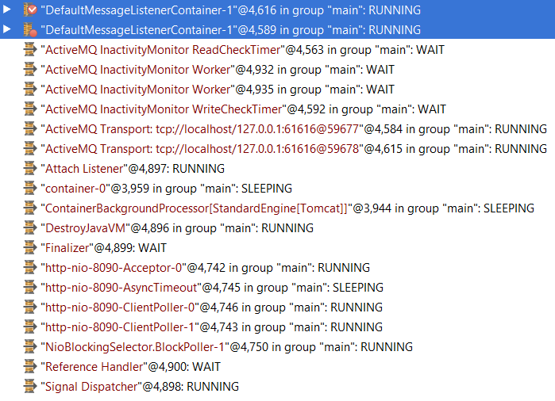
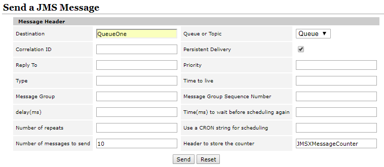
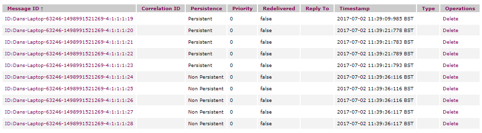
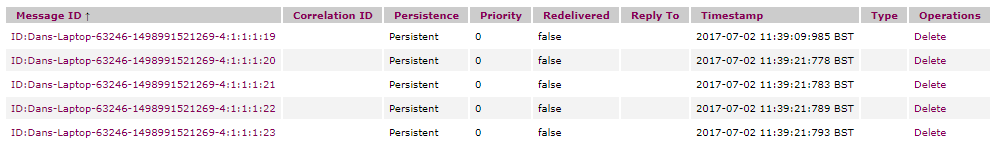

In my previous post [Using JMS in Spring Boot](http://lankydanblog.com/2017/06/18/using-jms-in-spring-boot/) I mentioned some characteristics that message queues exhibit, redundancy and asynchronous messaging but didn't mention them any further. ActiveMQ, which was used in the earlier post, provides both of these by default and therefore does not require any sort of special setup to get them working. In this post we will look at some evidence that proves that ActiveMQ provides redundancy and asynchronous messaging out of the box.

As always we will be using Spring Boot to get everything up and running nice and quickly, extra information that provides the foundation for this post can be found [here](http://lankydanblog.com/2017/06/18/using-jms-in-spring-boot/).

Lets look at asynchronous messaging first as it's quite easy to prove. A synchronous messaging allows the client to continue while the messages are being processed, which makes it simple to write an example to prove this. All we need is a client that sends messages at a faster rate than they can be consumed and with the magic of some print lines we can see this.

Before we see this in action we need to write some code, as its provided by default there isn't much code to actually show.

Application

```java
@EnableJms
@ComponentScan(basePackages = "lankydan.tutorial")
@SpringBootApplication
public class Application implements CommandLineRunner {

  @Autowired private JmsTemplate jmsTemplate;

  public static void main(String[] args) {
    SpringApplication.run(Application.class, args);
  }

  @Override
  public void run(final String args[]) {
    for (int i = 0; i < 5; i++) {
      System.out.println("<QueueOne> send message");
      jmsTemplate.convertAndSend("QueueOne", i);
    }
  }
}
```

This will run the Spring Boot application and by implementing `run` provided by the `CommandLineRunner` we can test the code easily. The `JmsTemplate` is injected in via the `@Autowired` annotation which allows us to send messages to whatever destinations we have setup. The run method will send 5 messages to `QueueOne` ready to be consumed.

QueueOneReceiver

```java
@Component
public class QueueOneReceiver {

  @JmsListener(destination = "QueueOne")
  public void receiveMessage() throws InterruptedException {
    System.out.println("<QueueOne> message <" + number + "> received");
    sleep(1000);
    System.out.println("<QueueOne> transaction <" + number + "> finished");
  }  
}
```

The `QueueOneReceiver` will consume messages from `QueueOne` and for the purpose of this post will print out some messages while having a little nap in between to make the example clearer.

Now when this is ran it will produce the following output (or something very similar)

```
<QueueOne> send message
<QueueOne> message <0> received
<QueueOne> send message
<QueueOne> send message
<QueueOne> send message
<QueueOne> send message
<QueueOne> transaction <0> finished
<QueueOne> message <1> received
<QueueOne> transaction <1> finished
<QueueOne> message <2> received
<QueueOne> transaction <2> finished
<QueueOne> message <3> received
<QueueOne> transaction <3> finished
<QueueOne> message <4> received
<QueueOne> transaction <4> finished
```

As you can see the messages are sent to the queue asynchronously allowing the client to continue running and add more to the queue. As they are processed so slowly, even though the first message is received straight away it cannot finish fast enough to mimic it running synchronously.

We can also take this example one step further and add another queue to show that the queues will run concurrently allowing both queues to receive messages at the same time. Through the use of debugging and some nicely placed breakpoints we can see that the messages are consumed in separate threads. I have placed breakpoints into the `receiveMessage` method of both `QueueOneReceiver` and `QueueTwoReceiver` (duplicated code that pulls from a different queue) which will halt the consumption of messages within each queue as they are taken one at a time.



The image above is not the clearest but you're going to have to trust me that the 2 threads of `DefaultMessageListenerContainer` represent the `receiveMessage` methods in each receiver. If you don't believe me then look below!


Hopefully I have regained your trust so we can continue through this post and look at redundancy. Redundancy allows the server to go down without losing the messages that were in the queue. So when the server is rebooted the consumption of messages will start again taking them from the queue in the same order that they were added before the server went down.

The the default message store for ActiveMQ is KahaDB, a file based persistence database which is optimised for fast persistence. There are various configurations that are available for it but for the purpose of this post they will not be looked at.

To test whether the messages can survive a server restart we need to send some persisted messages a queue, stop the server (the ActiveMQ process) and start it up again to see if the messages are still consumed. Messages sent via the Spring Boot application are persisted by default so we don't need to worry about that.

Through the use of some breakpoints in the consumers or commenting out the `receiveMessage` methods we can send messages to the queue without consuming them, after this point it's probably a good idea to stop the Spring Boot application. Another way to send some messages (nicer than the ways suggested a second ago) would be through the ActiveMQ admin console which we will be using later to view the queued messages. If you wanted to do this, then log into the admin console, on the navigation bar there is a send button which after pressing requires you to name the queue the messages are being delivered to, whether they should be persisted (yes for proof of redundancy) and the content of the message.



Once some messages have been sent to the queue you should have something that looks like this



The above image represents the messages that have been added to `QueueOne`. To help show the difference between persisted and non-persisted messages the queue has a mixture of each added to it. After ActiveMQ is restarted the messages in the queue decrease as all the non-persisted messages are lost showing that messaged need to be persisted if redundancy is to be upheld.



Now when the Spring Boot application is started up again the consumption of messages will resume proving that the message queue can withstand even death itself and after being resuscitated carries on like nothing happened.

So there we have it, in conclusion ActiveMQ provides default configuration that allows asynchronous messaging and provides redundancy in case failures occur. Due to these features being included out of the box there is minimal code required to get everything up and running, removing chances for us to forget to include some settings and decreasing the "boilerplate code" that developers hate so much.

I have included the code used in this post on my [GitHub](https://github.com/lankydan/spring-boot-activemq-default-tutorial) but as the post suggests there is not much included in it.

If you found this post helpful, please share it and if you want to keep up with my latest posts then you can follow me on Twitter at [@LankyDanDev](https://twitter.com/LankyDanDev).