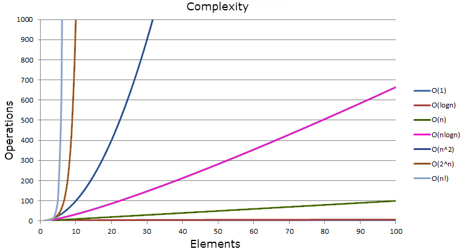

Big O Notation is one of those things that I was taught at university but never really grasped the concept. I knew enough to answer very basic questions on it but that was about it. Nothing has changed since then as I have not used or heard any of my colleagues mention it since I started working. So I thought I'd spend some time going back over it and wrote this post summarising the basics of Big O Notation and along with some code examples to help explain it.

So what is Big O Notation? In simple terms:

- It is the relative representation of complexity of an algorithm.</li>
- Describes how an algorithm performs and scales.</li>
- Describes the upper bound of the growth rate of a function and could be thought of a the <em>worst case scenario</em>.</li>

Now for a quick look at the syntax.

> O(n<sup>2</sup>)

<em>n</em> is the number of elements that the function receiving as inputs. So this example is saying for <em>n</em> inputs its complexity is equal to <em>n<sup>2</sup></em>.

Comparison of the common notations.

|   n   | Constant O(1) | Logarithmic O(log n) | Linear O(n) | Linear Logarithmic O(n log n) | Quadratic O(n<sup>2</sup> | Cubic O(n<sup>3</sup>) |
|:-----:|:-------------:|:--------------------:|:-----------:|:-----------------------------:|:-------------------------:|:----------------------:|
|   1   |       1       |           1          |      1      |               1               |             1             |            1           |
|   2   |       1       |           1          |      2      |               1               |             4             |            8           |
|   4   |       1       |           2          |      4      |               8               |             16            |           64           |
|   8   |       1       |           3          |      8      |               24              |             64            |           512          |
|   16  |       1       |           4          |      16     |               64              |            256            |          4,096         |
| 1,024 |       1       |          10          |    1,024    |             10,240            |         1,048,576         |      1,073,741,824     |

As you can see from this table as the complexity of a function increases the amount of computations or time it takes to complete a function can rise quite significantly. Therefore we want to keep this growth as low as possible as performance problems might arise if the function does not scale well as inputs are increased.



Some code examples should help clear things up a bit regarding how complexity effects performance. The code below is written in Java but obviously could be written in other languages.

__O(1)__

```java
public boolean isFirstNumberEqualToOne(List<Integer> numbers) {
  return numbers.get(0) == 1;
}
```

O(1) represents a function that always takes the same take regardless of input size.

__O(n)__

```java
public boolean containsNumber(List<Integer> numbers, int comparisonNumber) {
  for(Integer number : numbers) {
    if(number == comparisonNumber) {
      return true;
    }
  }
  return false;
}
```

O(n) represents the complexity of a function that increases linearly and in direct proportion to the number of inputs. This is a good example of how Big O Notation describes the <em>worst case scenario</em> as the function could return the <em>true</em> after reading the first element or <em>false</em> after reading all <em>n</em> elements.

__O(n<sup>2</sup>)__

```java
public static boolean containsDuplicates(List<String> input) {
  for (int outer = 0; outer < input.size(); outer++) {
    for (int inner = 0; inner < input.size(); inner++) {
      if (outer != inner && input.get(outer).equals(input.get(inner))) {
        return true;
      }
    }
  }
  return false;
}
```

O(n<sup>2</sup>) represents a function whose complexity is directly proportional to the square of the input size. Adding more nested iterations through the input will increase the complexity which could then represent O(n<sup>3</sup>) with 3 total iterations and O(n<sup>4</sup>) with 4 total iterations.

__O(2<sup>n</sup>)__

```java
public int fibonacci(int number) {
  if (number <= 1) {
    return number;
  } else {
    return fibonacci(number - 1) + fibonacci(number - 2);
  }
}
```

O(2<sup>n</sup>) represents a function whose performance doubles for every element in the input. This example is the recursive calculation of Fibonacci numbers. The function falls under O(2<sup>n</sup>) as the function recursively calls itself twice for each input number until the number is less than or equal to one.

__O(log n)__

```java
public boolean containsNumber(List<Integer> numbers, int comparisonNumber) {
  int low = 0;
  int high = numbers.size() - 1;
  while (low <= high) {
    int middle = low + (high - low) / 2;
    if (comparisonNumber < numbers.get(middle)) {
      high = middle - 1;
    } else if (comparisonNumber > numbers.get(middle)) {
      low = middle + 1;
    } else {
      return true;
    }
  }
  return false;
}
```

O(log n) represents a function whose complexity increases logarithmically as the input size increases. This makes O(log n) functions scale very well so the handling of larger inputs is much less likely to cause performance problems. The example above uses a binary search to check if the input list contains a certain number. In simple terms it splits the list in two on each iteration until the number is found or the last element is read. If you noticed this method has the same functionality as the O(n) example although the implementation is completely different and more difficult to understand. But, this is rewarded with a much better performance with larger inputs (as seen in the table).

The downside of this sort of implementation is that a Binary Search relies on the elements to already be in the correct order. This adds a bit of overhead performance wise if the elements need to be ordered before traversing through them.

There is much more to cover about Big O Notation but hopefully you now have a basic idea of what Big O Notation means and how that can translate into the code that you write.