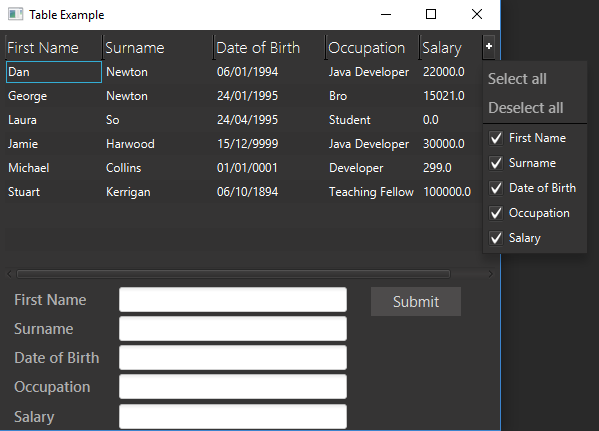
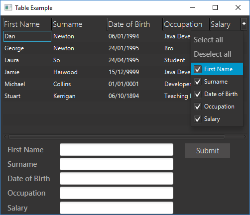
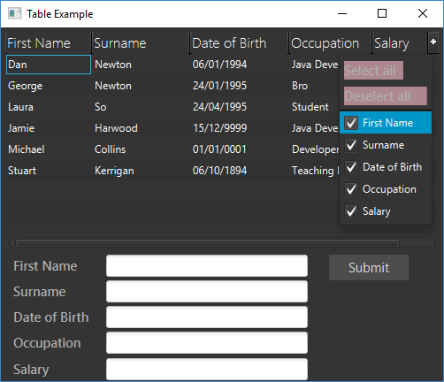

This is a post that I wanted to write as it was a problem I ran into at my previous job probably around this time last year. I was doing some general testing around a JavaFX table application I had written and I ran into this really annoying problem (I find it frustrating anyway). Upon loading up the `TableView`'s context menu at the top right corner which is used to show/hide columns if you click on one of the menu items the menu will close itself down. Now this doesn't seem like much of a problem at this point but I still had some columns I wanted to hide so I opened up the menu again and chose an item and the menu closed, so I did it again... and again... now do you see what I mean! That menu should stay open so I can show/hide multiple columns without reopening it. As us humans are a lazy bunch so reducing how many mouse clicks we need to make will make us much happier.

I'm going to be using some of the code I wrote in a previous post so if you need to know where some of it is coding from, have a look at [Editable Tables in JavaFX](https://lankydan.dev/2017/02/11/editable-table-in-javafx/). The rest of the code can be found at the bottom of this post.

There's not to much to cover for this topic so lets dive write into the code.

```java
/**
 * The {@linkplain TableViewContextMenuHelper} takes in a {@linkplain TableView}
 * as input and replaces it's default context menu. The context menu consists of
 * {@linkplain CustomMenuItem}s which are set to not close the context menu upon
 * clicking. {@linkplain TableViewContextMenuHelper} is a utility class and the
 * {@linkplain TableView} passed in should be used as normal.
 * 
 * Code based on answers found here:
 * http://stackoverflow.com/questions/27739833/adapt-tableview-menu-button
 * 
 * @author Dan Newton
 *
 */
public class TableViewContextMenuHelper {

	private TableView<?> tableView;
	private ContextMenu tableContextMenu;

	public TableViewContextMenuHelper(final TableView<?> tableView) {
		super();
		this.tableView = tableView;
		tableView.setTableMenuButtonVisible(true);

		// When the table's skin has loaded properly, which will occur after the
		// table has been initialised fully and a ChangeListener to the table's
		// menu button so that the default button's onAction can be overridden

		// ChangeListener.changed event
		tableView.skinProperty().addListener(event -> {
			// ChangeListener.changed event
			tableView.tableMenuButtonVisibleProperty()
					.addListener((observable, oldValue, newValue) -> {
						if (newValue == true) {
							registerListeners();
						}
					});
			if (tableView.isTableMenuButtonVisible()) {
				registerListeners();
			}
		});
	}

	private void registerListeners() {
		final Node buttonNode = getMenuButton();
		// replace mouse listener on "+" node
		buttonNode.setOnMousePressed(event -> {
			showContextMenu();
			event.consume();
		});
	}

	private Node getMenuButton() {
		final TableHeaderRow tableHeaderRow = getTableHeaderRow();
		if (tableHeaderRow == null) {
			return null;
		}
		// child identified as cornerRegion in TableHeaderRow.java
		return tableHeaderRow.getChildren().stream().filter(child -> child
				.getStyleClass().contains("show-hide-columns-button")).findAny()
				.get();
	}

	private TableHeaderRow getTableHeaderRow() {
		final TableViewSkin<?> tableSkin = (TableViewSkin<?>) tableView
				.getSkin();
		if (tableSkin == null) {
			return null;
		}
		// find the TableHeaderRow child
		return (TableHeaderRow) tableSkin.getChildren().stream()
				.filter(child -> child instanceof TableHeaderRow).findAny()
				.get();
	}

	protected void showContextMenu() {
		final Node buttonNode = getMenuButton();
		// When the menu is already shown clicking the + button hides it.
		if (tableContextMenu != null) {
			tableContextMenu.hide();
		} else {
			// Show the menu
			// rebuilds the menu each time it is opened
			tableContextMenu = createContextMenu();
			tableContextMenu.setOnHidden(event -> tableContextMenu = null);
			tableContextMenu.show(buttonNode, Side.BOTTOM, 0, 0);
			// Repositioning the menu to be aligned by its right side (keeping
			// inside the table view)
			tableContextMenu.setX(
					buttonNode.localToScreen(buttonNode.getBoundsInLocal())
							.getMaxX() - tableContextMenu.getWidth());
		}
	}

	// adds custom menu items to the context menu which allow us to control
	// the on hide property
	private ContextMenu createContextMenu() {
		final ContextMenu contextMenu = new ContextMenu();
		contextMenu.getItems().add(createSelectAllMenuItem(contextMenu));
		contextMenu.getItems().add(createDeselectAllMenuItem(contextMenu));
		contextMenu.getItems().add(new SeparatorMenuItem());
		addColumnCustomMenuItems(contextMenu);
		return contextMenu;
	}

	private CustomMenuItem createSelectAllMenuItem(
			final ContextMenu contextMenu) {
		final Label selectAllLabel = new Label("Select all");
		// adds listener to the label to change the size so the user
		// can click anywhere in the menu items area and not just on the
		// text to activate its onAction
		contextMenu.focusedProperty().addListener(event -> selectAllLabel
				.setPrefWidth(contextMenu.getWidth() * 0.75));

		final CustomMenuItem selectAllMenuItem = new CustomMenuItem(
				selectAllLabel);
		selectAllMenuItem.setOnAction(event -> selectAll(event));
		// set to false so the context menu stays visible after click
		selectAllMenuItem.setHideOnClick(false);
		return selectAllMenuItem;
	}

	private void selectAll(final Event event) {
		tableView.getColumns().forEach(column -> column.setVisible(true));
		event.consume();
	}

	private CustomMenuItem createDeselectAllMenuItem(
			final ContextMenu contextMenu) {
		final Label deselectAllLabel = new Label("Deselect all");
		// adds listener to the label to change the size so the user
		// can click anywhere in the menu items area and not just on the
		// text to activate its onAction
		contextMenu.focusedProperty().addListener(event -> deselectAllLabel
				.setPrefWidth(contextMenu.getWidth() * 0.75));

		final CustomMenuItem deselectAllMenuItem = new CustomMenuItem(
				deselectAllLabel);
		deselectAllMenuItem.setOnAction(event -> deselectAll(event));
		// set to false so the context menu stays visible after click
		deselectAllMenuItem.setHideOnClick(false);
		return deselectAllMenuItem;
	}

	private void deselectAll(final Event event) {
		tableView.getColumns().forEach(column -> column.setVisible(false));
		event.consume();
	}

	private void addColumnCustomMenuItems(final ContextMenu contextMenu) {
		// menu item for each of the available columns
		tableView.getColumns().forEach(column -> contextMenu.getItems()
				.add(createColumnCustomMenuItem(contextMenu, column)));
	}

	private CustomMenuItem createColumnCustomMenuItem(
			final ContextMenu contextMenu, final TableColumn<?, ?> column) {
		final CheckBox checkBox = new CheckBox(column.getText());
		// adds listener to the check box to change the size so the user
		// can click anywhere in the menu items area and not just on the
		// text to activate its onAction
		contextMenu.focusedProperty().addListener(
				event -> checkBox.setPrefWidth(contextMenu.getWidth() * 0.75));
		// the context menu item's state controls its bound column's visibility
		checkBox.selectedProperty().bindBidirectional(column.visibleProperty());

		final CustomMenuItem customMenuItem = new CustomMenuItem(checkBox);
		customMenuItem.getStyleClass().set(1, "check-menu-item");
		customMenuItem.setOnAction(event -> {
			checkBox.setSelected(!checkBox.isSelected());
			event.consume();
		});
		// set to false so the context menu stays visible after click
		customMenuItem.setHideOnClick(false);
		return customMenuItem;
	}

}
```

The first important line in here is

```java
tableView.setTableMenuButtonVisible(true)
```

This does what it says, it makes the menu button on the `TableView` visible. Obviously without this line everything that comes below would be pointless.

```java
// ChangeListener.changed event
tableView.skinProperty().addListener(event -> {
	// ChangeListener.changed event
	tableView.tableMenuButtonVisibleProperty()
			.addListener((observable, oldValue, newValue) -> {
				if (newValue == true) {
					registerListeners();
				}
			});
	if (tableView.isTableMenuButtonVisible()) {
		registerListeners();
	}
});
```

Some listeners are added to the `TableView` to allow us to override the default `onAction` on the menu button later on. The first listener is added to `tableView.skinProperty` so to wait for the `TableView` to be properly initialised correctly before adding the listener onto `tableView.tableMenuButtonVisibleProperty` which calls another method handling the overriding of the default menu button's `onAction`.

```java
private void registerListeners() {
    final Node buttonNode = getMenuButton();
    // replace mouse listener on "+" node
    buttonNode.setOnMousePressed(event -> {
        showContextMenu();
        event.consume();
    });
}
```

This gets the menu button from the `TableView` and replaces its action by using `buttonNode.setOnMousePressed` and calls the method that creates the context menu.

```java
private Node getMenuButton() {
    final TableHeaderRow tableHeaderRow = getTableHeaderRow();
    if (tableHeaderRow == null) {
    return null;
    }
    // child identified as cornerRegion in TableHeaderRow.java
    return tableHeaderRow.getChildren().stream().filter(child -> child
      .getStyleClass().contains("show-hide-columns-button")).findAny()
      .get();
}

private TableHeaderRow getTableHeaderRow() {
    final TableViewSkin<?> tableSkin = (TableViewSkin<?>) tableView
      .getSkin();
    if (tableSkin == null) {
    return null;
    }
    // find the TableHeaderRow child
    return (TableHeaderRow) tableSkin.getChildren().stream()
      .filter(child -> child instanceof TableHeaderRow).findAny()
      .get();
}
```

These two methods retrieve the table header row and thus the table's menu button. There's not much to say about these methods apart from that they use Stream's to find the table header row/menu button. Have a quick look at [Java 8 Streams](https://lankydan.dev/2017/01/22/java-8-streams/) if you are unsure with how they work.

```java
protected void showContextMenu() {
	final Node buttonNode = getMenuButton();
	// When the menu is already shown clicking the + button hides it.
	if (tableContextMenu != null) {
		tableContextMenu.hide();
	} else {
		// Show the menu
		// rebuilds the menu each time it is opened
		tableContextMenu = createContextMenu();
		tableContextMenu.setOnHidden(event -> tableContextMenu = null);
		tableContextMenu.show(buttonNode, Side.BOTTOM, 0, 0);
		// Repositioning the menu to be aligned by its right side (keeping
		// inside the table view)
		tableContextMenu.setX(
				buttonNode.localToScreen(buttonNode.getBoundsInLocal())
						.getMaxX() - tableContextMenu.getWidth());
	}
}
```

The method to create the context menu is called from within here. If the menu is visible then hide it when the menu button is clicked, otherwise create a new context menu. The position where the menu is displayed is altered from the default of sticking out towards the right side of the `TableView` to being contained within the `TableView` itself.





As you can see the position changes quite a lot and will be up to user preference as to where you would want the menu to be displayed.

```java
// adds custom menu items to the context menu which allow us to control
// the on hide property
private ContextMenu createContextMenu() {
    final ContextMenu contextMenu = new ContextMenu();
    contextMenu.getItems().add(createSelectAllMenuItem(contextMenu));
    contextMenu.getItems().add(createDeselectAllMenuItem(contextMenu));
    contextMenu.getItems().add(new SeparatorMenuItem());
    addColumnCustomMenuItems(contextMenu);
    return contextMenu;
}
```

The context menu is created here and consists of only `CustomMenuItem`'s as we require the unique `hideOnClickProperty` of the `CustomMenuItem`. For some reason none of the other implementations of menu items have this property and the lower down JavaFX code requires this class to be used or extended if we want to stop the context menu from hiding on click. This was quite annoying to me as you would think there would be a nice simple way to define this sort of interaction, such putting this property on the `MenuItem` class itself which would allow use to remove a lot of code added in this post. Anyway now I have got that off my chest, lets carry on.

```java
private CustomMenuItem createSelectAllMenuItem(
        final ContextMenu contextMenu) {
    final Label selectAllLabel = new Label("Select all");
    // adds listener to the label to change the size so the user
    // can click anywhere in the menu items area and not just on the
    // text to activate its onAction
    contextMenu.focusedProperty().addListener(event -> selectAllLabel
            .setPrefWidth(contextMenu.getWidth() * 0.75));

    final CustomMenuItem selectAllMenuItem = new CustomMenuItem(
            selectAllLabel);
    selectAllMenuItem.setOnAction(event -> selectAll(event));
    // set to false so the context menu stays visible after click
    selectAllMenuItem.setHideOnClick(false);
    return selectAllMenuItem;
}

private void selectAll(final Event event) {
    tableView.getColumns().forEach(column -> column.setVisible(true));
    event.consume();
}
```

As mentioned above a `CustomMenuItem` has been used to create a "Select all" button. The `CustomMenuItem` takes in a `Node` into its constructor which is what will be displayed on the context menu, in this case a `Label` is passed into it with the text "Select all". An `onAction` listener has been added to the menu item to allow it to call `selectAll`. Remember to set the `hideOnClickProperty` to false by using `setHideOnClick(false)`.

Another problem I ran into while testing this code was there were instances when it seemed that the menu items didn't do anything when I clicked them. After a bit more observation I found out that it was due to the area in which the `CustomMenuItem` would actually register the event was bound to the size of the `Node` inside of it. Therefore if you did not click on the "Select all" text for example and instead did it to the space to the side of it, it would not do anything.



To get around this I increased the width of the `Node` inside the `CustomMenuItem`. This has the effect of invisibly increasing the area in which you can successfully click the menu item, this can be seen more easily if you play around with the `CSS` a bit. The code I used to do this waited for the context menu to be focused, as it will be fully initialised with its width and sets the label to a percentage of the menu's width. I used 75% as anything greater seemed to increase the width of the context menu itself leaving us again with a area that the Node does not cover. There might be other valid properties to add a listener to, just don't do what I did below.

```java
contextMenu.widthProperty().addListener(event -> deselectAllLabel.setPrefWidth(contextMenu.getWidth()))
```

This lead to my context menu to reach an ever increasing size, which even though it was pretty funny it was exactly the functionality I was looking for...

The "Deselect all" menu item followed the same code as above except for one key difference, which I'm sure you can figure out on your own... If you couldn't, it hides all the table columns instead of showing them all.

```java

private void addColumnCustomMenuItems(final ContextMenu contextMenu) {
    // menu item for each of the available columns
    tableView.getColumns().forEach(column -> contextMenu.getItems()
            .add(createColumnCustomMenuItem(contextMenu, column)));
}

private CustomMenuItem createColumnCustomMenuItem(
        final ContextMenu contextMenu, final TableColumn<?, ?> column) {
    final CheckBox checkBox = new CheckBox(column.getText());
    // adds listener to the check box to change the size so the user
    // can click anywhere in the menu items area and not just on the
    // text to activate its onAction
    contextMenu.focusedProperty().addListener(
            event -> checkBox.setPrefWidth(contextMenu.getWidth() * 0.75));
    // the context menu item's state controls its bound column's visibility
    checkBox.selectedProperty().bindBidirectional(column.visibleProperty());

    final CustomMenuItem customMenuItem = new CustomMenuItem(checkBox);
    customMenuItem.getStyleClass().set(1, "check-menu-item");
    customMenuItem.setOnAction(event -> {
        checkBox.setSelected(!checkBox.isSelected());
        event.consume();
    });
    // set to false so the context menu stays visible after click
    customMenuItem.setHideOnClick(false);
    return customMenuItem;
}
```

Here is the code that allows us to hide/show individual table columns. This time round a `CheckBox` is used instead of a `Label` as the `Node` to store inside the `CustomMenuItem`, which allows us to see the state of the column more easily from the menu. By using `bindBiDirectional` the `CheckBox` and `TableColumn` will happily swing both ways. What I mean is, if the `CheckBox` is not selected then the `TableColumn` will be hidden and going the other way if the `CheckBox` is selected and then the "Deselect all" button is pressed the `TableColumn` will hide which in turn will deselect the `CheckBox`. The `onAction` of the menu item is used to control the `CheckBox` which in turn will control the `TableColumn`. Again remember to use `setHideOnClick(false)` to keep the context menu visible.

The last piece of code I will provide in this post is an example of the `CSS` you need to included if you wanted to alter how the menu items look, although I did not use a specific styling as I quite liked the default.

```css
.check-box {
    -fx-font-size: 11pt;
    -fx-font-family: "Segoe UI Semibold";
    -fx-text-fill: white;
    -fx-opacity: 0.6;
}
view raw
```

Due to using a `CheckBox` in the `CustomMenuItem`'s the styling used above will alter how it appears in the menu.

Now we have reached the end of this tutorial you will now have a possible solution to stop a table's context menu from disappearing every time you click on it. For all of the source code used in this post have a look at my [Github](https://github.com/lankydan/Stopping-JavaFX-Context-Menus-from-auto-hiding).