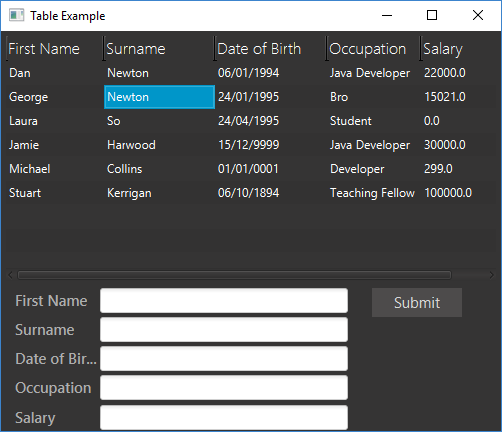
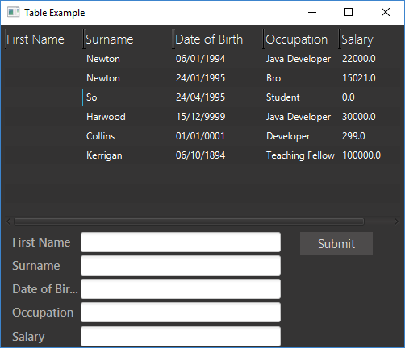
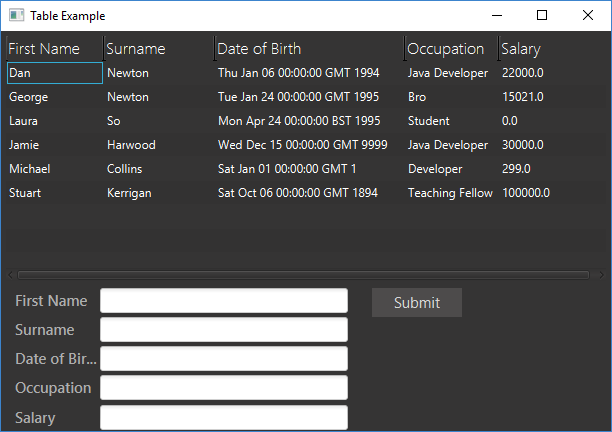
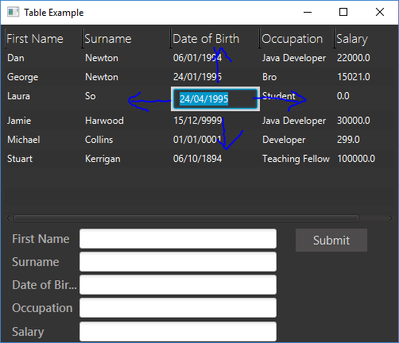

After hearing my colleague constantly talking about the editable grids that the company I work at designed a long time ago, I decided to do something to make him proud of me. So I wrote a application that creates an editable `TableView` in JavaFX that can be used to brainlessly enter in data, if that's what you want to do. Unfortunately JavaFX didn't want to make this nice and simple to do and I even found a bug in the JavaFX code while writing the example code... So buckle up as there is a lot of code in this post and don't worry I'll put some explanations and even pictures in so you don't get lost.



Check out [Getting started with JavaFX](https://lankydanblog.wordpress.com/2017/01/08/getting-started-with-javafx/) if your need some background knowledge in what will be explained in this post.

Lets start with the `fxml` for setting up the table, the rest of the `fxml` code can be found on my [Github](https://github.com/lankydan/JavaFX-Table-Tutorial/blob/master/JavaFXTableTutorial/resources/lankydan/tutorials/fxml/TableApp.fxml).

```xml
<TableView fx:id="table" prefHeight="255.0" prefWidth="501.0">
  <columns>
    <TableColumn prefWidth="98.0" text="First Name">
      <cellValueFactory>
        <PropertyValueFactory property="firstName" />
      </cellValueFactory>
    </TableColumn>
        <TableColumn prefWidth="111.0" text="Surname">
          <cellValueFactory>
            <PropertyValueFactory property="surname" />
      </cellValueFactory>
    </TableColumn>
     <TableColumn fx:id="dateOfBirthColumn" prefWidth="99.0" text="Date of Birth">
      <cellValueFactory>
         <PropertyValueFactory property="dateOfBirth" />
      </cellValueFactory>
    </TableColumn>
          <TableColumn prefWidth="106.0" text="Occupation">
          <cellValueFactory>
            <PropertyValueFactory property="occupation" />
      </cellValueFactory>
    </TableColumn>
          <TableColumn fx:id="salaryColumn" prefWidth="84.0" text="Salary">
          <cellValueFactory>
            <PropertyValueFactory property="salary" />
      </cellValueFactory>
    </TableColumn>
  </columns>
</TableView>
```

Some simple things you can see from quickly looking at the code is that a `TableView` has been defined with some columns which each have names and some have `fx:id`'s to be used within the `controller` later on. An important feature that we need to notice is the `cellValueFactory` and `PropertyValueFactory` that are defined within each of the `TableColumn` tags. These map to the model that the table's data will be displaying where the properties defined in the `PropertyValueFactory` tags will match to the model's fields. This will become clearer just below.

Now that the table's basic layout has been constructed lets get on to setting up and representing the data that will be displayed in it. The first thing we need to do is create a object / model that will represent each row in the table and where each column will match to a property in from the model.

```java
public class PersonTableData {

	private SimpleStringProperty firstName;
	private SimpleStringProperty surname;
	private SimpleObjectProperty<Date> dateOfBirth;
	private SimpleStringProperty occupation;
	private SimpleDoubleProperty salary;

  	// added to create the model from the Person object, which might be data retrieved from a database 
	public PersonTableData(Person person) {
		this.firstName = new SimpleStringProperty(person.getFirstName());
		this.surname = new SimpleStringProperty(person.getSurname());
		this.dateOfBirth = new SimpleObjectProperty<Date>(
				person.getDateOfBirth());
		this.occupation = new SimpleStringProperty(person.getOccupation());
		this.salary = new SimpleDoubleProperty(person.getSalary());
	}

	public PersonTableData(final String firstName, final String surname,
			final Date dateOfBirth, final String occupation,
			final double salary) {
		this.firstName = new SimpleStringProperty(firstName);
		this.surname = new SimpleStringProperty(surname);
		this.dateOfBirth = new SimpleObjectProperty<Date>(dateOfBirth);
		this.occupation = new SimpleStringProperty(occupation);
		this.salary = new SimpleDoubleProperty(salary);
	}

	public String getFirstName() {
		return firstName.get();
	}

	public void setFirstName(final String firstName) {
		this.firstName.set(firstName);
	}

	public String getSurname() {
		return surname.get();
	}

	public void setSurname(final String surname) {
		this.surname.set(surname);
	}

	public Date getDateOfBirth() {
		return dateOfBirth.get();
	}

	public void setDateOfBirth(final Date dateOfBirth) {
		this.dateOfBirth.set(dateOfBirth);
	}

	public String getOccupation() {
		return occupation.get();
	}

	public void setOccupation(final String occupation) {
		this.occupation.set(occupation);
	}

	public double getSalary() {
		return salary.get();
	}

	public void setSalary(final double salary) {
		this.salary.set(salary);
	}

}
```

The first thing that is important to notice is that the types of the fields are not what you would normally expect, like a `String` or `double` for example, but are defined as properties instead. This is not 100% necessary to use and a `String` could be used instead of a `SimpleStringProperty `or a `Date` instead of a `SimpleObjectProperty&lt;Date&gt;`. What the property does is wrap the value it holds, which are accessed via` get()` or `set()`, and listens for events that are fired on the value. This means that you are able to add listeners or bind it to other properties which is not something that you could do with a simple `String`. The getters are 100% required to allow the display the values in the table and the setters are optional and only required if you want to do some setting, like editing a value for example. Also notice that they use the get() and set() methods to access the wrapped value of the property instead of returning or changing the actual property. The names of the properties inside the model do not matter, but do you remember where we defined names inside the `PropertyValueFactory` tags in the `fxml` earlier? We need the names defined in these tags to match up to the getters and setters in the model. If they don't match it wont crash or anything but your not going to get any data display in the unmatched columns.



To test this if you changed the `PropertyValueFactory` name for one of the fields and ran the code it would not display anything in that column, but if you then changed the name of the getter while leaving name of the models property the same it will now display correctly.

It is also possible to add the columns into the `TableView` within the Java code rather than in the `fxml`. The piece of code below is an example of how you could of added the `dateOfBirth` column to the table.

```java
private void createColumnManually() {
	TableColumn<PersonTableData, Date> dateOfBirthColumn = new TableColumn<>(
			"Date of Birth");
	dateOfBirthColumn.setCellValueFactory(person -> {
		SimpleObjectProperty<Date> property = new SimpleObjectProperty<>();
		property.setValue(person.getValue().getDateOfBirth());
		return property;
	});
	table.getColumns().add(2, dateOfBirthColumn);
}
```

The table has now been defined in the `fxml` and the model to represent the data has been successfully created. Its time to get onto the main functionality and making the table editable.

```java
public class TableAppController implements Initializable {

	@FXML
	private TableView<PersonTableData> table;

	@FXML
	private TextField firstNameTextField;

	@FXML
	private TextField surnameTextField;

	@FXML
	private TextField dateOfBirthTextField;

	@FXML
	private TextField occupationTextField;

	@FXML
	private TextField salaryTextField;

	@FXML
	private Button submitButton;

	private ObservableList<PersonTableData> data = FXCollections
			.observableArrayList();

	private static final String DATE_PATTERN = "dd/MM/yyyy";

	private static final SimpleDateFormat DATE_FORMATTER = new SimpleDateFormat(
			DATE_PATTERN);

	@FXML
	private TableColumn<PersonTableData, Date> dateOfBirthColumn;

	@FXML
	private TableColumn<PersonTableData, Double> salaryColumn;

	@Override
	public void initialize(final URL url, final ResourceBundle rb) {
		DATE_FORMATTER.setLenient(false);
		table.setItems(data);
		populate(retrieveData());
		setupDateOfBirthColumn();
		setupSalaryColumn();
		setTableEditable();

	}

	private List<Person> retrieveData() {
		try {
			return Arrays.asList(
					new Person("Dan", "Newton",
							DATE_FORMATTER.parse("06/01/1994"),
							"Java Developer", 22000),
					new Person("George", "Newton",
							DATE_FORMATTER.parse("24/01/1995"), "Bro", 15021),
					new Person("Laura", "So",
							DATE_FORMATTER.parse("24/04/1995"), "Student", 0),
					new Person("Jamie", "Harwood",
							DATE_FORMATTER.parse("15/12/9999"),
							"Java Developer", 30000),
					new Person("Michael", "Collins",
							DATE_FORMATTER.parse("01/01/0001"), "Developer",
							299),
					new Person("Stuart", "Kerrigan",
							DATE_FORMATTER.parse("06/10/1894"),
							"Teaching Fellow", 100000));
		} catch (ParseException e) {
			e.printStackTrace();
		}
		return new ArrayList<Person>();
	}

	private void populate(final List<Person> people) {
		people.forEach(p -> data.add(new PersonTableData(p)));
	}

	private void setupDateOfBirthColumn() {
		// formats the display value to display dates in the form of dd/MM/yyyy
		dateOfBirthColumn
				.setCellFactory(EditCell.<PersonTableData, Date>forTableColumn(
						new MyDateStringConverter(DATE_PATTERN)));
		// updates the dateOfBirth field on the PersonTableData object to the
		// committed value
		dateOfBirthColumn.setOnEditCommit(event -> {
			final Date value = event.getNewValue() != null ? event.getNewValue()
					: event.getOldValue();
			((PersonTableData) event.getTableView().getItems()
					.get(event.getTablePosition().getRow()))
							.setDateOfBirth(value);
			table.refresh();
		});
	}

	private void setupSalaryColumn() {
		// sets the cell factory to use EditCell which will handle key presses
		// and firing commit events
		salaryColumn.setCellFactory(
				EditCell.<PersonTableData, Double>forTableColumn(
						new MyDoubleStringConverter()));
		// updates the salary field on the PersonTableData object to the
		// committed value
		salaryColumn.setOnEditCommit(event -> {
			final Double value = event.getNewValue() != null
					? event.getNewValue() : event.getOldValue();
			((PersonTableData) event.getTableView().getItems()
					.get(event.getTablePosition().getRow())).setSalary(value);
			table.refresh();
		});
	}

	private void setTableEditable() {
		table.setEditable(true);
		// allows the individual cells to be selected
		table.getSelectionModel().cellSelectionEnabledProperty().set(true);
		// when character or numbers pressed it will start edit in editable
		// fields
		table.setOnKeyPressed(event -> {
			if (event.getCode().isLetterKey() || event.getCode().isDigitKey()) {
				editFocusedCell();
			} else if (event.getCode() == KeyCode.RIGHT
					|| event.getCode() == KeyCode.TAB) {
				table.getSelectionModel().selectNext();
				event.consume();
			} else if (event.getCode() == KeyCode.LEFT) {
				// work around due to
				// TableView.getSelectionModel().selectPrevious() due to a bug
				// stopping it from working on
				// the first column in the last row of the table
				selectPrevious();
				event.consume();
			}
		});
	}

	@SuppressWarnings("unchecked")
	private void editFocusedCell() {
		final TablePosition<PersonTableData, ?> focusedCell = table
				.focusModelProperty().get().focusedCellProperty().get();
		table.edit(focusedCell.getRow(), focusedCell.getTableColumn());
	}

	@SuppressWarnings("unchecked")
	private void selectPrevious() {
		if (table.getSelectionModel().isCellSelectionEnabled()) {
			// in cell selection mode, we have to wrap around, going from
			// right-to-left, and then wrapping to the end of the previous line
			TablePosition<PersonTableData, ?> pos = table.getFocusModel()
					.getFocusedCell();
			if (pos.getColumn() - 1 >= 0) {
				// go to previous row
				table.getSelectionModel().select(pos.getRow(),
						getTableColumn(pos.getTableColumn(), -1));
			} else if (pos.getRow() < table.getItems().size()) {
				// wrap to end of previous row
				table.getSelectionModel().select(pos.getRow() - 1,
						table.getVisibleLeafColumn(
								table.getVisibleLeafColumns().size() - 1));
			}
		} else {
			int focusIndex = table.getFocusModel().getFocusedIndex();
			if (focusIndex == -1) {
				table.getSelectionModel().select(table.getItems().size() - 1);
			} else if (focusIndex > 0) {
				table.getSelectionModel().select(focusIndex - 1);
			}
		}
	}

	private TableColumn<PersonTableData, ?> getTableColumn(
			final TableColumn<PersonTableData, ?> column, int offset) {
		int columnIndex = table.getVisibleLeafIndex(column);
		int newColumnIndex = columnIndex + offset;
		return table.getVisibleLeafColumn(newColumnIndex);
	}

	@FXML
	private void submit(final ActionEvent event) {
		if (allFieldsValid()) {
			final String firstName = firstNameTextField.getText();
			final String surname = surnameTextField.getText();
			Date dateOfBirth = null;
			try {
				dateOfBirth = DATE_FORMATTER
						.parse(dateOfBirthTextField.getText());
			} catch (final ParseException e) {
			}
			final String occupation = occupationTextField.getText();
			final double salary = Double.parseDouble(salaryTextField.getText());
			data.add(new PersonTableData(firstName, surname, dateOfBirth,
					occupation, salary));
		}
	}

	private boolean allFieldsValid() {
		return !firstNameTextField.getText().isEmpty()
				&& !surnameTextField.getText().isEmpty()
				&& dateOfBirthFieldValid()
				&& !occupationTextField.getText().isEmpty()
				&& !salaryTextField.getText().isEmpty();
	}

	private boolean dateOfBirthFieldValid() {
		if (!dateOfBirthTextField.getText().isEmpty()) {
			try {
				DATE_FORMATTER.parse(dateOfBirthTextField.getText());
				return true;
			} catch (ParseException e) {
				return false;
			}
		}
		return false;
	}
}
```

Lets break that down into smaller chunks of code.

```java
@FXML
private TableView<PersonTableData> table;

private ObservableList<PersonTableData> data = FXCollections.observableArrayList();

@Override
public void initialize(final URL url, final ResourceBundle rb) {
	table.setItems(data);
	populate(retrieveData());
}

private List<Person> retrieveData() {
	try {
		return Arrays.asList(
			new Person("Dan", "Newton",
			    DATE_FORMATTER.parse("06/01/1994"),
			    "Java Developer", 22000),
			new Person("George", "Newton",
			    DATE_FORMATTER.parse("24/01/1995"), "Bro", 15021),
			new Person("Laura", "So",
			    DATE_FORMATTER.parse("24/04/1995"), "Student", 0),
			new Person("Jamie", "Harwood",
			    DATE_FORMATTER.parse("15/12/9999"),
			    "Java Developer", 30000),
			new Person("Michael", "Collins",
			    DATE_FORMATTER.parse("01/01/0001"), "Developer",
			    299),
			new Person("Stuart", "Kerrigan",
			    DATE_FORMATTER.parse("06/10/1894"),
			    "Teaching Fellow", 100000));
	} catch (ParseException e) {
		e.printStackTrace();
	}
	return new ArrayList<Person>();
}

private void populate(final List<Person> people) {
	people.forEach(p -> data.add(new PersonTableData(p)));
}
```

This is the basic code required to pass some data into the table. Notice that the table is defined as a `TableView&lt;PersonTableData&gt;` showing that the data it stores is represented by the model` PersonTableData`. The data that will be stored in the table is held within a `ObservableList&lt;PersonTableData&gt;` which is like the properties from earlier allowing us to listen for changes by using listeners. Once these are both setup we will link them together by calling `table.setItems(data)` and populate the data. I created a `populateData()` method in this example which in real situations might be a call to database which will return data or objects which are converted into the models stored in the table (`PersonTableData` in this example).

```java
private static final String DATE_PATTERN = "dd/MM/yyyy";

@FXML
private TableColumn<PersonTableData, Date> dateOfBirthColumn;

private void setupDateOfBirthColumn() {
	// formats the display value to display dates in the form of dd/MM/yyyy
	dateOfBirthColumn
			.setCellFactory(EditCell.<PersonTableData, Date>forTableColumn(
					new MyDateStringConverter(DATE_PATTERN)));
	// updates the dateOfBirth field on the PersonTableData object to the
	// committed value
	dateOfBirthColumn.setOnEditCommit(event -> {
		final Date value = event.getNewValue() != null ? event.getNewValue()
				: event.getOldValue();
		((PersonTableData) event.getTableView().getItems()
				.get(event.getTablePosition().getRow()))
						.setDateOfBirth(value);
		table.refresh();
	});
}
```

Setting the cell factory overrides the default allowing us to change the functionality of how data is displayed in the table. This piece of code allows the `dateOfBirth` column's values be displayed in the form of `"dd/MM/yyyy"` instead of the default `Date.toString()` output which will normally look pretty ugly to store in a table. I did this by defining a my own version of a `TableCell` called `EditCell` and a converter `MyDateStringConverter` to convert the date into the format I desire. These will be explained later. The `setOnEditCommit` is used to save the committed value when the user has changed the value in the column by updating the `PersonTableData` model for the edited row.



The `salary` column follows the same format as the `dateOfBirth` column but `MyDoubleStringConverter` was used instead to convert the input into a `double` value.

```java
@FXML
private TableColumn<PersonTableData, Double> salaryColumn;

private void setupSalaryColumn() {
	salaryColumn.setCellFactory(
			EditCell.<PersonTableData, Double>forTableColumn(
					new MyDoubleStringConverter()));
	// updates the salary field on the PersonTableData object to the
	// committed value
	salaryColumn.setOnEditCommit(event -> {
		final Double value = event.getNewValue() != null
				? event.getNewValue() : event.getOldValue();
		((PersonTableData) event.getTableView().getItems()
				.get(event.getTablePosition().getRow())).setSalary(value);
		table.refresh();
	});
}
```

Going back to the `EditCell` that I mentioned earlier, this is a `TableCell` that extends `TextFieldTableCell`. [james-d](https://gist.github.com/james-d/be5bbd6255a4640a5357) for writing the piece of code below.

```java
public class EditCell<S, T> extends TextFieldTableCell<S, T> {

	private TextField textField;
	private boolean escapePressed = false;
	private TablePosition<S, ?> tablePos = null;

	public EditCell(final StringConverter<T> converter) {
		super(converter);
	}

	public static <S> Callback<TableColumn<S, String>, TableCell<S, String>> forTableColumn() {
		return forTableColumn(new DefaultStringConverter());
	}

	public static <S, T> Callback<TableColumn<S, T>, TableCell<S, T>> forTableColumn(
			final StringConverter<T> converter) {
		return list -> new EditCell<S, T>(converter);
	}

	@Override
	public void startEdit() {
		if (!isEditable() || !getTableView().isEditable()
				|| !getTableColumn().isEditable()) {
			return;
		}
		super.startEdit();

		if (isEditing()) {
			if (textField == null) {
				textField = getTextField();
			}
			escapePressed = false;
			startEdit(textField);
			final TableView<S> table = getTableView();
			tablePos = table.getEditingCell();
		}
	}

	/** {@inheritDoc} */
	@Override
	public void commitEdit(T newValue) {
		if (!isEditing())
			return;
		final TableView<S> table = getTableView();
		if (table != null) {
			// Inform the TableView of the edit being ready to be committed.
			CellEditEvent editEvent = new CellEditEvent(table, tablePos,
					TableColumn.editCommitEvent(), newValue);

			Event.fireEvent(getTableColumn(), editEvent);
		}
		// we need to setEditing(false):
		super.cancelEdit(); // this fires an invalid EditCancelEvent.
		// update the item within this cell, so that it represents the new value
		updateItem(newValue, false);
		if (table != null) {
			// reset the editing cell on the TableView
			table.edit(-1, null);
		}
	}

	/** {@inheritDoc} */
	@Override
	public void cancelEdit() {
		if (escapePressed) {
			// this is a cancel event after escape key
			super.cancelEdit();
			setText(getItemText()); // restore the original text in the view
		} else {
			// this is not a cancel event after escape key
			// we interpret it as commit.
			String newText = textField.getText();
			// commit the new text to the model
			this.commitEdit(getConverter().fromString(newText));
		}
		setGraphic(null); // stop editing with TextField
	}

	/** {@inheritDoc} */
	@Override
	public void updateItem(T item, boolean empty) {
		super.updateItem(item, empty);
		updateItem();
	}

	private TextField getTextField() {

		final TextField textField = new TextField(getItemText());

		textField.setOnAction(new EventHandler<ActionEvent>() {

			@Override
			public void handle(ActionEvent event) {
				System.out.println("hi");
			}
		});

		// Use onAction here rather than onKeyReleased (with check for Enter),
		textField.setOnAction(event -> {
			if (getConverter() == null) {
				throw new IllegalStateException("StringConverter is null.");
			}
			this.commitEdit(getConverter().fromString(textField.getText()));
			event.consume();
		});

		textField.focusedProperty().addListener(new ChangeListener<Boolean>() {
			@Override
			public void changed(ObservableValue<? extends Boolean> observable,
					Boolean oldValue, Boolean newValue) {
				if (!newValue) {
					commitEdit(getConverter().fromString(textField.getText()));
				}
			}
		});

		textField.setOnKeyPressed(t -> {
			if (t.getCode() == KeyCode.ESCAPE)
				escapePressed = true;
			else
				escapePressed = false;
		});
		textField.setOnKeyReleased(t -> {
			if (t.getCode() == KeyCode.ESCAPE) {
				throw new IllegalArgumentException(
						"did not expect esc key releases here.");
			}
		});

		textField.addEventFilter(KeyEvent.KEY_PRESSED, event -> {
			if (event.getCode() == KeyCode.ESCAPE) {
				textField.setText(getConverter().toString(getItem()));
				cancelEdit();
				event.consume();
			} else if (event.getCode() == KeyCode.RIGHT
					|| event.getCode() == KeyCode.TAB) {
				getTableView().getSelectionModel().selectNext();
				event.consume();
			} else if (event.getCode() == KeyCode.LEFT) {
				getTableView().getSelectionModel().selectPrevious();
				event.consume();
			} else if (event.getCode() == KeyCode.UP) {
				getTableView().getSelectionModel().selectAboveCell();
				event.consume();
			} else if (event.getCode() == KeyCode.DOWN) {
				getTableView().getSelectionModel().selectBelowCell();
				event.consume();
			}
		});

		return textField;
	}

	private String getItemText() {
		return getConverter() == null
				? getItem() == null ? "" : getItem().toString()
				: getConverter().toString(getItem());
	}

	private void updateItem() {
		if (isEmpty()) {
			setText(null);
			setGraphic(null);
		} else {
			if (isEditing()) {
				if (textField != null) {
					textField.setText(getItemText());
				}
				setText(null);
				setGraphic(textField);
			} else {
				setText(getItemText());
				setGraphic(null);
			}
		}
	}

	private void startEdit(final TextField textField) {
		if (textField != null) {
			textField.setText(getItemText());
		}
		setText(null);
		setGraphic(textField);
		textField.selectAll();
		// requesting focus so that key input can immediately go into the
		// TextField
		textField.requestFocus();
	}
}
```

To make the the cells in the table editable the default functionality of the cells needed to be overridden. The most important methods that needed to be changed from their default were the `commitEdit` and `cancelEdit` methods as by default `cancelEdit` will not attempt to commit the new value in the cell.

```java
textField.addEventFilter(KeyEvent.KEY_PRESSED, event -> {
    if (event.getCode() == KeyCode.ESCAPE) {
      textField.setText(getConverter().toString(getItem()));
      cancelEdit();
      event.consume();
    } else if (event.getCode() == KeyCode.RIGHT
        || event.getCode() == KeyCode.TAB) {
      getTableView().getSelectionModel().selectNext();
      event.consume();
    } else if (event.getCode() == KeyCode.LEFT) {
      getTableView().getSelectionModel().selectPrevious();
      event.consume();
    } else if (event.getCode() == KeyCode.UP) {
      getTableView().getSelectionModel().selectAboveCell();
      event.consume();
    } else if (event.getCode() == KeyCode.DOWN) {
      getTableView().getSelectionModel().selectBelowCell();
      event.consume();
    }
});
```

I want to bring your attention to this pretty ugly piece of code. This is needed to handle the key presses that occur when a cell is being edited. The events will not be fired when moving between cells only once you begin editing a value. With this piece of code we can move to the adjacent cells using the arrow keys or tab which is a nice feature for when you need to enter lots of values to different cells meaning you don't need to use your mouse to select them.



Getting back to the converters that I mentioned earlier, they are pretty simple as there are already converters to use in JavaFX, but they don't work if you put in invalid inputs... So these extend their functionality but are able to handle incorrect inputs.

```java
public class MyDateStringConverter extends DateStringConverter {

	public MyDateStringConverter(final String pattern) {
		super(pattern);
	}

	@Override
	public Date fromString(String value) {
		// catches the RuntimeException thrown by
		// DateStringConverter.fromString()
		try {
			return super.fromString(value);
		} catch (RuntimeException ex) {
			return null;
		}
	}
}
```

```java
public class MyDoubleStringConverter extends DoubleStringConverter {

	@Override
	public Double fromString(final String value) {
		return value.isEmpty() || !isNumber(value) ? null
				: super.fromString(value);
	}

	public boolean isNumber(String value) {
		int size = value.length();
		for (int i = 0; i < size; i++) {
			if (!Character.isDigit(value.charAt(i))) {
				return false;
			}
		}
		return size > 0;
	}
}
```

So we have defined some editable cells in the table, but we need to actually prepare the table to be editable.

```java
@FXML
private TableView<PersonTableData> table;

private void setTableEditable() {
	table.setEditable(true);
	// allows the individual cells to be selected
	table.getSelectionModel().cellSelectionEnabledProperty().set(true);
	// when character or numbers pressed it will start edit in editable
	// fields
	table.setOnKeyPressed(event -> {
		if (event.getCode().isLetterKey() || event.getCode().isDigitKey()) {
			editFocusedCell();
		} else if (event.getCode() == KeyCode.RIGHT
				|| event.getCode() == KeyCode.TAB) {
			table.getSelectionModel().selectNext();
			event.consume();
		} else if (event.getCode() == KeyCode.LEFT) {
			// work around due to
			// TableView.getSelectionModel().selectPrevious() due to a bug
			// stopping it from working on
			// the first column in the last row of the table
			selectPrevious();
			event.consume();
		}
	});
}

@SuppressWarnings("unchecked")
private void editFocusedCell() {
	final TablePosition<PersonTableData, ?> focusedCell = table
			.focusModelProperty().get().focusedCellProperty().get();
	table.edit(focusedCell.getRow(), focusedCell.getTableColumn());
}

@SuppressWarnings("unchecked")
private void selectPrevious() {
	if (table.getSelectionModel().isCellSelectionEnabled()) {
		// in cell selection mode, we have to wrap around, going from
		// right-to-left, and then wrapping to the end of the previous line
		TablePosition<PersonTableData, ?> pos = table.getFocusModel()
				.getFocusedCell();
		if (pos.getColumn() - 1 >= 0) {
			// go to previous row
			table.getSelectionModel().select(pos.getRow(),
					getTableColumn(pos.getTableColumn(), -1));
		} else if (pos.getRow() < table.getItems().size()) {
			// wrap to end of previous row
			table.getSelectionModel().select(pos.getRow() - 1,
					table.getVisibleLeafColumn(
							table.getVisibleLeafColumns().size() - 1));
		}
	} else {
		int focusIndex = table.getFocusModel().getFocusedIndex();
		if (focusIndex == -1) {
			table.getSelectionModel().select(table.getItems().size() - 1);
		} else if (focusIndex > 0) {
			table.getSelectionModel().select(focusIndex - 1);
		}
	}
}

private TableColumn<PersonTableData, ?> getTableColumn(
		final TableColumn<PersonTableData, ?> column, int offset) {
	int columnIndex = table.getVisibleLeafIndex(column);
	int newColumnIndex = columnIndex + offset;
	return table.getVisibleLeafColumn(newColumnIndex);
}
```

The method call your see in the code above is allowing the table to be edited which is then followed by allowing the individual cells to be selected rather than a whole row at once. The `setOnKeyPressed` event is required to allow us to traverse between the cells, which was mentioned earlier, without needing to be editing them first. Unfortunately the method `TableView.getSelectionModel().selectPrevious()` does not work correctly. As it does not let you select the previous cell when you are in the first cell in the last row of the table. It seems that a `-1` was left in unnecessarily, so I copied the method and removed the `-1`...

```java
pos.getRow() &lt; table.getItems().size() - 1
```

became

```java
pos.getRow() &lt; table.getItems().size()
```

The last piece of code in this example is adding a new row into the table by taking some values from text fields.

```java
@FXML
private TextField firstNameTextField;

@FXML
private TextField surnameTextField;

@FXML
private TextField dateOfBirthTextField;

@FXML
private TextField occupationTextField;

@FXML
private TextField salaryTextField;

@FXML
private Button submitButton;

private ObservableList<PersonTableData> data = FXCollections
			.observableArrayList();

private static final String DATE_PATTERN = "dd/MM/yyyy";

private static final SimpleDateFormat DATE_FORMATTER = new SimpleDateFormat(
		DATE_PATTERN);

@FXML
private void submit(final ActionEvent event) {
	if (allFieldsValid()) {
		final String firstName = firstNameTextField.getText();
		final String surname = surnameTextField.getText();
		Date dateOfBirth = null;
	try {
		dateOfBirth = DATE_FORMATTER
			.parse(dateOfBirthTextField.getText());
	} catch (final ParseException e) {
	}
	final String occupation = occupationTextField.getText();
	final double salary = Double.parseDouble(salaryTextField.getText());
	data.add(new PersonTableData(firstName, surname, dateOfBirth,
	occupation, salary));
	}
}

private boolean allFieldsValid() {
	return !firstNameTextField.getText().isEmpty()
			&& !surnameTextField.getText().isEmpty()
			&& dateOfBirthFieldValid()
			&& !occupationTextField.getText().isEmpty()
			&& !salaryTextField.getText().isEmpty();
}

private boolean dateOfBirthFieldValid() {
	if (!dateOfBirthTextField.getText().isEmpty()) {
		try {
			DATE_FORMATTER.parse(dateOfBirthTextField.getText());
			return true;
		} catch (ParseException e) {
			return false;
		}
	}
	return false;
}
```

There's not much to explain in this example as it is simply taking the values from the text fields and if valid a new `PersonTableData` model is created and added to the `ObservableList` which will then be displayed in the table.

If you have reached this point, well done! I know that was a lot of code to read through, I'm looking at the word count while writing this and it looks like I have written an essay. So anyway, by using the code that you have seen in this tutorial you should be able to make a fully editable grid which unfortunately requires a lot of configuration to get working... But there's no reason for you to be sad as you have seen example of how to do it and if that's not enough here is a link to the all the example code on [Github](https://github.com/lankydan/JavaFX-Table-Tutorial).