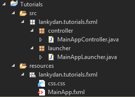

JavaFX is used to create desktop applications and internet applications. It is meant to replace Swing as the main GUI library that comes included with Java SE. This post will cover some of the basics to help get started with using JavaFX.

Before I start giving out code examples I am going to insist that you use [Scene Builder](http://gluonhq.com/labs/scene-builder/) to help design the GUI's that you make. It is a drag and drop application so you can simply move the components you want on your application to where you want them and Scene Builder will write the code for you. If you use Eclipse like I currently am you can install the plugin `e(fx)clipse` which will let you access Scene Builder directly from Eclipse and also brings some other useful tools with it as well.

Now we can get started. JavaFX allows the GUI's to be written in using `.fxml` files. As the the extension suggests this is a form of XML. The main benefit of using this form is that it inherently separates the View from the Controller as it is best practice to use MVC (Model - View - Controller) pattern when writing JavaFX applications. The FXML is not able to control anything it simply displays information. All the controlling will be used in the aptly named Controller class which can include actions that are referenced in the FXML. So when a button is pressed it will fire an ActionEvent which will be caught by the relevant listener in the Controller which will then perform some sort of process.

The example in this post is quite simple and is ignoring the Model from MVC pattern. It will demonstrate how to launch, display and control a JavaFX application.

First comes the simplest part which is the launcher. It must extend Application and all it does is reference a FXML file (which will be shown later) and uses this to create a new scene.

```java
public class MainAppLauncher extends Application {

	public static void main(String[] args) {
		Application.launch(MainAppLauncher.class, args);
	}

	@Override
	public void start(Stage stage) throws Exception {
		try {
			Parent root = FXMLLoader.load(getClass().getClassLoader()
					.getResource("lankydan/tutorials/fxml/MainApp.fxml"));
			stage.setScene(new Scene(root));
			stage.show();
		} catch (Exception e) {
			
		}
	}
}
```

As the launcher contains a reference to the FXML it only makes sense to go onto this part next. As mentioned earlier I recommend using [Scene Builder](http://gluonhq.com/labs/scene-builder/) to write the code for you.

```xml
<?xml version="1.0" encoding="UTF-8"?>

<?import javafx.scene.control.Button?>
<?import javafx.scene.control.Label?>
<?import javafx.scene.control.TextField?>
<?import javafx.scene.layout.AnchorPane?>
<?import javafx.scene.text.Font?>

<AnchorPane id="anchorPane" prefHeight="154.0" prefWidth="365.0" styleClass="root" stylesheets="lankydan/tutorials/fxml/css.css" xmlns="http://javafx.com/javafx/8.0.111" xmlns:fx="http://javafx.com/fxml/1" fx:controller="lankydan.tutorials.fxml.controller.MainAppController">
	<children>
		<AnchorPane prefHeight="154.0" prefWidth="271.0">
			<children>
				<Button fx:id="randomColorButton" layoutY="86.0" mnemonicParsing="false" onAction="#handleRandomColorButtonAction" prefHeight="31.0" prefWidth="271.0" text="Random" />
				<Label alignment="CENTER" layoutY="-1.0" prefHeight="87.0" prefWidth="271.0" text="Color Changer App" textAlignment="CENTER">
					<font>
						<Font size="16.0" />
					</font>
				</Label>
				<TextField fx:id="colorTextField" layoutY="117.0" onAction="#handleColorTextFieldAction" prefHeight="31.0" prefWidth="271.0" promptText="Enter a hex/rgb/named color" />
			</children>
		</AnchorPane>
		<Label fx:id="colorLabel" layoutX="271.0" prefHeight="154.0" prefWidth="124.0" />
	</children>
</AnchorPane>
```

Some of the first things you will notice while looking at this code is that it uses a style sheet and references a Controller (both of these will be shown later). The Controller is referenced using the `fx:controller` notation. Further down you will see another notation called `fx:id` which names the component so it can be referenced from inside the Controller class. Another important part of these components are the onAction's. So if a button with `onAction="#handleRandomColorButtonAction"` is pressed it will fire a ActionEvent to the Controller and will be caught by the method named `handleRandomColorButtonAction(ActionEvent event)`.

Its probably a good time to mentioned the Controller's code now.

```java
public class MainAppController implements Initializable {

	@FXML
	private Button randomColorButton;

	@FXML
	private TextField colorTextField;

	@FXML
	private Label colorLabel;

	private final Random randomNumberGenerator = new Random();

	@Override
	public void initialize(final URL url, final ResourceBundle rb) {
		setInitialLabelColor();
	}

	private void setInitialLabelColor() {
		setLabelColor(Color.CADETBLUE.toString());
	}

	private void setLabelColor(final String colorString) {
		try {
			final Color color = Color.valueOf(colorString);
			colorLabel.setStyle(
					"-fx-background-color: #" + color.toString().substring(2));
		} catch (NullPointerException | IllegalArgumentException e) {
			// Do nothing
		}

	}

	@FXML
	private void handleRandomColorButtonAction(final ActionEvent event) {
		setLabelColor(generateRandomColorString());
	}

	private String generateRandomColorString() {
		final double red = randomNumberGenerator.nextDouble();
		final double green = randomNumberGenerator.nextDouble();
		final double blue = randomNumberGenerator.nextDouble();
		return Color.color(red, green, blue).toString();
	}

	@FXML
	private void handleColorTextFieldAction(final ActionEvent event) {
		final String colorString = colorTextField.getText();
		if (!colorString.isEmpty()) {
			setLabelColor(colorTextField.getText());
		}
	}

}
```

Firstly the Controller must implement Initializable. It includes `@FXML` anotations which are what link up to the `fx:id`'s and `onAction`'s that are defined in the FXML. It allows the components that are marked with the `@FXML` annotations to be controlled from within the Java code, such as changing the style of a component or adding text into a TextField.

The code below demonstrates the use of `@FXML` notation:

```java
@FXML
private Button randomColorButton;
```

```java
@FXML
private void handleRandomColorButtonAction(final ActionEvent event) {
  setLabelColor(generateRandomColorString());
}
```

```xml
<Button fx:id="randomColorButton" layoutY="86.0" mnemonicParsing="false" onAction="#handleRandomColorButtonAction" prefHeight="31.0" prefWidth="271.0" text="Random" />
```

At this point a working JavaFX application will have been produced but it wont look that nice unless you are happy with the default JavaFX style. The simplest way to change the look and feel of the application is through the use of CSS. Simply reference the style sheet from within the root component of the FXML code. Annoyingly the CSS used in JavaFX differs from others used in HTML for example and uses its own notations. A good place to look for these notations is the [JavaFX CSS Reference Guide](https://docs.oracle.com/javafx/2/api/javafx/scene/doc-files/cssref.html). Below I have added the CSS that I used within this application.

```css
#pane, .root{
    -fx-background-color: #353434;
    -fx-foreground-color: #353434;
}

.background {
    -fx-background-color: #674A44;
    -fx-foreground-color: #353434;
}

.label {
    -fx-font-size: 14pt;
    -fx-font-family: "Segoe UI Semibold";
    -fx-text-fill: white;
    -fx-background-color: #353434;
}

.text-field {
    -fx-font-size: 12pt;
    -fx-font-family: "Segoe UI Semibold";
}

.button {
    -fx-padding: 5 22 5 22;   
    -fx-border-color: #353434;
    -fx-border-width: 0;
    -fx-background-radius: 0;
    -fx-background-color: derive(#353434,20%);
    -fx-font-family: "Segoe UI", Helvetica, Arial, sans-serif;
    -fx-font-size: 11pt;
    -fx-text-fill: #d8d8d8;
    -fx-background-insets: 0 0 0 0, 0, 1, 2;
}

.button:hover {
    -fx-background-color: #3a3a3a;
}

.button:pressed, .button:default:hover:pressed {
  -fx-background-color: #bdbcbc;
  -fx-text-fill: black;
}

.button:disabled, .button:default:disabled {
    -fx-opacity: 0.4;
    -fx-background-color: #353434;
    -fx-text-fill: white;
}

.button:default {
    -fx-background-color: -fx-focus-color;
    -fx-text-fill: #ffffff;
}

.button:default:hover {
    -fx-background-color: derive(-fx-focus-color,30%);
}

.text-field {
	-fx-focus-color:transparent;
	-fx-faint-focus-color:transparent;
	-fx-background-color: #575758;
	-fx-text-fill: white;
}
```

One of the more annoying things I encountered while I tried to use JavaFX for the first time was getting accessing my files correctly. The references that are inside the MainAppLauncher and MainApp.fxml need to be correct and if they are wrong you are going to have a bad time. Unfortunately it will just say Location is required as if its trying to taunt you. Therefore I have included the file structure I used for this post as to hopefully lessen the pain caused by this.



Now that you have reached this point you should have a fully working JavaFX application. I will try and make some follow up posts to this one explaining some of the other features of JavaFX.
