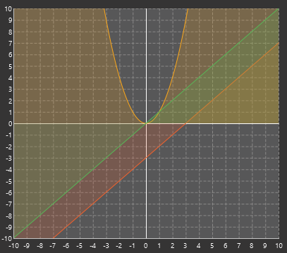
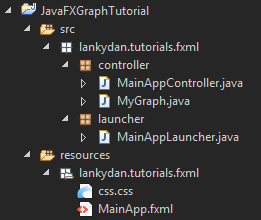
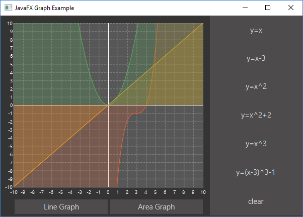
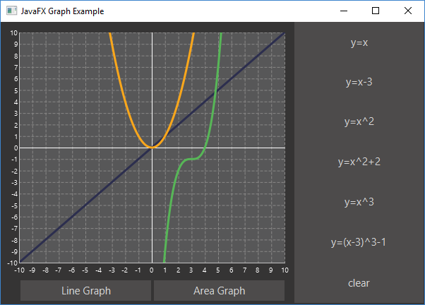

When I was doing my 3rd year project in university I needed a good looking chart to use in my user interface and now I have grown older (nearly 2 whole years!) I wish I would have turned to the charts in JavaFX rather than the ugly looking JChart2D API that I used. Now don't get me wrong I'm not hating on JChart2D as it was easy to use and at the time I was really happy with it. But the charts / graphs that you can use in JavaFX look really good, they even come with some fancy animations by default. Okay, I'm finished hyping up these graphs, so I'm going to show you a little example application I wrote and hopefully you will feel the same about them as me...



Before you go any further I recommend that you read up on the basics of using JavaFX, my other post [Getting started with JavaFX](https://lankydanblog.wordpress.com/2017/01/08/getting-started-with-javafx/) covers this.

In this post I will cover the basic use of a `LineChart` and `AreaChart`. The code is pretty simple and only requires a little bit of set up in the `Controller` and `fxml`. All you need to do is add the chart to the `fxml` code, give it a `fx:id`, set up it's properties to your liking and your done.

```xml
<LineChart fx:id="lineGraph" createSymbols="false" legendVisible="false" prefHeight="372.0" prefWidth="423.0" visible="false">
  <xAxis>
    <NumberAxis autoRanging="false" lowerBound="-10" side="BOTTOM" tickUnit="1" upperBound="10" />
  </xAxis>
  <yAxis>
    <NumberAxis autoRanging="false" lowerBound="-10" side="LEFT" tickUnit="1" upperBound="10" />
  </yAxis>
  <cursor>
    <Cursor fx:constant="CROSSHAIR" />
  </cursor>
</LineChart>
```

This is this the set up for the `LineChart`. It defines the axis's upper and lower bounds which will change the chart to look more like a graph. By setting the lower bound of the x or y axis will cause the chart to auto draw lines to represent the axis that will pass through the coordinates (0,0). The `tickUnit` represents how separated the grid lines on the chart are and `autoRanging` has also been disabled to prevent the chart from resizing itself to best fit the content that is on the chart. Finally a cursor has been defined, there are a few other cursors that can be used but I think the crosshair cursor looks the best.

Now you know how to create the chart your going to need to know how to plot some points onto it, unless you are happy with it being empty...

```java
public void plotLine() {
	final XYChart.Series<Double, Double> series = new XYChart.Series<Double, Double>();
	for (double x = -range; x <= range; x = x + 0.01) {
		series.getData().add(new XYChart.Data<Double, Double>(x, Math.pow(x, 2)));
	}
	graph.getData().add(series);
}
```

Here we are creating a new `series` object which will contain the plotted points.

```java
final XYChart.Series<Double, Double> series = new XYChart.Series<Double, Double>();
```

Then adding the plots to the `series`.

```java
series.getData().add(new XYChart.Data<Double, Double>(x, Math.pow(x, 2)));
```

The plotted coordinates are stored in the form of (x,y) so in the example above the x coordinate has the value `x` and the y coordinate takes the value of `x^2`.</span>

The final step is to add the `series` to the chart.

```java
graph.getData().add(series);
```

After this has been done the points will be plotted onto the chart and will be connected together between each plot. The order that the plots (`XYChart.Data`) are added to the series does not matter as it will connect the closest plots to each other, although this isn't relevant if your adding plots from loops.

Now that the basics of using these charts is covered lets get onto a larger example. Below is all the code your need to get setup.

```java

public class MainAppLauncher extends Application {

	public static void main(String[] args) {
		Application.launch(MainAppLauncher.class, args);
	}

	@Override
	public void start(Stage stage) throws Exception {
		try {
			Parent root = FXMLLoader.load(getClass().getClassLoader()
					.getResource("lankydan/tutorials/fxml/MainApp.fxml"));
			stage.setScene(new Scene(root));
			stage.setTitle("JavaFX Graph Example");
			stage.show();
		} catch (Exception e) {
			System.out.print(e);
		}
	}
}
```

`MainAppLauncher` is used to load run the JavaFX code.

```java
public class MainAppController implements Initializable {

	@FXML
	private LineChart<Double, Double> lineGraph;

	@FXML
	private AreaChart<Double, Double> areaGraph;

	@FXML
	private Button lineGraphButton;

	@FXML
	private Button areaGraphButton;

	@FXML
	private Button xyButton;

	@FXML
	private Button xyButton2;

	@FXML
	private Button squaredButton;

	@FXML
	private Button squaredButton2;

	@FXML
	private Button cubedButton;

	@FXML
	private Button cubedButton2;

	@FXML
	private Button clearButton;

	private MyGraph mathsGraph;
	private MyGraph areaMathsGraph;

	@Override
	public void initialize(final URL url, final ResourceBundle rb) {
		mathsGraph = new MyGraph(lineGraph, 10);
		areaMathsGraph = new MyGraph(areaGraph, 10);
	}

	@FXML
	private void handleLineGraphButtonAction(final ActionEvent event) {
		lineGraph.setVisible(true);
		areaGraph.setVisible(false);
	}

	@FXML
	private void handleAreaGraphButtonAction(final ActionEvent event) {
		areaGraph.setVisible(true);
		lineGraph.setVisible(false);
	}

	@FXML
	private void handleXYButtonAction(final ActionEvent event) {
		plotLine(x -> x);
	}

	private void plotLine(Function<Double, Double> function) {
		if (lineGraph.isVisible()) {
			mathsGraph.plotLine(function);
		} else {
			areaMathsGraph.plotLine(function);
		}
	}

	@FXML
	private void handleXYButton2Action(final ActionEvent event) {
		plotLine(x -> x - 3);
	}

	@FXML
	private void handleSquaredButtonAction(final ActionEvent event) {
		plotLine(x -> Math.pow(x, 2));
	}

	@FXML
	private void handleSquaredButton2Action(final ActionEvent event) {
		plotLine(x -> Math.pow(x, 2) + 2);
	}

	@FXML
	private void handleCubedButtonAction(final ActionEvent event) {
		plotLine(x -> Math.pow(x, 3));
	}

	@FXML
	private void handleCubedButton2Action(final ActionEvent event) {
		plotLine(x -> Math.pow(x - 3, 3) - 1);
	}

	@FXML
	private void handleClearButtonAction(final ActionEvent event) {
		clear();
	}

	private void clear() {
		if (lineGraph.isVisible()) {
			mathsGraph.clear();
		} else {
			areaMathsGraph.clear();
		}
	}
}
```

`MainAppController` is the center piece of this code which controls the chart by handling the `ActionEvents` fired by button presses, which in this example leads to the lines being drawn onto the chart. I have also used some [lambda expressions](https://lankydanblog.wordpress.com/2017/01/14/a-little-lambda-tutorial/) in this example to make the code shorter and a little bit fancier.

```java
public class MyGraph {

	private XYChart<Double, Double> graph;
	private double range;

	public MyGraph(final XYChart<Double, Double> graph, final double range) {
		this.graph = graph;
		this.range = range;
	}

	public void plotLine(final Function<Double, Double> function) {
		final XYChart.Series<Double, Double> series = new XYChart.Series<Double, Double>();
		for (double x = -range; x <= range; x = x + 0.01) {
			plotPoint(x, function.apply(x), series);
		}
		graph.getData().add(series);
	}

	private void plotPoint(final double x, final double y,
			final XYChart.Series<Double, Double> series) {
		series.getData().add(new XYChart.Data<Double, Double>(x, y));
	}

	public void clear() {
		graph.getData().clear();
	}
}
```

`MyGraph` is a wrapper object that takes in a `XYChart` which both `LineChart` and `AreaChart` are and has some methods to plot and clear lines. This code could be in `MainAppController` as there isn't much code in it but it looks much tidier like this. It uses the `plotLine` code shown above although it is split out into a two methods instead.

```xml
<?xml version="1.0" encoding="UTF-8"?>

<?import javafx.scene.Cursor?>
<?import javafx.scene.chart.AreaChart?>
<?import javafx.scene.chart.LineChart?>
<?import javafx.scene.chart.NumberAxis?>
<?import javafx.scene.control.Button?>
<?import javafx.scene.layout.AnchorPane?>
<?import javafx.scene.layout.VBox?>

<AnchorPane maxHeight="400.0" maxWidth="600.0" minHeight="400.0" minWidth="600.0" prefHeight="400.0" prefWidth="600.0" styleClass="root" stylesheets="lankydan/tutorials/fxml/css.css" xmlns="http://javafx.com/javafx/8.0.111" xmlns:fx="http://javafx.com/fxml/1" fx:controller="lankydan.tutorials.fxml.controller.MainAppController">
   <children>
    <AnchorPane layoutX="416.0" minHeight="0.0" minWidth="0.0" prefHeight="400.0" prefWidth="185.0">
         <children>
            <VBox prefHeight="398.0" prefWidth="183.0">
               <children>
                  <Button mnemonicParsing="false" onAction="#handleXYButtonAction" prefHeight="66.0" prefWidth="193.0" text="y=x" fx:id="xyButton" />
                  <Button mnemonicParsing="false" onAction="#handleXYButton2Action" prefHeight="66.0" prefWidth="207.0" text="y=x-3" fx:id="xyButton2" />
                  <Button fx:id="squaredButton" mnemonicParsing="false" onAction="#handleSquaredButtonAction" prefHeight="67.0" prefWidth="220.0" text="y=x^2" />
                  <Button fx:id="squaredButton2" mnemonicParsing="false" onAction="#handleSquaredButton2Action" prefHeight="67.0" prefWidth="232.0" text="y=x^2+2" />
                  <Button fx:id="cubedButton" mnemonicParsing="false" onAction="#handleCubedButtonAction" prefHeight="67.0" prefWidth="236.0" text="y=x^3" />
                  <Button fx:id="cubedButton2" mnemonicParsing="false" onAction="#handleCubedButton2Action" prefHeight="67.0" prefWidth="266.0" text="y=(x-3)^3-1" />
                  <Button fx:id="clearButton" mnemonicParsing="false" onAction="#handleClearButtonAction" prefHeight="67.0" prefWidth="266.0" text="clear" />
               </children>
            </VBox>
         </children>
      </AnchorPane>
      <AnchorPane layoutX="-7.0" prefHeight="400.0" prefWidth="420.0">
         <children>
            <LineChart fx:id="lineGraph" legendVisible="false" prefHeight="372.0" prefWidth="423.0" visible="false">
              <xAxis>
              	<NumberAxis autoRanging="false" lowerBound="-10" side="BOTTOM" tickUnit="1" upperBound="10" />
              </xAxis>
              <yAxis>
                <NumberAxis autoRanging="false" lowerBound="-10" side="LEFT" tickUnit="1" upperBound="10" />
              </yAxis>
              <cursor>
                 <Cursor fx:constant="CROSSHAIR" />
              </cursor>
            </LineChart>
            <AreaChart fx:id="areaGraph" legendVisible="false" prefHeight="372.0" prefWidth="423.0">
              <xAxis>
              	<NumberAxis autoRanging="false" lowerBound="-10" side="BOTTOM" tickUnit="1" upperBound="10" />
              </xAxis>
              <yAxis>
                <NumberAxis autoRanging="false" lowerBound="-10" side="LEFT" tickUnit="1" upperBound="10" />
              </yAxis>
              <cursor>
                 <Cursor fx:constant="CROSSHAIR" />
              </cursor>
            </AreaChart>
            <Button fx:id="lineGraphButton" onAction="#handleLineGraphButtonAction" layoutX="35.0" layoutY="366.0" mnemonicParsing="false" prefHeight="29.0" prefWidth="185.0" text="Line Graph" />
            <Button layoutX="224.0" onAction="#handleAreaGraphButtonAction" layoutY="366.0" mnemonicParsing="false" prefHeight="29.0" prefWidth="185.0" text="Area Graph" />
         </children>
      </AnchorPane>
   </children>
</AnchorPane>
```

`MainApp.fxml` contains all the code to set up the visuals of the application.

```css
#pane, .root, .split-pane{
    -fx-background-color: #353434;
    -fx-foreground-color: #353434;
}

.default-color0.chart-series-line { -fx-stroke: #2c2e4e; }

.chart-vertical-zero-line {
    -fx-stroke: white;
}
.chart-horizontal-zero-line {
    -fx-stroke: white;
}

.chart-plot-background {
    -fx-background-color: #575758;
    -fx-foreground-color: white;
    -fx-stroke: white;
} 

.chart-vertical-grid-lines {
    -fx-stroke: #898887;
}
.chart-horizontal-grid-lines {
    -fx-stroke: #898887;
}
.chart-alternative-row-fill {
    -fx-fill: transparent;
    -fx-stroke: transparent;
    -fx-stroke-width: 0;
}

.axis {
	-fx-stroke: white;
	-fx-fill: white;
    -fx-font-size: 1.4em;    
    -fx-tick-label-fill: white;
    -fx-font-family: Tahoma;
    -fx-tick-length: 0;
    -fx-minor-tick-length: 0;
}

.background {
    -fx-background-color: #674A44;
    -fx-foreground-color: #353434;
}

.button {
    -fx-padding: 5 22 5 22;   
    -fx-border-color: #353434;
    -fx-border-width: 0;
    -fx-background-radius: 0;
    -fx-background-color: derive(#353434,20%);
    -fx-font-family: "Segoe UI", Helvetica, Arial, sans-serif;
    -fx-font-size: 11pt;
    -fx-text-fill: #d8d8d8;
    -fx-background-insets: 0 0 0 0, 0, 1, 2;
}

.button:hover {
    -fx-background-color: #3a3a3a;
}

.button:pressed, .button:default:hover:pressed {
  -fx-background-color: #bdbcbc;
  -fx-text-fill: black;
}

.button:disabled, .button:default:disabled {
    -fx-opacity: 0.4;
    -fx-background-color: #353434;
    -fx-text-fill: white;
}

.button:default {
    -fx-background-color: -fx-focus-color;
    -fx-text-fill: #ffffff;
}

.button:default:hover {
    -fx-background-color: derive(-fx-focus-color,30%);
}

.text-area .content {
	-fx-background-color: #575758;
}
```

`css.css` is the `stylesheet` that is used for this application and is referenced inside of `MainApp.fxml`.

If you try to run this by yourself there are a few changes you will need to remember to make otherwise you are going to run into some errors. Make sure that you have your files structured well or understand how the paths to the files work. Below is a picture of how I structured my files.



Once you have sorted out your project structure remember to rename the paths in your code to match the structure and names you have chosen. This includes the path in `MainAppLauncher` and the paths to the `controller` and `css` in `MainApp.fxml`.

Once everything has been put together correctly you should be able to run it and it will look like this.



And by pressing the Line Graph button it will look like this.



So now that you have seen a little bit of what the charts in JavaFX have to offer you might consider using it when your writing some of your own applications. They are pretty easy to setup and come with some decent styles and animations by default. I will write a few more posts on how to use some of the other charts in the future.
