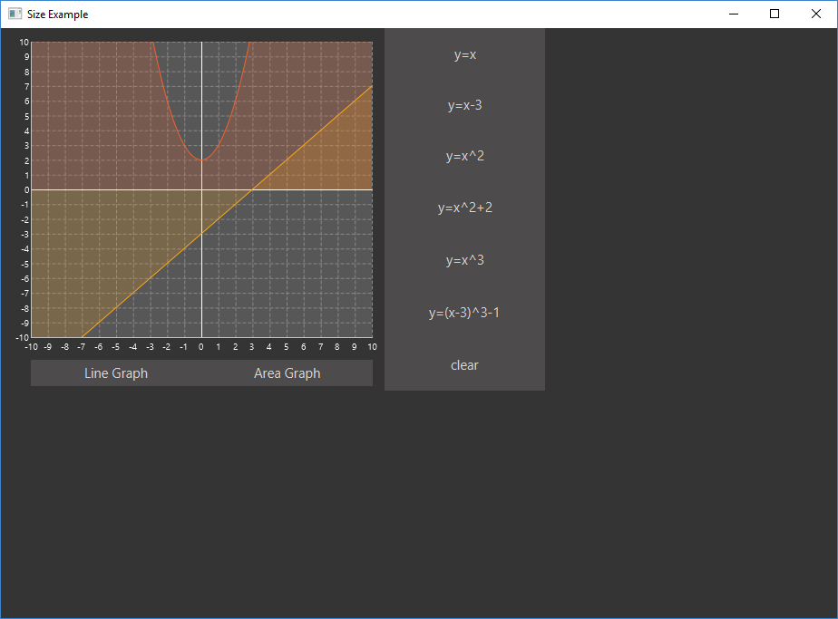
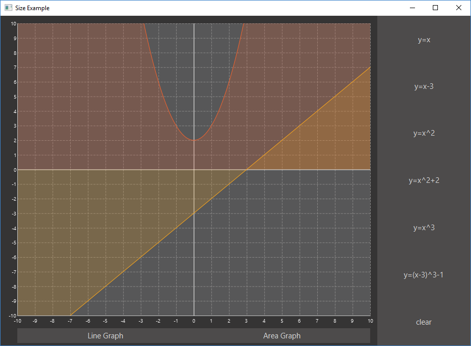

Does size matter? That's a question that's been around for a while and the answer is up for debate. But this is JavaFX and the answer is a resounding yes size does matter. I'm not saying that user interfaces need to bigger to be better, I'm talking about controlling size. If you don't control it properly you will end up having undesirable results, what  if the user makes the window so small that part of the display gets cut out never to be seen again, unless the window is made larger again of course. Maybe its resized so large that there is loads of empty space around the edge of the interface. So your going to need to keep size under control and your in luck as in this post I will cover some ways to do this.



I am going to be reusing some of the code that I wrote in previous posts, so have a look at [Getting Started with JavaFX](https://lankydan.dev/2017/01/08/getting-started-with-javafx/) and [JavaFX Charts look pretty good!](https://lankydan.dev/2017/01/29/javafx-graphs-look-pretty-good/) for explanations of some of the code that will be used here.

A good place to start is controlling the minimum and maximum size of the window, although controlling the maximum size is not as useful as you will probably want users to be able to full screen the application. The window is know as the `Stage` in terms of JavaFX so to control the min/max size of the window some properties on the `Stage` will need to be adjusted.

```java
public class SizeAppLauncher extends Application {

	public static void main(String[] args) {
		Application.launch(SizeAppLauncher.class, args);
	}

	@Override
	public void start(Stage stage) throws Exception {
		try {
			final Parent root = FXMLLoader.load(getClass().getClassLoader()
					.getResource("lankydan/tutorials/fxml/SizeApp.fxml"));
			final Scene scene = new Scene(root);
			stage.setScene(scene);
			stage.setTitle("Size Example");
			
			stage.setMinHeight(250);
			stage.setMinWidth(500);
			
			stage.setMaxHeight(500);
			stage.setMaxWidth(1000);
			
			stage.show();
		} catch (Exception e) {
			System.out.print(e);
		}
	}
}
```

There's not much to explain here, all you need to do is call the `setMaxHeight`, `setMaxWidth`, `setMinHeight` and `setMinWidth` methods and pass in the sizes that you want to restrict the `Stage` to. If you decide that you don't want to restrict the maximum size then just remove the set max methods and its all done. Now removing the max size is not a big deal but not controlling the minimum size of the window could make your application act unexpectedly. Its not a definite requirement as users do not normally make the windows really small but if it is possible for them to do so then someone will inevitably do it, so you've been warned.

Maintaining the aspect ratio of the window is also possible with a few lines of code, although it acts unexpectedly when decreasing size, which is pretty annoying... So take this with a pinch of salt as I personally don't like using it very much.

```java
public class SizeAppLauncher extends Application {

	public static void main(String[] args) {
		Application.launch(SizeAppLauncher.class, args);
	}

	@Override
	public void start(Stage stage) throws Exception {
		try {
			final Parent root = FXMLLoader.load(getClass().getClassLoader()
					.getResource("lankydan/tutorials/fxml/SizeApp.fxml"));
			final Scene scene = new Scene(root);
			stage.setScene(scene);
			stage.setTitle("Size Example");

			stage.minWidthProperty().bind(scene.heightProperty().multiply(1.5));
			stage.minHeightProperty().bind(scene.widthProperty().divide(1.5));

			stage.show();
		} catch (Exception e) {
			System.out.print(e);
		}
	}
}
```

The lines to control the min/max size of the `Stage` have been removed as the code to maintain the aspect ratio overrides its function, you could try it for yourself and put them back in and increase / decrease the windows size and see that it doesn't prevent you from doing it.

That's enough about controlling the size of the window, your going to need to know how to setup the components inside of it as well or they might go crazy or disappear off the edge of the window. We're going to need to use some re-sizable components to do this such as `AnchorPane`, `Hbox` and `VBox` and use some anchors to control them.

```xml
<?xml version="1.0" encoding="UTF-8"?>

<?import javafx.scene.Cursor?>
<?import javafx.scene.chart.AreaChart?>
<?import javafx.scene.chart.LineChart?>
<?import javafx.scene.chart.NumberAxis?>
<?import javafx.scene.control.Button?>
<?import javafx.scene.layout.AnchorPane?>
<?import javafx.scene.layout.HBox?>
<?import javafx.scene.layout.VBox?>

<AnchorPane maxHeight="400.0" maxWidth="600.0" minHeight="400.0" minWidth="600.0" prefHeight="400.0" prefWidth="600.0" styleClass="root" stylesheets="lankydan/tutorials/fxml/css.css" xmlns="http://javafx.com/javafx/8.0.111" xmlns:fx="http://javafx.com/fxml/1" fx:controller="lankydan.tutorials.fxml.controller.MainAppController">
   <children>
      <HBox prefHeight="400.0" prefWidth="600.0" AnchorPane.bottomAnchor="0.0" AnchorPane.leftAnchor="0.0" AnchorPane.rightAnchor="0.0" AnchorPane.topAnchor="0.0">
         <children>
            <AnchorPane prefHeight="400.0" prefWidth="420.0" HBox.hgrow="ALWAYS">
               <children>
                  <LineChart fx:id="lineGraph" createSymbols="false" legendVisible="false" prefWidth="423.0" visible="false" AnchorPane.bottomAnchor="28.0" AnchorPane.leftAnchor="0.0" AnchorPane.rightAnchor="0.0" AnchorPane.topAnchor="0.0">
                    <xAxis>
                    	<NumberAxis autoRanging="false" lowerBound="-10" side="BOTTOM" tickUnit="1" upperBound="10" />
                    </xAxis>
                    <yAxis>
                      <NumberAxis autoRanging="false" lowerBound="-10" side="LEFT" tickUnit="1" upperBound="10" />
                    </yAxis>
                    <cursor>
                       <Cursor fx:constant="CROSSHAIR" />
                    </cursor>
                  </LineChart>
                  <AreaChart fx:id="areaGraph" createSymbols="false" legendVisible="false" prefHeight="372.0" prefWidth="423.0" AnchorPane.bottomAnchor="28.0" AnchorPane.leftAnchor="0.0" AnchorPane.rightAnchor="0.0" AnchorPane.topAnchor="0.0">
                    <xAxis>
                    	<NumberAxis autoRanging="false" lowerBound="-10" side="BOTTOM" tickUnit="1" upperBound="10" />
                    </xAxis>
                    <yAxis>
                      <NumberAxis autoRanging="false" lowerBound="-10" side="LEFT" tickUnit="1" upperBound="10" />
                    </yAxis>
                    <cursor>
                       <Cursor fx:constant="CROSSHAIR" />
                    </cursor>
                  </AreaChart>
                  <HBox layoutX="33.0" layoutY="366.0" prefHeight="29.0" prefWidth="377.0" AnchorPane.bottomAnchor="5.0" AnchorPane.leftAnchor="33.0" AnchorPane.rightAnchor="13.0">
                     <children>
                        <Button fx:id="lineGraphButton" maxWidth="Infinity" mnemonicParsing="false" onAction="#handleLineGraphButtonAction" prefHeight="29.0" prefWidth="183.0" text="Line Graph" HBox.hgrow="ALWAYS" />
                        <Button maxWidth="Infinity" mnemonicParsing="false" onAction="#handleAreaGraphButtonAction" prefHeight="29.0" prefWidth="184.0" text="Area Graph" HBox.hgrow="ALWAYS" />
                     </children>
                  </HBox>
               </children>
            </AnchorPane>
            <VBox prefHeight="398.0" prefWidth="183.0" HBox.hgrow="NEVER">
               <children>
                  <Button maxHeight="Infinity" mnemonicParsing="false" onAction="#handleXYButtonAction" prefHeight="66.0" prefWidth="266.0" text="y=x" VBox.vgrow="ALWAYS" fx:id="xyButton" />
                  <Button maxHeight="Infinity" mnemonicParsing="false" onAction="#handleXYButton2Action" prefHeight="66.0" prefWidth="266.0" text="y=x-3" VBox.vgrow="ALWAYS" fx:id="xyButton2" />
                  <Button fx:id="squaredButton" maxHeight="Infinity" mnemonicParsing="false" onAction="#handleSquaredButtonAction" prefHeight="67.0" prefWidth="266.0" text="y=x^2" VBox.vgrow="ALWAYS" />
                  <Button fx:id="squaredButton2" maxHeight="Infinity" mnemonicParsing="false" onAction="#handleSquaredButton2Action" prefHeight="67.0" prefWidth="266.0" text="y=x^2+2" VBox.vgrow="ALWAYS" />
                  <Button fx:id="cubedButton" maxHeight="Infinity" mnemonicParsing="false" onAction="#handleCubedButtonAction" prefHeight="67.0" prefWidth="266.0" text="y=x^3" VBox.vgrow="ALWAYS" />
                  <Button fx:id="cubedButton2" maxHeight="Infinity" mnemonicParsing="false" onAction="#handleCubedButton2Action" prefHeight="67.0" prefWidth="266.0" text="y=(x-3)^3-1" VBox.vgrow="ALWAYS" />
                  <Button fx:id="clearButton" maxHeight="Infinity" mnemonicParsing="false" onAction="#handleClearButtonAction" prefHeight="67.0" prefWidth="266.0" text="clear" VBox.vgrow="ALWAYS" />
               </children>
            </VBox>
         </children>
      </HBox>
   </children>
</AnchorPane>
```

I know that's a lot of code to take in so I'm going to break it down for you.

```xml
AnchorPane.bottomAnchor="0.0" AnchorPane.leftAnchor="0.0" AnchorPane.rightAnchor="0.0" AnchorPane.topAnchor="0.0"
```

This piece of code is taken out of one of the `HBox` tags and anchors it to each side of the `AnchorPane` that is the `HBox`'s parent. The "0.0" means that it is anchored to the edge of the parent so if this was made to be "5.0" then it is anchored to 5 units from each edge.

To make this a bit clearer.

```xml
AnchorPane.bottomAnchor="5.0"
```

This means the bottom of the `HBox` is anchored to be 5 units from the `AnchorPane`'s bottom edge.

```xml
AnchorPane.leftAnchor="100.0"
```

And this one means that the left of the `HBox` is anchored to be 100 units from the left of the parent `AnchorPane`'s left edge.

Some more properties are coming your way.

```xml
HBox.hgrow="ALWAYS"
```

Use this to make components inside a HBox grow horizontally when the HBox changes size, if you don't want it to change then use...

```xml
HBox.hgrow="NEVER"
```

Components inside VBox's can also use a very similar property but instead of changing horizontally they will grow or shrink vertically.

```xml
VBox.vgrow="ALWAYS"
```

The examples above have used `ALWAYS` and `NEVER` but you can also use the values `INHERIT` and `SOMETIMES`. They seem pretty straight forward where `INHERIT` will take the property of its parent and honestly I've not used the `SOMETIMES` option but I guess it sometimes changes the size...

The last thing of note in this example is the maximum height or width of the buttons.

```xml
maxHeight="Infinity"
maxWidth="Infinity"
```

Without these properties inside of the `Button` tags they will not grow to fit their `Hbox` or `Vbox` parent even though each `Button` has defined either the `vgrow` or `hgrow` property.

Adding this all together will leave you looking with a much nicer application.



That's the end of this little tutorial. As you can see, size does matter. So go tell that to all your friends, just remember to tell them you are talking about JavaFX or they might get the wrong impression!

Here is a [link](https://github.com/lankydan/JavaFX-Size-Example) to all the code if you just want to plug in and go.