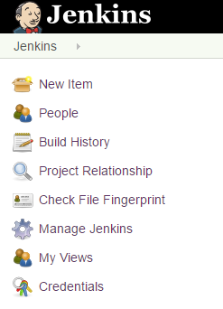
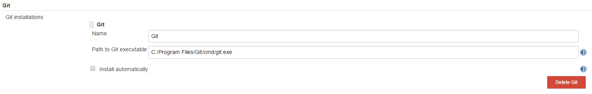
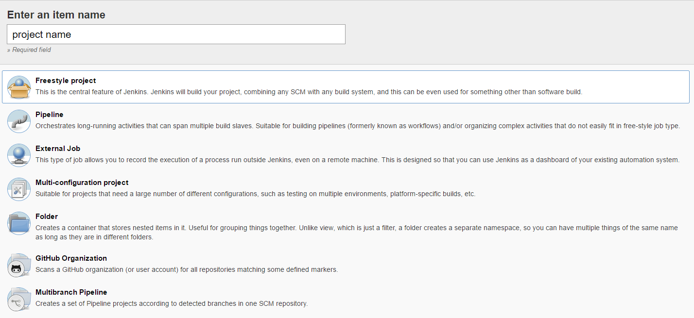
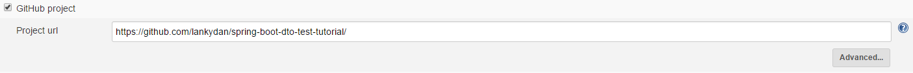
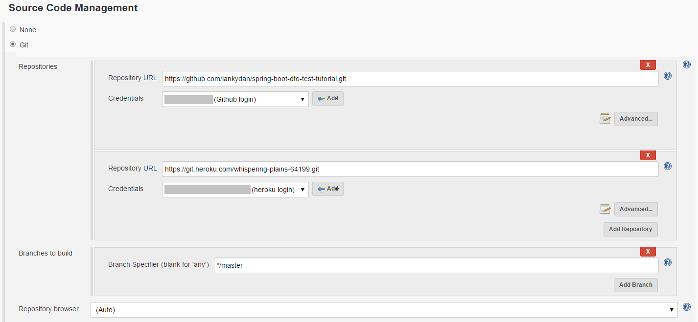
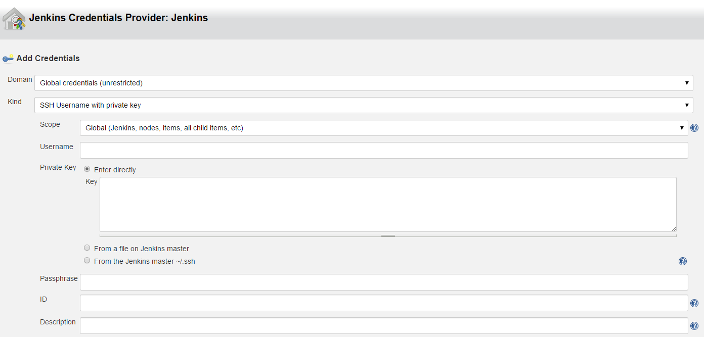
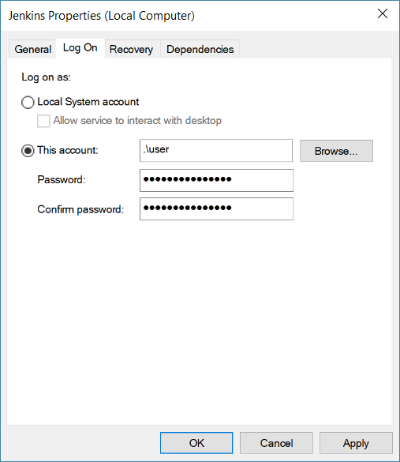
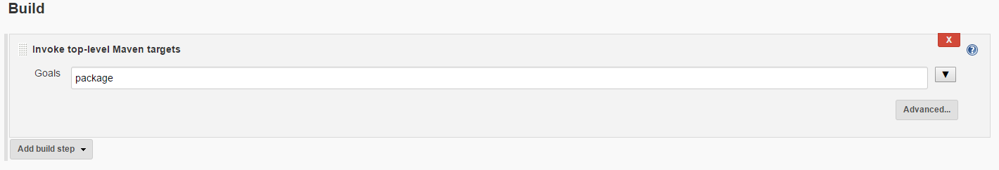
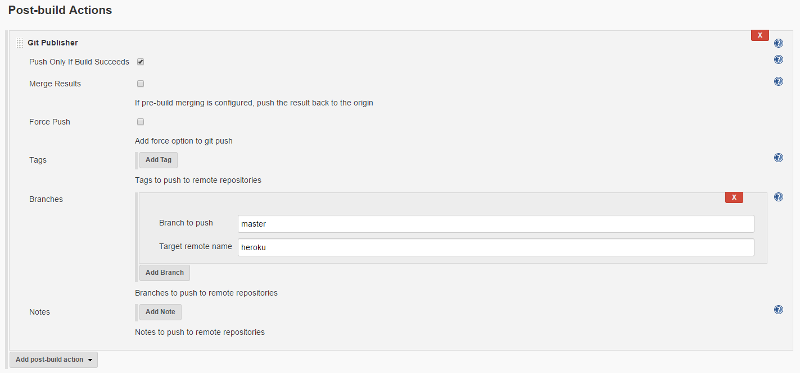

Jenkins is a open source automation server that allows users to setup workflows to that can enable continuous integration. For example a user could create a workflow that would pull some code from a repository, run some tests and deploy it onto a server, removing a lot of the user interaction from process so the user can keep on writing code and only have to pay attention if something goes wrong. This is what we will look at in this post, firstly we will need to setup Jenkins and then create a process/workflow/build (you can call it whatever you want). We will be using Heroku for the server as it allows Java applications to be hosted where Spring Boot will be utilised to do so. On a side note I tried to do this with a Ruby on Rails app originally but I got all sorts of problems arising due to using Windows...

In case you didn't read all of the introduction, as I personally use Windows some of the configuration in this post is tailored towards it and might not be required on other operating systems.

Some prerequisits before we continue, this post assumes that you already have Git and Maven installed on your machine, access to a GitHub account and repository and a Heroku account.

The first thing we need to do is install Jenkins which you can download from the [Jenkins website](https://jenkins.io/download/). As I use Windows I decided to download the version for Windows... Once downloaded start the installation and eventually you will be directed to a webpage which will continue the rest of the installation. Here you will need to chose whether you want the standard or custom install, the standard install contains all the plugins that are required for this post.

You should now be able to access Jenkins by going to `localhost:8080` in your browser. The screen is going to be pretty empty due to no builds existing, but everything we need at the moment can be found on the left-hand side of the screen.



From here we need to select `Manage Jenkins` and on the next screen `Global Tool Configuration`&nbsp;so that we can point Jenkins to the local install of Git.



These are the only general settings that we need to setup for this post. There are plenty of other settings found in `Manage Jenkins` but none of them are required for now.

Going back to the Jenkins main page press `New Item` to create a new build that will pull code from a repository, run some tests and deploy it to Heroku.



Enter whatever project name you wish to call the build and choose `Freestyle Project`. This will take you to it's configuration screen where we need to define the process that was mentioned above.

Under the `General` settings, tick `GitHub project` and enter the name of the repository that you wish to use.



In the `Source Code Management` settings, select `Git` and the option to add repositories is now displayed. We will require two repositories, the first is the GitHub repository where the code is being pulled from and the second is the Heroku repository which is where we will be pushing code to (leading to it being deployed). The URLs to the repositories will require ".git" on the end of the paths.



The credentials I used for the GitHub repository were simply my GitHub username and password, although there are plenty of other options available if you wish to use them. The credentials for Heroku on the other hand required a SSH key and a bit of extra setup.

To generate a SSH key for your machine if you haven't already run the command
```
heroku login
```

Which will require you to enter in your Heroku account's username and password and if successful will generate a SSH key for machine. The generated key can be accessed from your Heroku account or by running the command

```
heroku keys --long
```

With this key at hand we can finishing adding the credentials.



Although we are still not finished here. Due to using Windows a little more needs to be done to get this connection to Heroku to work. The `Jenkins service` needs to be logged on as the user of the machine that the SSH key was registered to. To do this simply open up the `Windows Services`, which can be done by typing "services" into the Windows start menu. Find the service named Jenkins and right click it so that the properties can be accessed. Go to the `Log On` tab and enter you Windows username.



Replace "user" with your own username.

It is also worth pressing the advanced button for the Heroku repository and give it a name so that it can be accessed later on as part of the workflow.

The next thing that we need to do is run some tests. As the code in the repository is Java and uses Maven we will need to add a Maven build step to do so. I chose to run the command `package` as it builds and tests the project, although if you just wanted to run the tests, then run the `test` command.



The final step to finish the build is to add a `post-build action` which is where the push to Heroku is done.



To do this we need to add a `Git Publisher`. It is worth ticking the checkbox to only push if the build succeeds as we don't want to push code out that is not working correctly and might even fail to deploy. We can now make use of the Heroku repository name that was created earlier by filling in the `Target remote` name with it.

Save the changes if you haven't already and go back to the homepage of the project/build and press `Build Now`. If everything was done correctly, and there are no other random Windows issues that seem to pop up, the build should work correctly.

In conclusion you should now be able to setup a simple Jenkins build that will retrieve code from a GitHub repository, run tests and push code to Heroku so that it can be deployed. The next step would be to automatically start a build when code is pushed to a repository, which can also be achieved with Jenkins... unfortunately for various reasons I could not set this up on my machine and therefore is not included in this post, although there are plenty of resources on the web showing how to set it up.

If you found this post helpful, please share it and if you want to keep up with my latest posts then you can follow me on Twitter at [@LankyDanDev](https://twitter.com/LankyDanDev).