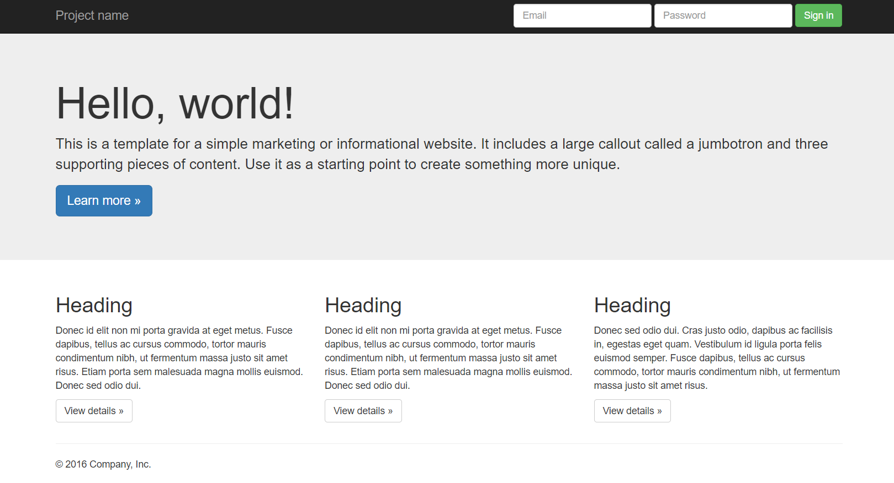
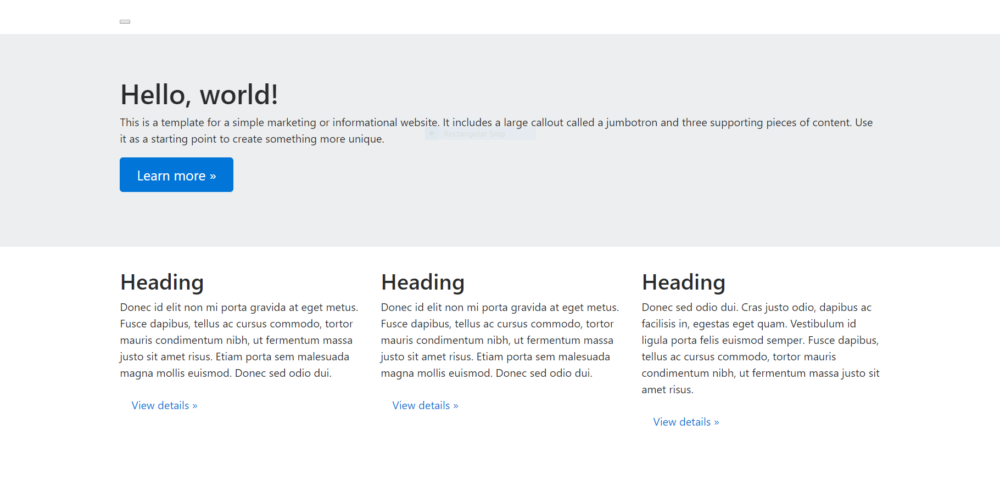
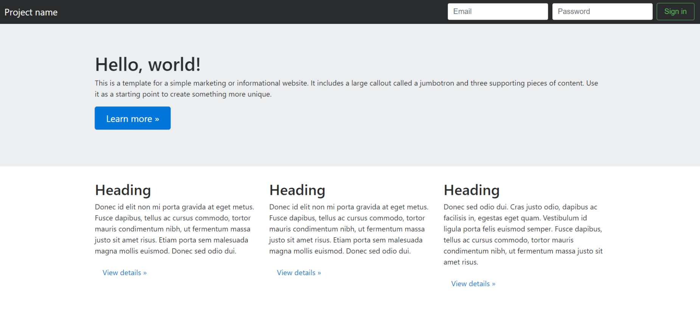

This is a little post in how to setup Bootstrap-4-alpha6 in Rails 5.1.0.

```
Rails version => 5.1.0.rc1
Bootstrap Ruby Gem => 4.0.0.alpha6
```

I noticed some guides mentioned installing node.js, which I already had setup. So you could try it without node.js if you want but you might run into some issues that are not covered here.

If you know what you are doing then you could also have a look at the README for the ruby gem at [Bootstrap Ruby Gem Github](https://github.com/twbs/bootstrap-rubygem).

To show this in its simplest fashion we are going to create a new rails application

```
rails new test_app
```

Inside the Gemfile add

```
gem 'bootstrap', '~> 4.0.0.alpha6'
```

And then run

```
bundle install
```

Next we will need to rename the `app/assets/stylesheets/application.css` file to `application.scss` (the extension could be changed to `.sass` for Sass syntax) and add

```
@import "Bootstrap";
```

As well as remove

```
*= require_tree
*= require_self
```

In `app/assets/javascripts/application.js` add

```
//= require bootstrap-sprockets
```

So it looks something like (the require_tree needs to be last)

```
//= require rails-ujs
//= require turbolinks
//= require bootstrap-sprockets
//= require_tree
```

That should be all the configuration that is required to setup Bootstrap, now we just need a little proof that it actually works. So we are going to create a static page and take some HTML from a [Bootstrap](http://getbootstrap.com/examples/jumbotron/) example page and see if it works. The page should look something like this



First lets create a static page

```
rails generate controller StaticPage home
```

And set the root to this page in the `config/routes.rb` file by adding the following line

```
root 'static_page#home'
```

Now all that is left is to copy and paste the HTML code into the `views/static_page/home.html.erb` file created by the `generate` command.

```html
<nav class="navbar navbar-inverse navbar-fixed-top">
<div class="container">
  <div class="navbar-header">
    <button type="button" class="navbar-toggle collapsed" data-toggle="collapse" data-target="#navbar" aria-expanded="false" aria-controls="navbar">
      <span class="sr-only">Toggle navigation</span>
      <span class="icon-bar"></span>
      <span class="icon-bar"></span>
      <span class="icon-bar"></span>
    </button>
    <a class="navbar-brand" href="#">Project name</a>
  </div>
  <div id="navbar" class="navbar-collapse collapse">
    <form class="navbar-form navbar-right">
      <div class="form-group">
        <input type="text" placeholder="Email" class="form-control">
      </div>
      <div class="form-group">
        <input type="password" placeholder="Password" class="form-control">
      </div>
      <button type="submit" class="btn btn-success">Sign in</button>
    </form>
  </div><!--/.navbar-collapse -->
</div>
</nav>

<!-- Main jumbotron for a primary marketing message or call to action -->
<div class="jumbotron">
<div class="container">
  <h1>Hello, world!</h1>
  <p>This is a template for a simple marketing or informational website. It includes a large callout called a jumbotron and three supporting pieces of content. Use it as a starting point to create something more unique.</p>
  <p><a class="btn btn-primary btn-lg" href="#" role="button">Learn more &raquo;</a></p>
</div>
</div>

<div class="container">
<!-- Example row of columns -->
<div class="row">
  <div class="col-md-4">
    <h2>Heading</h2>
    <p>Donec id elit non mi porta gravida at eget metus. Fusce dapibus, tellus ac cursus commodo, tortor mauris condimentum nibh, ut fermentum massa justo sit amet risus. Etiam porta sem malesuada magna mollis euismod. Donec sed odio dui. </p>
    <p><a class="btn btn-default" href="#" role="button">View details &raquo;</a></p>
  </div>
  <div class="col-md-4">
    <h2>Heading</h2>
    <p>Donec id elit non mi porta gravida at eget metus. Fusce dapibus, tellus ac cursus commodo, tortor mauris condimentum nibh, ut fermentum massa justo sit amet risus. Etiam porta sem malesuada magna mollis euismod. Donec sed odio dui. </p>
    <p><a class="btn btn-default" href="#" role="button">View details &raquo;</a></p>
 </div>
  <div class="col-md-4">
    <h2>Heading</h2>
    <p>Donec sed odio dui. Cras justo odio, dapibus ac facilisis in, egestas eget quam. Vestibulum id ligula porta felis euismod semper. Fusce dapibus, tellus ac cursus commodo, tortor mauris condimentum nibh, ut fermentum massa justo sit amet risus.</p>
    <p><a class="btn btn-default" href="#" role="button">View details &raquo;</a></p>
  </div>
</div>
```

Which will produce this output



Now you might have noticed that there is a little box at the top of the page. That is meant to be the navbar, but they work differently in [Bootstrap-4-alpha6](http://blog.getbootstrap.com/2017/01/06/bootstrap-4-alpha-6/). Therefore we are going to need to change the code to get it to work.

By changing the navbar code to the below

```html
<nav class="navbar navbar-toggleable-md navbar-inverse bg-inverse">
    <button class="navbar-toggler navbar-toggler-right" type="button" data-toggle="collapse" data-target="#navbarSupportedContent"
        aria-controls="navbarSupportedContent" aria-expanded="false" aria-label="Toggle navigation">
    <span class="navbar-toggler-icon"></span>
  </button>

    <a class="navbar-brand" href="#">Project name</a>

    <div class="collapse navbar-collapse justify-content-end" id="navbarSupportedContent">
        <form class="form-inline my-2 my-lg-0">
            <input class="form-control mr-sm-2" type="text" placeholder="Email">
            <input class="form-control mr-sm-2" type="text" placeholder="Password">
            <button class="btn btn-outline-success my-2 my-sm-0" type="submit">Sign in</button>
        </form>
    </div>
</nav>
```

The navbar should now work, although it does look slightly different to the example



You should now be up and running with Bootstrap-4-alpha6! Remember to look at the [Bootstrap blog](http://blog.getbootstrap.com/2017/01/06/bootstrap-4-alpha-6/) for more information into what has changed in this version.