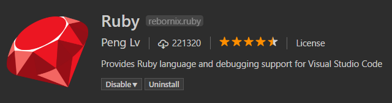
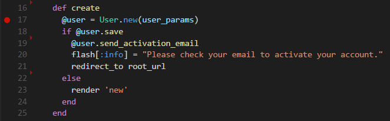
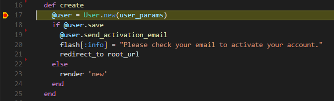
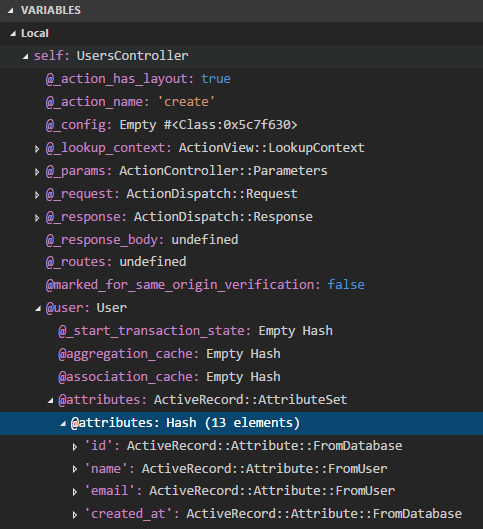

I have been using Visual Studio Code as my IDE while coding in Ruby as I didn't want to fork out a load of money to purchase RubyMine (I hate spending money) and so far have been getting by without being able to debug my code. Now the only reason as I haven't needed to debug so far is that I am still learning Ruby and Rails and therefore the code I am writing isn't exactly the most difficult to fix when something goes wrong. But I got stuck recently and it took me a long long time to figure out what was going wrong and started to wish that I had a debugger setup. Anyway time for me to stop blabbing on and actually give you some information.

Setting it up is actually really easy as some awesome people have made some plugins and gems for us to use.

So the first thing to do is install the [Ruby plugin](https://marketplace.visualstudio.com/items?itemName=rebornix.Ruby) in VS Code. This plugin does much more that just enabling debugging but I'll let you find that out for yourself, the information on the plugin's page is a good start.



Once that is done we need to install the gems that actually do the debugging that the IDE can use to display. Depending on the version of Ruby you are using you will need to install slightly different gems.

```bash
Ruby 1.8.x
gem install ruby-debug-ide
gem install ruby-debug-base</pre>
```

```bash
Ruby 1.9.x
gem install ruby-debug-ide
gem install ruby-debug-base19x</pre>
```

```bash
Ruby 2.x
gem install ruby-debug-ide
gem install debase
```

Once you have installed the gems for the version of Ruby you are using you are pretty much there, now you just need to run the Rails server in debug mode and its done.

Go to the debug tab on VS Code and by clicking the gear icon it will open the launch.json file which should have a load of configurations marked with `type: "Ruby"` and if there aren't any for some magical reason then you can add them manually. In case something weird happens to you the configuration for debugging a Rails server is found below.

```json
{
  "name": "Rails server",
  "type": "Ruby",
  "request": "launch",
  "cwd": "${workspaceRoot}",
  "program": "${workspaceRoot}/bin/rails",
  "args": [
     "server"
  ]
}
```

That should do it! Now if you click `run` with the Rails server option selected in the drop down it will start up in debug mode and a little menu will appear at the top of the screen with debug options such as `continue` and `step over`. The bar at the bottom of the window even changes colour to indicate it is in debug mode.

Now that the server has been started in debug mode we can add some breakpoints to step into the code and see what is happening. So I have put a breakpoint into my code (please don't make any comments on my code!) and lets see what happens.



If you don't know how to add a breakpoint, simply just click onto the left of the line number that you want it on and then the dot will appear like in the image above. I am pretty sure the dot will always be red but I am not 100% sure that it can't be changed through themes.

Now if I call this method it will pause when it reaches the breakpoint. If you were in a browser it should open VS Code and wait for your next move.



At this point you can decide to just carry on normal execution by pressing `continue (f5)` or `step over (f10)`, there are a few more options but I'm too lazy to write them down. Another decision you can make is to have a look at the state of variables and much more information just by looking to the left of the screen. Below is an image of what the variables section should look like.



So that is the end of this crash course into debugging a Rails server with Visual Studio Code. By enabling debugging we can make this already useful (and free!) IDE even better. Happy debugging!

If you found this post helpful, please share it and if you want to keep up with my latest posts then you can follow me on Twitter at [@LankyDanDev](https://twitter.com/LankyDanDev).