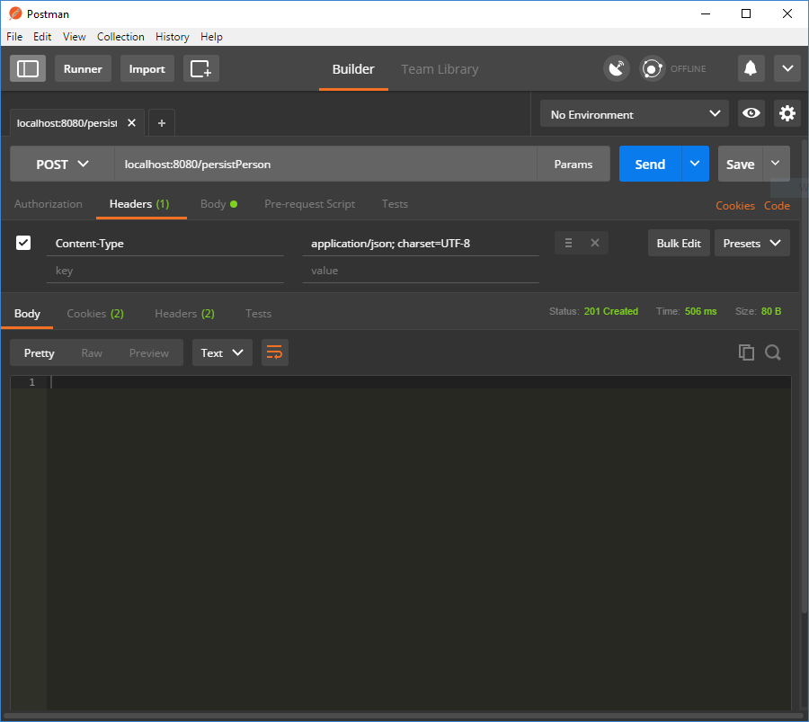
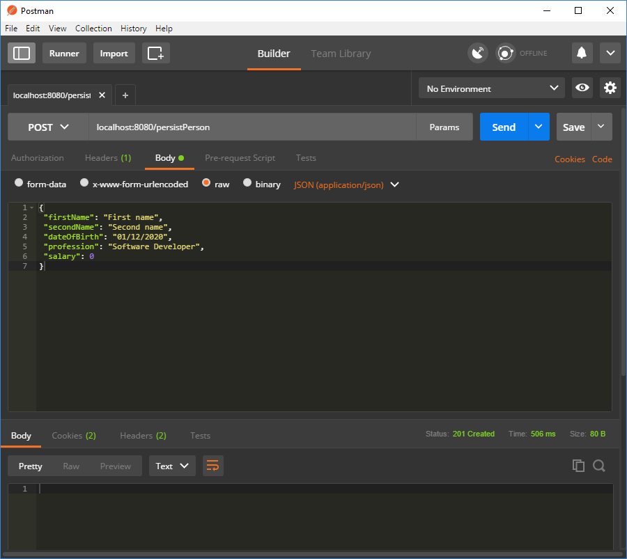

A very quick and little tutorial into sending a POST request to a Rest Controller in Spring Boot.

Have a look at [Spring’s starter guide](https://spring.io/guides/gs/spring-boot/) if your starting from scratch. The setup that is not described in this post is covered there.

The Maven dependencies required in this post are

```xml
<dependencies>
  <dependency>
      <groupId>org.springframework.boot</groupId>
      <artifactId>spring-boot-starter-web</artifactId>
  </dependency>
  <dependency>
      <groupId>org.springframework.boot</groupId>
      <artifactId>spring-boot-starter-test</artifactId>
      <scope>test</scope>
  </dependency>
</dependencies>
```

The Rest Controller

```java
@RestController
public class PersonRestController {

  @Autowired private PersonService personService;

  @Autowired private PersonRepository personRepository;

  @RequestMapping(value = "/persistPerson", method = RequestMethod.POST)
  public ResponseEntity<String> persistPerson(@RequestBody PersonDTO person) {
    if (personService.isValid(person)) {
      personRepository.persist(person);
      return ResponseEntity.status(HttpStatus.CREATED).build();
    }
    return ResponseEntity.status(HttpStatus.I_AM_A_TEAPOT).build();
  }
}
```

The first thing to notice is that the class is annotated with `@RestController` allowing it to accept the requests that are sent to its path, which is "/" as one has not been defined in this example. Some beans have been injected in using the `@Autowired` annotation allowing them to be used in this controller.

Onto the more POST specific code. `@RequestMapping` defines the path that the annotated method can accept requests from and specifies that this method accepts POST requests.

This method accepts requests from

```
the rest of the request .../persistPerson
```

For example

```
localhost:8080/persistPerson
```

By default if no method is mentioned then it will accept GET requests. `@RequestBody` marks that the `person` input is retrieved from the body / content of the POST request. This is a notable difference between GET and POST as the GET request does contain a body.

As POST requests are meant to be used to save new data to a database this example does just that, although none of the actual persistence code is actually implemented. If the input `person` is valid then it will call the repositories persist method and return a `HttpStatus.CREATED` (201) response code. This is the response code that is normally returned from a successful POST request. If the `person` was not valid then it returns a different response code. I used` I_AM_A_TEAPOT` (418) as it looked silly but it should probably be `NO_CONTENT` (204) or `CONFLICT` (409) although I there does not seem to be a consensus on what the correct response is.

To manually test this I used [Postman](https://www.getpostman.com/). To send a POST request to the Rest Controller:

- Set the request type to POST
- Set the content type in the header to `application/json; charset=UTF-8`
- Add the JSON for the `PersonDTO` to the body of the request (in the raw option)
- Add the request path
- Press send

If you haven't already, startup your server before you try to send the request or obviously it wont wont.

Request path

```
localhost:8080/persistPerson
```

Body

```json
{
 "firstName": "First name",
 "secondName": "Second name",
 "dateOfBirth": "01/12/2020",
 "profession": "Software Developer",
 "salary": 0
}
```

These two pictures below should help make this clearer





It's probably also a good idea to test the code. So lets look at how to do so.

```java
import static org.mockito.BDDMockito.given;
import static org.mockito.Matchers.any;
import static org.mockito.Mockito.times;
import static org.mockito.Mockito.verify;
import static org.springframework.http.MediaType.APPLICATION_JSON_UTF8;
import static org.springframework.test.web.servlet.request.MockMvcRequestBuilders.post;
import static org.springframework.test.web.servlet.result.MockMvcResultMatchers.status;

@RunWith(SpringRunner.class)
@WebMvcTest(PersonRestController.class)
public class PersonRestControllerTest {

  @Autowired private MockMvc mockMvc;

  @Autowired private ObjectMapper objectMapper;

  @MockBean private PersonService personService;

  @MockBean private PersonRepository personRepository;

  private JacksonTester<PersonDTO> jsonTester;

  private PersonDTO personDTO;

  @Before
  public void setup() {
    JacksonTester.initFields(this, objectMapper);
    personDTO = new PersonDTO();
  }

  @Test
  public void persistPerson_IsValid_PersonPersisted() throws Exception {
    final String personDTOJson = jsonTester.write(personDTO).getJson();
    given(personService.isValid(any(PersonDTO.class))).willReturn(true);
    mockMvc
        .perform(post("/persistPerson").content(personDTOJson).contentType(APPLICATION_JSON_UTF8))
        .andExpect(status().isCreated());
    verify(personRepository).persist(any(PersonDTO.class));
  }

  @Test
  public void persistPerson_IsNotValid_PersonNotPersisted() throws Exception {
    final String personDTOJson = jsonTester.write(personDTO).getJson();
    given(personService.isValid(any(PersonDTO.class))).willReturn(false);
    mockMvc
        .perform(post("/persistPerson").content(personDTOJson).contentType(APPLICATION_JSON_UTF8))
        .andExpect(status().isIAmATeapot());
    verify(personRepository, times(0)).persist(any(PersonDTO.class));
  }
}
```

The `@WebMvcTest` annotation is used which will disable full auto-configuration and only apply configuration relevant to MVC tests including setting up the `MockMvc` used in this test. The `PersonRestController` has been marked in the annotation as it is the test subject. Using `MockMvc` provides a faster way of testing MVC controllers like the `PersonRestController` as it removes the need to fully start a HTTP server. `@MockBean` is used on each bean that was injected into the `PersonRestController` so that they are then mocked in the tests.

Each test converts the `personDTO` into JSON using the `JacksonTester` and sends a POST request that includes the JSON in its body / content. The tests will pass if the correct response code is returned and if `personRespository.persist` was called the correct amount of times. Mockito is used to mock the return of the `personService.isValid` method and to verify if `personRepository.persist` was called or not.

By reaching this point you should be able write a simple Rest Controller that can accept POST requests and be able to manually test it with Postman and automatically with a test.

The code used in this post can be found on my [GitHub](https://github.com/lankydan/spring-boot-post-tutorial).
