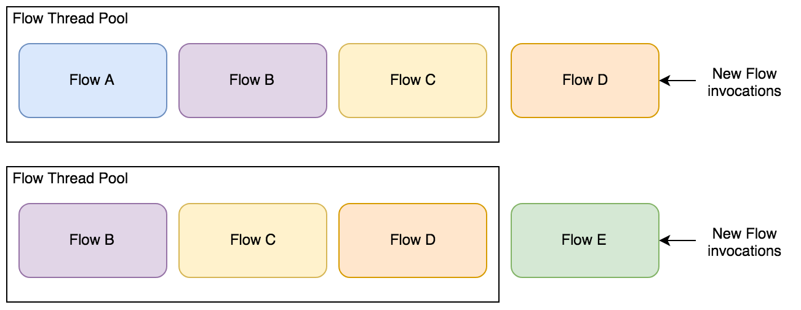
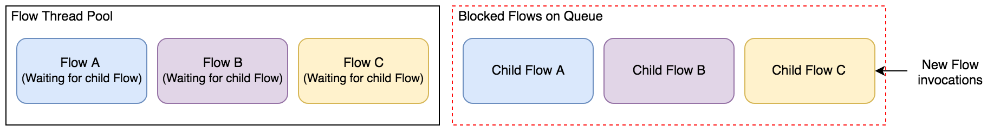

How can I make my Flows faster? There's a good chance you have thought about this before if you have been working with Corda for a while. You can make reasonable tweaks to eke out performance improvements by changing a few things: transaction size, optimising queries and reducing the number of network hops required throughout the Flow's execution. There is one other possibility that probably also crossed your mind at some point. Multi-threading.

More specifically, asynchronously starting Flows/Sub Flows from an already executing Flow. Doing so has the potential to greatly improve your CorDapps performance.

If you tried this, you probably faced a similar exception to the one I got. Furthermore, as of now, Corda does not support threading of Sub Flows. But, it can still be done. We just need to be clever about it. That's where multi-threading within Corda Services comes in. They can be called within Flows but are not prisoners to the strict rules that Flows put on them since an executing Flow will not suspend or checkpoint from within a service.

In this post, I will focus on multi-threading the starting of Flows from within a Service. There are other area's that threading can be used within Corda, but this is an interesting area to that I want to look into deeper. On the other hand, starting Flows from a Service is also filled with a few gotchas. These need to be accounted for and traversed around. Otherwise, you are going to wake up one day and wonder why everything has stopped for no apparent reason.

Luckily for you, I am here to help. For me, well, I had to face this problem head-on.

Luckily for me, R3 was able to help.

For reference, I will be using Corda Enterprise `3.1` for this post. To actually gain any benefit from the contents of this post you will need to be using Enterprise. This is due to Enterprise supporting multiple Flows executing asynchronously. Open Source does not currently allow this.

I also recommend looking at my previous post [Corda Services 101](https://lankydanblog.com/2018/08/19/corda-services-101/) as we will be building off the foundation laid there.

## Scenario

Let's start with outlining the scenario that we will be using for this post.

- PartyA sends PartyB some messages over time. Each message comes from a single Flow.
- PartyB responds to all messages sent to them. Each message comes from a single Flow, but they want a single place to execute the process.

A series of Flows can be quickly put together to satisfy this requirement. Doing this sequentially should prove absolutely zero problems (after we have fixed all the stupid mistakes we all make).

Although this scenario is a poor case for needing performance, it is a simple one to understand so we can focus on running this asynchronously.

## The slow synchronous solution

Before we look at the asynchronous solution, it will be beneficial to have a quick look at the code we will be moving from. Below is the code from `ReplyToMessagesFlow`. I don't want to go through all of the underlying code and instead only want to focus on the code relevant to this post:

```kotlin
@InitiatingFlow
@StartableByRPC
class ReplyToMessagesFlow : FlowLogic<List<SignedTransaction>>() {

  @Suspendable
  override fun call(): List<SignedTransaction> {
    return messages().map { reply(it) }
  }

  private fun messages() =
    repository().findAll(PageSpecification(1, 100))
      .states
      .filter { it.state.data.recipient == ourIdentity }

  private fun repository() = serviceHub.cordaService(MessageRepository::class.java)

  @Suspendable
  private fun reply(message: StateAndRef<MessageState>) =
    subFlow(SendMessageFlow(response(message), message))

  private fun response(message: StateAndRef<MessageState>): MessageState {
    val state = message.state.data
    return state.copy(
      contents = "Thanks for your message: ${state.contents}",
      recipient = state.sender,
      sender = state.recipient
    )
  }
}
```

If you did have a read through [Corda Services 101]("https://lankydanblog.com/2018/08/19/corda-services-101/) then you might have recognised this class. As I mentioned earlier, putting together a solution for the proposed problem is very easy. Retrieve the `MessageState`s from the Vault and start a `subFlow` to reply to them.

This code will happily chug along through the messages one by one.

So, can we take this code and make it faster?

## A failed attempt at asynchronicity

Let's try and make the current code faster by introducing threading! We will use `CompletableFutures` to do this:

```kotlin
@InitiatingFlow
@StartableByRPC
class ReplyToMessagesBrokenAsyncFlow : FlowLogic<List<SignedTransaction>>() {

  @Suspendable
  override fun call(): List<SignedTransaction> {
      return messages().map { CompletableFuture.supplyAsync { reply(it) }.join() }
  }

  // everything else is the same as before
}
```

Most of the code is the same as before and has therefore been excluded from the example.

The only change to the code is the addition of `CompletableFuture` and its `supplyAsync` method (comes from Java). It attempts to start executing the `reply` function for each message on a separate thread.

So why is this section named "A failed attempt"? I refer you to the stack trace you get when executing the above code:

```
java.util.concurrent.CompletionException: java.lang.IllegalArgumentException: Required value was null.
    at java.util.concurrent.CompletableFuture.encodeThrowable(CompletableFuture.java:273) ~[?:1.8.0_172]
    at java.util.concurrent.CompletableFuture.completeThrowable(CompletableFuture.java:280) ~[?:1.8.0_172]
    at java.util.concurrent.CompletableFuture$AsyncSupply.run(CompletableFuture.java:1592) ~[?:1.8.0_172]
    at java.util.concurrent.CompletableFuture$AsyncSupply.exec(CompletableFuture.java:1582) ~[?:1.8.0_172]
    at java.util.concurrent.ForkJoinTask.doExec(ForkJoinTask.java:289) ~[?:1.8.0_172]
    at java.util.concurrent.ForkJoinPool$WorkQueue.runTask(ForkJoinPool.java:1056) ~[?:1.8.0_172]
    at java.util.concurrent.ForkJoinPool.runWorker(ForkJoinPool.java:1692) ~[?:1.8.0_172]
    at java.util.concurrent.ForkJoinWorkerThread.run(ForkJoinWorkerThread.java:157) ~[?:1.8.0_172]
Caused by: java.lang.IllegalArgumentException: Required value was null.
    at net.corda.node.services.statemachine.FlowStateMachineImpl.checkDbTransaction(FlowStateMachineImpl.kt:201) ~[corda-node-3.1.jar:?]
    at net.corda.node.services.statemachine.FlowStateMachineImpl.processEventImmediately(FlowStateMachineImpl.kt:192) ~[corda-node-3.1.jar:?]
    at net.corda.node.services.statemachine.FlowStateMachineImpl.subFlow(FlowStateMachineImpl.kt:271) ~[corda-node-3.1.jar:?]
    at net.corda.core.flows.FlowLogic.subFlow(FlowLogic.kt:312) ~[corda-core-3.1.jar:?]
    at com.lankydanblog.tutorial.flows.ReplyToMessagesBrokenAsyncFlow.reply(ReplyToMessagesBrokenAsyncFlow.kt:57) ~[classes/:?]
    at com.lankydanblog.tutorial.flows.ReplyToMessagesBrokenAsyncFlow.access$reply(ReplyToMessagesBrokenAsyncFlow.kt:19) ~[classes/:?]
    at com.lankydanblog.tutorial.flows.ReplyToMessagesBrokenAsyncFlow$poop$inlined$map$lambda$1.get(ReplyToMessagesBrokenAsyncFlow.kt:46) ~[classes/:?]
    at com.lankydanblog.tutorial.flows.ReplyToMessagesBrokenAsyncFlow$poop$inlined$map$lambda$1.get(ReplyToMessagesBrokenAsyncFlow.kt:19) ~[classes/:?]
```

You are going to get that, along with a lengthy list of checkpointing log lines that Corda is printing out. Furthermore, just to cover my ass and prove to you that this is not due to a problem with `CompletableFuture`s, here is a different error you get when using an `Executor` threadpool:

```
Exception in thread "pool-29-thread-1" Exception in thread "pool-29-thread-2" java.lang.IllegalArgumentException: Required value was null.
    at net.corda.node.services.statemachine.FlowStateMachineImpl.checkDbTransaction(FlowStateMachineImpl.kt:201)
    at net.corda.node.services.statemachine.FlowStateMachineImpl.processEventImmediately(FlowStateMachineImpl.kt:192)
    at net.corda.node.services.statemachine.FlowStateMachineImpl.subFlow(FlowStateMachineImpl.kt:271)
    at net.corda.core.flows.FlowLogic.subFlow(FlowLogic.kt:312)
    at com.lankydanblog.tutorial.flows.ReplyToMessagesBrokenAsyncFlow.reply(ReplyToMessagesBrokenAsyncFlow.kt:48)
    at com.lankydanblog.tutorial.flows.ReplyToMessagesBrokenAsyncFlow.access$reply(ReplyToMessagesBrokenAsyncFlow.kt:19)
    at com.lankydanblog.tutorial.flows.ReplyToMessagesBrokenAsyncFlow$call$inlined$map$lambda$1.run(ReplyToMessagesBrokenAsyncFlow.kt:29)
    at java.util.concurrent.ThreadPoolExecutor.runWorker(ThreadPoolExecutor.java:1149)
    at java.util.concurrent.ThreadPoolExecutor$Worker.run(ThreadPoolExecutor.java:624)
    at java.lang.Thread.run(Thread.java:748)
java.lang.IllegalArgumentException: Required value was null.
    at net.corda.node.services.statemachine.FlowStateMachineImpl.checkDbTransaction(FlowStateMachineImpl.kt:201)
    at net.corda.node.services.statemachine.FlowStateMachineImpl.processEventImmediately(FlowStateMachineImpl.kt:192)
    at net.corda.node.services.statemachine.FlowStateMachineImpl.subFlow(FlowStateMachineImpl.kt:271)
    at net.corda.core.flows.FlowLogic.subFlow(FlowLogic.kt:312)
    at com.lankydanblog.tutorial.flows.ReplyToMessagesBrokenAsyncFlow.reply(ReplyToMessagesBrokenAsyncFlow.kt:48)
    at com.lankydanblog.tutorial.flows.ReplyToMessagesBrokenAsyncFlow.access$reply(ReplyToMessagesBrokenAsyncFlow.kt:19)
    at com.lankydanblog.tutorial.flows.ReplyToMessagesBrokenAsyncFlow$call$inlined$map$lambda$1.run(ReplyToMessagesBrokenAsyncFlow.kt:29)
    at java.util.concurrent.ThreadPoolExecutor.runWorker(ThreadPoolExecutor.java:1149)
    at java.util.concurrent.ThreadPoolExecutor$Worker.run(ThreadPoolExecutor.java:624)
    at java.lang.Thread.run(Thread.java:748)
```

Hopefully you believe me at this point. If not, refer back to what I said at the start. Corda does not currently support starting new Flows asynchronously from an executing Flow. It is something that I believe they are working towards. But, as of now. Don't use this solution.

## A working asynchronous solution

We have seen that threading inside a Flow is a no go. To carry on with our quest for performance, we will now look at threading from a Corda Service. This should come as no surprise since the title and opening paragraphs already discussed this...

Sarcastic comments aside. Delegating to a Service will require a bit of rework from the original solution but the bulk of the code will remain the same. Most of it will just be copied and pasted to another class. Taking the code from the Flow and putting it into a Service.

Below is the new `MessageService` that contains the code from the original `ReplyToMessagesFlow`, but with a few changes and addition of threading code:

```kotlin
@CordaService
class MessageService(private val serviceHub: AppServiceHub) : SingletonSerializeAsToken() {

  private companion object {
    val executor: Executor = Executors.newFixedThreadPool(8)!!
  }

  fun replyAll() {
    messages().map {
      executor.execute {
        reply(it)
      }
    }
  }

  private fun messages() =
      repository().findAll(PageSpecification(1, 100))
          .states
          .filter { it.state.data.recipient == serviceHub.myInfo.legalIdentities.first() }

  private fun repository() = serviceHub.cordaService(MessageRepository::class.java)

  private fun reply(message: StateAndRef<MessageState>) =
      serviceHub.startFlow(SendMessageFlow(response(message), message))

  private fun response(message: StateAndRef<MessageState>): MessageState {
    val state = message.state.data
    return state.copy(
        contents = "Thanks for your message: ${state.contents}",
        recipient = state.sender,
        sender = state.recipient
    )
  }
}
```

As you can see most of the code is the same as it was in the `ReplyToMessagesFlow`.

The first point I want to highlight is the use of an `Executor` thread pool. I have not used `CompletableFutures` here for reasons that we will look at later.

So how does this all work? The `replyAll` function executes `reply` on a new system thread for each message retrieved from the Vault. This new thread, in turn, calls `startFlow`. Triggering a new Flow to be put onto the Flow Worker queue. This is where all the fun happens and everything starts to get messy.

The Flow Worker queue looks after the order that Flows execute in and will fill and empty as Flows are added and completed. This queue is crucial in coordinating the execution of Flows within a node. It is also the source of pain when it comes to multi-threading Flows ourselves.

Below is a diagram demonstrating a simplistic view of the queue:



Why am I talking about this queue? Well, we need to be extra careful not to fill the queue up with Flows that cannot complete.

How can that happen? By starting a Flow within an executing Flow who then awaits its finish. This won't cause a problem until all the threads in the queue's thread pool encounter this situation. Once it does happen, it leaves the queue in deadlock. No Flows can finish, as they all rely on a number of queued Flows to complete.



This is most likely to happen on a high throughput system that is triggering the same flow many times. The chance the queue is full of Flows waiting for other Flows to finish now shoots up.

This isn't great and makes things a tad harder. But, as long as we are aware of this, we can accommodate for it.

This is also the reason for the `Executor` thread pool, rather than `CompletableFuture`s. By starting new Flows and not waiting for their completion, deadlock can be avoided. This is also the downside of this solution. Without the results of the new Flows, its capabilities are extremely limited.

All that being said, if your use-case fits the sort of structure shown above then I definitely recommend using this solution.

In the next section, I will discuss using `CompletableFuture`s.

## A dangerous solution with CompletableFutures

There is one simple reason why this is dangerous. Deadlock. I recommend keeping clear of this solution. Unless your node has access to enough threads, to decrease the chance of filling the queue with threads that can't finish. On the other hand, it is a much more ideal solution since you can await the results of the started Flows and do something with them. This makes for a much more useful solution.

Below is what the `MessageService` would look like with `CompletableFuture`s:

```kotlin
@CordaService
class MessageService(private val serviceHub: AppServiceHub) : SingletonSerializeAsToken() {

  fun replyAll(): List<SignedTransaction> =
    messages().map { reply(it).returnValue.toCompletableFuture().join() }

  // everything else is the same as before
}
```

The code is completely the same except for the `replyAll` function. The `toCompletableFuture` function that the returned `CordaFuture` provides, calls `join` to wait for the result of all futures and returns the overall result.

As I mentioned before, this solution could lead to deadlock. But, for your scenario, maybe it doesn't. It is up to you to determine how likely it is to happen. If the odds are against you, it's probably best to walk away. Either choosing to stick with a synchronous or an asynchronous solution similar to what I detailed in the previous section.

## Do I really need to do this?

For now, yes, I believe you do.

Moving forward, I doubt that you will need to rely on the solution I proposed in this post.

I believe that Corda is working towards removing the need to even think about threading when starting Flows from within Flows. Instead, allowing you to simply call `subFlow` with an option to run it asynchronously. This would have allowed us to keep the original synchronous solution but with an option to make each `subFlow` run on a separate thread.

## Joining the sections together

In conclusion, in Corda Enterprise 3, it is possible to initiate new Flows asynchronously within an executing Flow. This can provide good performance benefits depending on your use-case. There are downsides though. You cannot await the results of the asynchronous Flows without endangering your node with the threat of deadlock. The node's underlying queue cannot deal with the situation it is being put in. Therefore, you need to be careful about how you go about introducing threads to your Flow invocations. Thankfully, as Corda progresses, it's likely you won't even need to worry about doing this yourself. It might even be as simple as adding a boolean function argument. That is the dream!

The code used in this post can be found on my [GitHub](https://github.com/lankydan/corda-services-multi-threading-flows).

If you found this post helpful, you can follow me on Twitter at [@LankyDanDev](http://www.twitter.com/LankyDanDev) to keep up with my new posts.