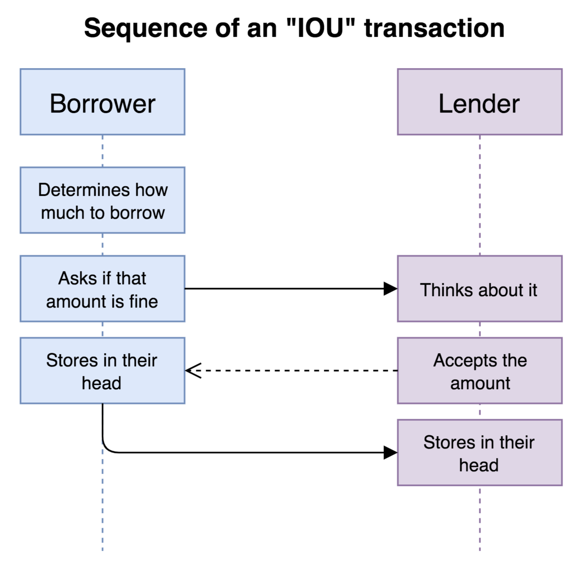
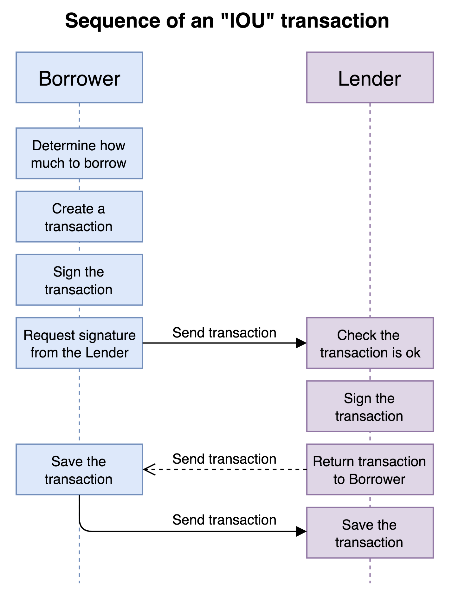

This post was written for Corda 3. If you are looking for a more up to date version, I recommend looking at my updated version of this post, [Developing with Corda 4](https://lankydan.dev/developing-with-corda-4).

In my [last post](https://lankydan.dev/2018/06/05/what-is-corda/) I gave an overview of what Corda is trying to achieve and the design decisions that were made to do so. That information is great to know so we can get some perspective of the platform but it's not going to help us in writing a system that can leverage Corda. To do that we need to know how the components of Corda work and fit together, only then can we start writing an application that actually does something and works correctly from the perspective of Corda. I see this as the same as learning any other framework but we need the voice in the back of our heads to remind us every now and then that we are in fact designing upon a Distributed Ledger Technology platform so we can make sure that the applications we create are properly designed.

In this post we will look at writing a very simple Corda application.

Corda is compatible with any JVM language. I know your thinking it, but no, it's not written in Java. It is actually written in Kotlin. This might require a little bit of extra learning to get to grips with Kotlin if you normally work with Java (like I do) but it shouldn't take you long to be comfortable with it. Due to this, I personally suggest writing your own code in Kotlin to keep the whole stack in the same language so when you need to dig down into Corda's own code it won't look alien compared to what you were just writing. Obviously, that is just my suggestion and you could instead use Clojure but your going to find it hard to get a hold of any existing examples without first converting them into their Clojure equivalents.

It is a bit hard to dive straight into the code without first understanding the [key concepts of Corda](https://docs.corda.net/key-concepts.html). Rather than going through these myself, I personally believe the documentation Corda provides on this subject is very helpful and should get you most of the way there.

For the purpose of this post, I think it is best to leave out the configuration required to actually setup Corda nodes and instead we should fully focus on writing a Corda application. In a later post I will go over the configuration needed to setup nodes so that they can interact with each other. For now your just going to have to trust me that this stuff works.

## Overview of the application

Before we can begin writing any code, we need to have an understanding of what the application is trying to achieve. Rather than coming up with my own example, I will lean upon [r3's training materials](https://github.com/roger3cev/corda-training-solutions) as the example is reasonably simple to understand. This example is the "IOU" process (I owe you), where someone requests for some money which will be paid back at a later date. In this post, we will just focus on the issuing of an IOU.

Below is a sequence diagram containing the very simplified steps involved in issuing an IOU between two people:



As you can see, the borrower asks for some money, if the lender agrees, then they both try and remember that the borrower owes the lender some money. This is process is simple, but even then, it has been simplified some more. In this process we haven't actually mentioned when and how the money is transferred between them. For the purpose of this tutorial we shall leave this transfer out and just focus on saving the intent of borrowing and lending money between them.

So, how is this sort of process modelled in Corda? Again, before we move on, I want to mention [Corda's key concepts](https://docs.corda.net/key-concepts.html) as they are extremely important for understanding what is going on properly.

To model the process in Corda, we need to replace some of the steps. Determining how much money to borrow, becomes the creation of a transaction containing this information. A party being happy with what is proposed, is now represented by signing the transaction with their key. Communication between the borrower and lender, is replaced with sending a transaction between them. Finally, remembering who owes who, is now set in stone with both parties saving the transaction that occurred between them. By altering the simple diagram with this new information, a new version is created:



There are more steps but the process is still pretty simple. The diagram really speaks for itself and I don't think there is anything more I can add to it. What I will say, is that I have still further simplified the diagram a little bit by removing the Notary, but only to focus on the process we are trying to model. We'll touch on what a Notary is very, very, very briefly later on but I will again suggest [Corda's documentation](https://docs.corda.net/key-concepts-notaries.html) on the subject (I'll do the same again later on).

These diagrams should provide us with enough guidance to put our Corda application together for issuing an IOU between two parties.

## States

Onto the coding sections, let's start with states. Information on states can be found [here](https://docs.corda.net/key-concepts-states.html) from the Corda documentation. States are passed around the network between nodes and eventually find themselves stored on the ledger. In terms of a transaction, a state can be an input or an output and many of these can exist on a single transaction. They are also immutable, which is required to build up the chain of states that are used within transactions.

As mentioned earlier, I am leaning upon [r3 training materials](https://github.com/roger3cev/corda-training-solutions). Below is the `IOUState` that will be passed around with the application:

```kotlin
data class IOUState(val amount: Amount<Currency>,
                    val lender: Party,
                    val borrower: Party,
                    val paid: Amount<Currency> = Amount(0, amount.token),
                    override val linearId: UniqueIdentifier = UniqueIdentifier()) : LinearState {
    
    override val participants: List<Party> get() = listOf(lender, borrower)
}
```

Due to the "IOU" concept, pretty much all the fields make sense without much explanation; `amount` is the lent amount, `lender` the party lending the money and so on. The only property that needs explaining is `linearId` which is of type `UniqueIdentifier`, this class is basically a UUID, in fact it's `internalId` is generated from the `UUID` class.

The state extends `LinearState` which is one of the general types of state that Corda uses with another being `FungibleState`. Both of these are implementations of `ContractState`. `LinearState`s are use to represent states that, quoting it's docs, "evolves by superseding itself". As such, when the state is updated it should be included as an input of a transaction with a newer version being output. The old state will now be marked as `CONSUMED` from `UNCONSUMED` when saved to the vault (Corda's abstraction over the database).

`ContractState` requires a property that returns the participants of the state.

The participants are a very important part of the state. The parties defined within this list determine who gets to have the state saved to their own vault/database. If you find that your state is not being saved to a party that should know about it, this is most likely the issue. I have personally ran into and felt the pain of this mistake.

In the above code, the participants were not included in the constructor and instead relies on defining a `get` function that can be used to retrieve them. Here it returns the `lender` and the `borrower` since they are the only two parties involved in the transaction. If you wanted to, you could add the `participants` to the constructor like below:

```kotlin
data class IOUState(val amount: Amount<Currency>,
                    val lender: Party,
                    val borrower: Party,
                    val paid: Amount<Currency> = Amount(0, amount.token),
                    override val linearId: UniqueIdentifier = UniqueIdentifier(), 
                    override val participants: List<Party> = listOf(lender, borrower)) : LinearState
```

This allows you to define participants that might not be included in the state. Which route you take depends on your use-case, for this tutorial either will do the job.

## Contracts

Next up are contracts. Contracts are used to validate input and output states for a given command by all parties involved in the transaction, the command could be, for example, issuing the state or paying off owed money. We will look at commands slightly later in this section but we should be able to brush over them for now.

Contracts are quite nice to write due to their expressiveness. We are able to write conditions within the contract that must be met for a transaction to be valid. If any are not met then an exception will be thrown which will normally end in terminating the current transaction since an involved party has found it invalid.

These conditions use the `requireThat` DSL that Corda defines to specify conditions along with error messages that details what is wrong with the transaction. This makes it nice and easy to go through a contract and understand what it is doing since the code conditions are nicely complemented by the English messages (or whatever language you want to write them in).

Below is an example of a contract that is used to validate the `IOUState` defined above, again this is taken from [r3's training materials](https://github.com/roger3cev/corda-training-solutions):

```kotlin
class IOUContract : Contract {
    companion object {
        @JvmStatic
        val IOU_CONTRACT_ID = "net.corda.contracts.IOUContract"
    }

    interface Commands : CommandData {
        class Issue : TypeOnlyCommandData(), Commands
        class Transfer : TypeOnlyCommandData(), Commands
        class Settle : TypeOnlyCommandData(), Commands
    }

    override fun verify(tx: LedgerTransaction) {
        val command = tx.commands.requireSingleCommand<Commands>()
        when (command.value) {
            is Commands.Issue -> requireThat {
                "No inputs should be consumed when issuing an IOU." using (tx.inputs.isEmpty())
                "Only one output state should be created when issuing an IOU." using (tx.outputs.size == 1)
                val iou = tx.outputStates.single() as IOUState
                "A newly issued IOU must have a positive amount." using (iou.amount.quantity > 0)
                "The lender and borrower cannot have the same identity." using (iou.borrower != iou.lender)
                "Both lender and borrower together only may sign IOU issue transaction." using
                        (command.signers.toSet() == iou.participants.map { it.owningKey }.toSet())
            }
            is Commands.Transfer -> requireThat {
                // more conditions
            }
            is Commands.Settle -> {
               // more conditions
            }
        }
    }
}
```

I have simplified the contract for the purpose of this post since we will only focus on implementing one command type. Let's start from the top and work our way down.

The `IOUContract` implements `Contract` requiring it to now have a `verify` function that gets called to verify (hence the name) a transaction.

### Contract class name

The class name of the contract has been included here:

```kotlin
companion object {
    @JvmStatic
    val IOU_CONTRACT_ID = "net.corda.contracts.IOUContract"
}
```

This is used in other parts of Corda when reflection is required. r3's training materials have done it this way but I personally think it's a bit funky and should be done differently.

```kotlin
companion object {
    @JvmStatic
    val IOU_CONTRACT_ID = IOUContract::class.qualifiedName!!
}
```

That's a bit better in my opinion. This solution removes the need to change the string's value if the class is moved or renamed. That being said, Corda has followed the convention of using strings in their code so if you need to use the inbuilt contracts you can expect them to to follow this format. I'll leave it up to you to decide which one you prefer.

### Commands

Now we can talk about the commands that I briefly mentioned earlier on in this section. I have put them below again so you don't need to scroll again:

```kotlin
interface Commands : CommandData {
    class Issue : TypeOnlyCommandData(), Commands
    class Transfer : TypeOnlyCommandData(), Commands
    class Settle : TypeOnlyCommandData(), Commands
}
```

These commands are used to specify the intention of the transaction. It has been put here due to it's connection to the contract since they determine what conditions must be validated. That being said, you could put these commands somewhere else if you wanted, such as in its own file or outside of the contract class but within the same file. As long as your solution best describes your intention then you are probably going in the correct direction.

Since these commands are simple and are only used for to specify intent, `TypeOnlyCommandData` is extended. Other abstract classes are available that specify commands that we might want to use, such as `MoveCommand`.

We will see how to use the commands in the next section.

### Implementing verify

Here's where most of the magic happens, the code has been copied and pasted below:

```kotlin
override fun verify(tx: LedgerTransaction) {
    val command = tx.commands.requireSingleCommand<Commands>()
    when (command.value) {
        is Commands.Issue -> requireThat {
            "No inputs should be consumed when issuing an IOU." using (tx.inputs.isEmpty())
            "Only one output state should be created when issuing an IOU." using (tx.outputs.size == 1)
            val iou = tx.outputStates.single() as IOUState
            "A newly issued IOU must have a positive amount." using (iou.amount.quantity > 0)
            "The lender and borrower cannot have the same identity." using (iou.borrower != iou.lender)
            "Both lender and borrower together only may sign IOU issue transaction." using
                    (command.signers.toSet() == iou.participants.map { it.owningKey }.toSet())
        }
        is Commands.Transfer -> requireThat {
            // more conditions
        }
        is Commands.Settle -> {
            // more conditions
        }
    }
}
```

The verify function checks whether the proposed transaction is valid. If so, the transaction will continue forward and most likely be signed and committed to the ledger but if any of the conditions are not met an `IllegalArgumentException` is thrown thus likely leading to the termination of the proposed transaction.

Exceptions are generally how Corda deals with unmet requirements. When an exception is thrown, assuming nothing is trying to catch it, execution is terminated and propagated up until it is caught or it ends up in the console output. Using this, it provides a simple way to control the flow of the transaction since the it can be stopped anywhere in it's execution, even on the counterparty's node, as the exception will be passed back to the initiator.

Onto the verification code itself. The command that the transaction is executing on it's states is retrieved and depending on the type, different checks are made to check the validity of the transaction. The `requireThat` DSL that Corda provides allows you to write a condition that must be true to continue along an error message that is output if the condition is false.

Let's look at one of the `requireThat` statements a bit more closely:

```kotlin
val iou = tx.outputStates.single() as IOUState
"A newly issued IOU must have a positive amount." using (iou.amount.quantity > 0)
```

Theres not much to explain here. The DSL takes care of the intent of the statement. What I will point out is the syntax:

```
<string message of what condition should be met> using <condition it must pass>;
```

Quite simple. A point that stupidly caught me out a bit, if the condition contains spaces in it then it must be contained within brackets. Finally, the DSL can contain code that is not in a condition expression, allowing you to initialise variables and such which can then be used in the actual conditions.

That's enough of contracts for now. They will pop up again in the next section when we put the `IOUContract` into action.

## Flows

In Corda, flows are the central point where we tie of all previous sections. States, contracts and commands all come together to write the code that will propose a new transaction, send it to all counterparties to sign and commit it to the ledger if everyone is happy. You can do much more complicated things within flows but for this tutorial we will stick with the basics.

Following on from the examples in the previous sections, we will now implement the `IOUIssueFlow`. Again this is taken from [r3's training materials](https://github.com/roger3cev/corda-training-solutions). Below is code as a whole which we will then split and examine:

```kotlin
@InitiatingFlow
@StartableByRPC
class IOUIssueFlow(private val state: IOUState) : FlowLogic<SignedTransaction>() {

    @Suspendable
    override fun call(): SignedTransaction {
        val notary = serviceHub.networkMapCache.notaryIdentities.first()
        val issueCommand = Command(IOUContract.Commands.Issue(), state.participants.map { it.owningKey })
        val transaction = TransactionBuilder(notary = notary)
        transaction.addOutputState(state, IOUContract.IOU_CONTRACT_ID)
        transaction.addCommand(issueCommand)
        transaction.verify(serviceHub)
        val singleSignedTransaction = serviceHub.signInitialTransaction(transaction)
        val sessions = (state.participants - ourIdentity).map { initiateFlow(it) }.toSet()
        val allSignedTransaction = subFlow(CollectSignaturesFlow(singleSignedTransaction, sessions))
        subFlow(FinalityFlow(allSignedTransaction))
        return allSignedTransaction
    }
}

@InitiatedBy(IOUIssueFlow::class)
class IOUIssueFlowResponder(private val flowSession: FlowSession) : FlowLogic<Unit>() {
    @Suspendable
    override fun call() {
        val signedTransactionFlow = object : SignTransactionFlow(flowSession) {
            override fun checkTransaction(stx: SignedTransaction) {
                requireThat {
                    val output = stx.tx.outputs.single().data
                    "This must be an IOU transaction" using (output is IOUState)
                }
            }
        }
        subFlow(signedTransactionFlow)
    }
}
```

The flow of this code (yes that is a pun) is reasonably straight forward and will be possibly one of the typical flows that you write within your own application.

All it does is:

- Create a state
- Add the state to a new transaction
- Verify the transaction with a contract
- Sign the transaction
- Request the signatures of the counterparties
- Save the transaction for all participants

Now that we know the steps that are made within this flow, we can go through and explain this is done within the code.

### The Initiating Flow

Firstly, the flow class is annotated with `@InitiatingFlow` and extends `FlowLogic`. This combination is required by any flow that requests communication with a counterparty. `FlowLogic` contains one abstract function `call` that needs to be implemented by the flow. This is where all the magic happens. When the flow is triggered, which we will look at later, `call` is executed and any logic that we have put inside the function obviously runs. `FlowLogic` is generic (`FlowLogic<T>`) where `T` determines the return type of `call`. In the above example a `SignedTransaction` is returned but it is totally feasible to use `FlowLogic<Unit>` if you have no desire to return anything back to the caller of the flow.

Next up is the `@StartableByRPC` annotation. This allows the flow to be called from an RPC connection which is the interface between the outside of a Corda node and it's internals. We'll touch on this a bit more when we look at triggering the flow.

Yet another annotation popping up. `@Suspendable` actually originates from `quasar-core` instead of one of Corda's own libraries. This annotation is important and if you forget to add it you could run into errors that don't necessarily indicate what is going wrong. It is needed on all functions that communicate with a counterparty. As the name "suspendable" suggests, the annotation allows the function to be suspended while the counterparty is dealing with their side of the transaction. Quite a bit of magic goes on here and it is touched on briefly in the [Corda documentation on flows](https://docs.corda.net/flow-state-machines.html#suspendable-functions).

Now we're done with the annotations we can look at the contents of `call`. I've pasted it below again to save you some energy on scrolling:

```kotlin
@Suspendable
override fun call(): SignedTransaction {
    val notary = serviceHub.networkMapCache.notaryIdentities.first()
    val issueCommand = Command(IOUContract.Commands.Issue(), state.participants.map { it.owningKey })
    val transaction = TransactionBuilder(notary = notary)
    transaction.addOutputState(state, IOUContract.IOU_CONTRACT_ID)
    transaction.addCommand(issueCommand)
    transaction.verify(serviceHub)
    val singleSignedTransaction = serviceHub.signInitialTransaction(transaction)
    val sessions = (state.participants - ourIdentity).map { initiateFlow(it) }.toSet()
    val allSignedTransaction = subFlow(CollectSignaturesFlow(singleSignedTransaction, sessions))
    subFlow(FinalityFlow(allSignedTransaction))
    return allSignedTransaction
}
```

For this example I have just put everything into one function so we can see step by step what is happening; I will show another version of this function later on which splits it into smaller functions that I personally think conveys the purpose of the flow quite nicely.

### Creating the transaction

First, we will look at building the proposed transaction, the relevant code has been extracted below:

```kotlin
val notary = serviceHub.networkMapCache.notaryIdentities.first()
val issueCommand = Command(IOUContract.Commands.Issue(), state.participants.map { it.owningKey })
val transaction = TransactionBuilder(notary = notary)
transaction.addOutputState(state, IOUContract.IOU_CONTRACT_ID.toString())
transaction.addCommand(issueCommand)
  ```

For the purpose of this post we will assume there is only one Notary which allows us to be lazy and just retrieve the first one from the list. If you do not know what a Notary is, like earlier I suggest reviewing the [Corda Key Concepts](https://docs.corda.net/key-concepts-notaries.html) for a good explanation on the topic. For now, I'll provide you the bare minimum to carry on. A Notary is a node whose sole purpose is to validate that no double spends have occurred within a transaction sent to it and extra validation can also be run if it is setup to do so.

The `serviceHub` comes provided since we extended `FlowLogic`; the function `networkMapCache` will then provides us with the identities of the parties on the network and `notaryIdentities` narrows it down even more. As I mentioned earlier, we're going to be lazy and just retrieve the first one from this list. How you retrieve the Notary that you wish to use in a transaction might change depending on your requirements.

We then create a command that represents the intent of the transaction. In this case, we use the `IOUContract.Commands.Issue` that we defined earlier. In creating the command we also need to provide the public keys of the parties required to sign the transaction. `it` is a `Party` and `owningKey` represents their public key. The only signers in this transaction are contained within the states `participants` property but an independent list could be passed in instead.

All the components we need for our transaction have now been retrieved or created. Now we need to actually start putting it together. `TransactionBuilder` does just that. The Notary that we retrieved can only be passed in via the `TransactionBuilder` constructor, whereas the others have various add methods as well as being included in the constructor. `addOutputState` takes in the `state` passed into the flow along with the contract name that will verify it. Remember I mentioned two ways to get this name; via a public property within the object, how Corda normally does it or by manually adding the classes name yourself, either way the end goal is the same. The final component we add to this transaction is the command we created.

### Verifying and signing the transaction

The next block of code focuses on verifying and signing the transaction, again the relevant code has been pasted below:

```kotlin
transaction.verify(serviceHub)
val singleSignedTransaction = serviceHub.signInitialTransaction(transaction)
```

Once we are happy that everything we want to include in the transaction has been included, we need to verify it. Simply call the `verify` function the `TransactionBuilder` provides. This function results in the validation inside the contract being ran against the transaction. As mentioned in earlier in the contract section, if any of the conditions in the contract fail an exception is thrown. Since, in this code, there are no attempts to catch the exception, the flow will fail as the exception is propagated up the stack.

After the transaction has passed validation, as far as we (the initiator) are concerned, the transaction is ready to be shared with the other parties. To do this, `serviceHub.signInitialTransaction` is called. This leaves us with a new `SignedTransaction` that is currently only signed by us. Having this transaction signed will become important later when the Notary checks that the transaction has been signed by all the parties involved.

### Collecting signatures of the counterparties

The transaction is now both verified and signed by the initiator. The next step is requesting the signatures of the counterparties involved in the transaction. Once that is done the transaction can be persisted to everyone's vaults as they all agree that the transaction is correct and meets their needs.

Below is the code in charge of collecting signatures:

```kotlin
val sessions = (state.participants - ourIdentity).map { initiateFlow(it) }.toSet()
val allSignedTransaction = subFlow(CollectSignaturesFlow(singleSignedTransaction, sessions))
```

The counterparties in this transaction are defined by the parties in the `participants` list. If we remember back to how the `participants` field was constructed in the state, only two parties were contained in it, therefore only two parties will need to sign the transaction. Although that statement is correct, the transaction has already been signed by the initiator so now only the single counterparty (the `lender`) needs to sign it.

To send the transaction to the counterparty we first need to create a session with them. The `initiateFlow` does just that. It takes in a `Party` and returns a `FlowSession` to be used for communications. As mentioned the initiator does not need to sign the transaction again through this construct, so in the code they have been removed from the parties whose communication sessions are being created for. Due to us knowing who are involved in this transaction, the below could of been written instead:

```kotlin
val session = initiateFlow(state.lender)
val allSignedTransaction = subFlow(CollectSignaturesFlow(singleSignedTransaction, listOf(session)))
```

Instead of relying on the participants list we instead just create a session for the `lender` as our knowledge of the state indicates that they are the only counterparty.

The `FlowSession` needs to be used inside of the `CollectSignaturesFlow` along with the `SignedTransaction` that is still only signed by the initiator at this point. This is our first encounter with `subFlow`s. These are flows, similar to the one we are looking at in this post, that are called from within another flow. `CollectSignaturesFlow` cannot be triggered by itself as it is not annotated with `@InitiatingFlow`, therefore it can only ever be used from within a `subFlow`. Most of the flows provided by Corda out of the box fall within this same category.

All `subFlow` does is run the flow passed into it, by calling the flow's `call` function and returning whatever the flow would normally return. A flow does not require anything special to be passed into `subFlow`, if we ever needed to, `IOUIssueFlow` could be passed into it from another flow.

Corda provides flows for a lot of the typical operations that need to be repeated throughout our own flows. These are called via `subFlow` and include (and many more): `CollectSignaturesFlow`, `SignTransactionFlow`, `SendTransactionFlow` and `ReceiveTransactionFlow`.

Anyway, back to the flow at hand! `CollectSignaturesFlow` sends the `SignedTransaction` to the counterparty and awaits their response. We will look at how the response is sent back in a following section. Once returned, the `SignedTransaction` is now complete as it has been signed by everyone and can now be saved.

### Persisting the signed transaction

This is the smallest snippet we'll see during this breakdown, a whole one line:

```kotlin
subFlow(FinalityFlow(allSignedTransaction))
```

Although, for a one liner, this piece of code packs quite a punch. `FinalityFlow` will most likely always be called at the end of your flows, at least for the simpler flows anyway.

Calling `FinalityFlow` will:

- Send the transaction to the Notary (if required)
- Save the transaction to the initiator's vault
- Broadcast to the participants of the transaction to save it to their vaults

The last two steps depend on the Notary finding the transaction valid. If it does not, like usual, an exception is throw thus leading to an exit from the flow. Finally (yes, another pun), you do not need to write any code to save the transaction for the counterparties as that all happens behind the scenes.

### The Responding Flow

Everything in the flow that we have looked at so far is on the initiator's side of the process. There have been a few times during the example where the transaction was sent over to the counterparty and some "stuff" happened. In this brief section we will inspect the code that the counterparty would run:

```kotlin
@InitiatedBy(IOUIssueFlow::class)
class IOUIssueFlowResponder(private val flowSession: FlowSession) : FlowLogic<Unit>() {
    @Suspendable
    override fun call() {
        val signedTransactionFlow = object : SignTransactionFlow(flowSession) {
            override fun checkTransaction(stx: SignedTransaction) {
                requireThat {
                    val output = stx.tx.outputs.single().data
                    "This must be an IOU transaction" using (output is IOUState)
                }
            }
        }
        subFlow(signedTransactionFlow)
    }
}
```

As before this code was included earlier on in the post.

The most important line in this class is the `@InitiatedBy` annotation that specifies which flow it accepts requests from and responds back to, in this example it is the `IOUIssueFlow` that we have already gone through.

Since `IOUIssueFlowResponder` is also a flow, it extends `FlowLogic` and will need to implement it's own version of `call`. The `FlowSession` in the constructor is the session that was used by the initiator to communicate with this flow. `@Suspendable` is also used on `call` just like it was in the initiating flow.

`SignTransactionFlow` is the other half of the `CollectSignaturesFlow` that was called in the initiator. It is an abstract class that requires `checkTransaction` to be implemented. This contains any extra validation that the counterparty might want to run against the transaction. `SignTransaction`'s `call` function will still verify the transaction against the contract so this is the chance for anything else; ensuring that the transaction is up to the standards of the counterparty. Saying that, `checkTransaction` can also contain as little code as desired and could even be empty if the contract validation is enough. Rather than showing you what that would look like, I'll let you use your vivid imagination to imagine an empty function...

Finally, `subFlow` is called on the implementation of `SignTransactionFlow` leading to it being executed. The validation in the contract is ran, followed by the contents of `checkTransaction` and if all the checks come back fine, the transaction is signed and sent back to where it came from.

The code in this class could be as simple or complicated as it needs to be. For the example used in this tutorial, simple is good enough. This will change depending on your requirements and what must be communicated between the initiator and its responders.

### How I would structure the Initiating Flow

This little section is just for me to give you a suggestion in how to structure the initiating flow that we used in the examples. This in my opinion is better, but you might have a differing opinion on the subject:

```kotlin
@InitiatingFlow
@StartableByRPC
class IOUIssueFlow(private val state: IOUState) : FlowLogic<SignedTransaction>() {
    @@Suspendable
    override fun call(): SignedTransaction {
        val stx =  collectSignatures(verifyAndSign(transaction()))
        return subFlow(FinalityFlow(stx))
    }

    @Suspendable
    private fun collectSignatures(transaction: SignedTransaction): SignedTransaction {
        val sessions = (state.participants - ourIdentity).map { initiateFlow(it) }.toSet()
        return subFlow(CollectSignaturesFlow(transaction, sessions))
    }

    private fun verifyAndSign(transaction: TransactionBuilder): SignedTransaction {
        transaction.verify(serviceHub)
        return serviceHub.signInitialTransaction(transaction)
    }

    private fun transaction() = TransactionBuilder(notary()).apply {
        addOutputState(state, IOUContract.IOU_CONTRACT_ID)
        addCommand(Command(IOUContract.Commands.Issue(), state.participants.map { it.owningKey }))
    }

    private fun notary() = serviceHub.networkMapCache.notaryIdentities.first()
}
```

I don't think that I've done anything particularly special here but I think this separation makes each step clearer. `call` is reduced to two lines (one if you really wanted) and I won't even bother explaining what each method does as we have already been through the code and the function names so accurately describe what they are doing. Anyway, if you prefer writing it this way, then great. If you dont, then do what you wish; I won't be upset, I promise...

## Starting a Flow

In this final section we will look at how to call a flow from outside of the Corda node.

There are a few ways to do this, each working slightly differently. But, let's keep this short and sweet and only look at the bog standard `startFlow` function:

```kotlin
proxy.startFlow(::IOUIssueFlow, state)
```

That's it. As I said, short and sweet. `proxy` is of type `CordaRPCOps` which contains a load of functions revolved around interacting with the Corda node via RPC. `startFlow` is one of those functions. It takes in the name of the flow class along with any arguments that are part of the flow's constructor. So in this example `IOUIssueFlow`'s `call` function will be invoked with an `IOUState` being passed in to be used within the flow.

A `FlowHandle<T>` is returned where `T` is the same generic type of the invoked flow, in this case a `SignedTransaction`. `returnValue` can then be called to retrieve a `CordaFuture`, allowing the result to be retrieved as soon as it's available. `CordaFuture` is a subtype of a standard `Future` with a few extra methods made available, one of which is `toCompletableFuture` that may or not be useful to you (this was useful to me anyway).

## Wrapping up

Here we are, at the end at last.

This post should have hopefully given you some help in understanding how to go about developing with Corda. There is much more to learn as I have only covered the basics in this post (I also need to learn more myself first). In this post we implemented the process of an IOU while inspecting the components that are required to do so. States are facts that are shared among parties on the network, contracts are used to validate transactions and flows contain the logic to propose new transactions. With this information you should be in a good place to start writing your own flows. There is much more you can do with flows that hasn't been covered within this post, but these basics should serve you well through any flows that you try to write.

I plan to write more posts on developing on Corda, focusing on more complicated features and diving deeper into whats going on behind the scenes.

If you found this post helpful and want to keep up with my posts as I write them, then you can follow me on Twitter at [@LankyDanDev](https://twitter.com/lankydandev).