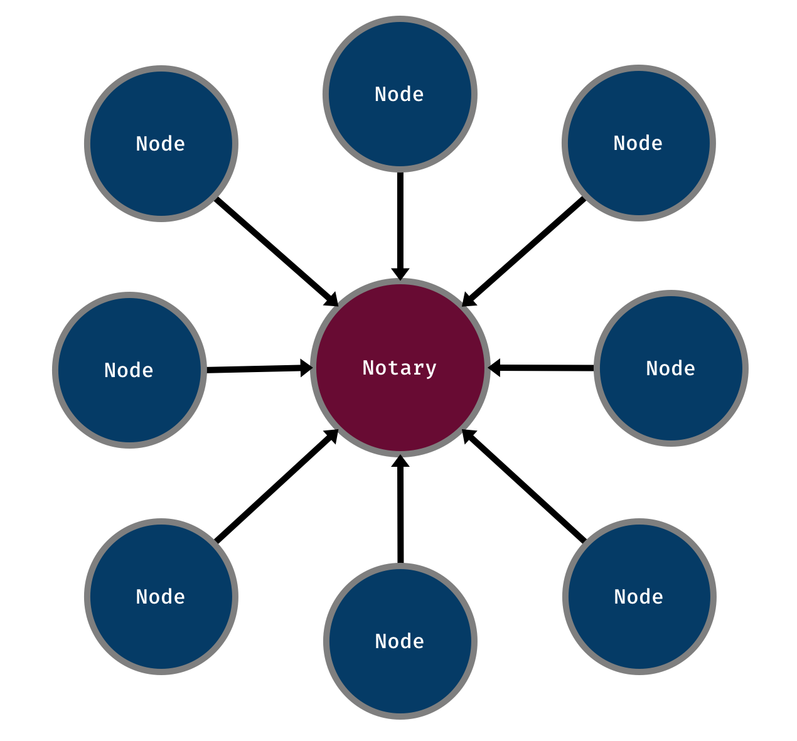
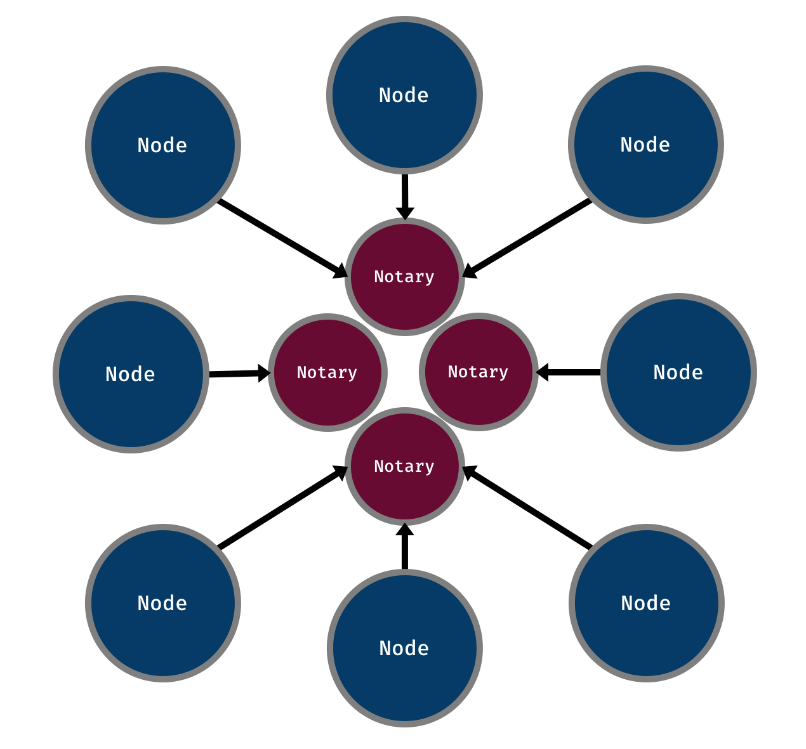

Do you need a very high throughput Corda network? Has the network's throughput levelled out? Have you already squeezed out all the performance you could from other areas? If your answers to these questions are "yes", then I may have some useful information for you. I have listed out these questions to decrease the chance of you prematurely optimising your Corda network/application. Switching to using multiple Notaries is only going to have a noticeable performance impact if it is one of the slowest parts involved in processing requests/transactions. It is highly likely that other areas need to be improved before looking into using multiple Notaries.

Before I continue. I really need to say this. I am not talking about using Notary Clusters in this post, which consist of Notaries that communicate with each other to reach consensus on whether states have been spent or not. I am talking about having multiple Notaries, each with their own identities, who only interact with the nodes that send them transactions to validate. This distinction needs to be made and should remove any confusion about exactly what I will be describing in this post.

At the time of writing, the current versions of Corda are:

- Open Source 3.3
- Enterprise 3.2

## Why would I want to do this?

Ok, so. Let's really dig into why you would want to use multiple Notaries. Diagrams do this best, so let's use one:



This situation doesn't look great. But, it might not actually be that bad. If the throughput of your network is not extremely high, this architecture should be able to handle the transactions passing through the Notary.

As mentioned in the introduction. It becomes an issue when the rate of transactions being sent to the Notary becomes very high. Once this point is reached, the Notary will start to lag behind. As it cannot validate the states in the transactions fast enough. If performance is important to the network, this is a good area to examine.

From a code perspective, this is the standard format that you have probably already been writing your CorDapps. You pick out a Notary based on particular criteria and send a transaction there. There might even be only a single Notary in the whole network that you have been dealing with. For example, in all my code examples I have produced before I have written code similar to the below that only relies on the single Notary in the network and blindly takes that one every time.

```kotlin
private fun notary(): Party = serviceHub.networkMapCache.notaryIdentities.first()
```

## Switching to multiple Notaries

Moving from a network that relies on a single Notary to a design that consists of many, fundamentally, requires two things:

- More than one Notary in the network
- An algorithm to choose which Notary to send a transaction to

Furthermore, the chosen Notary for a transaction is then referenced by future transactions if consuming states. If you end up in a situation where input states from different Notaries are being consumed, then you must perform a Notary Change Transaction. I will cover this topic later on.

Below is how the previous design could be altered to use a few Notaries:



The best thing about this diagram is that it illustrates how simple it is to add another Notary to the network and redistribute the load among them. There is nothing stopping us from adding more and more Notaries to the network. But, there will be a point where adding more does not lead to a performance increase. This keeps coming back to what I have mentioned previously. That adding more Notaries will only increase throughput when the Notaries themselves are reaching saturation.

### Choosing a Notary for issuance transactions

Below is a possible algorithm to choose which Notary to use:

```kotlin
private fun transaction(): TransactionBuilder =
  TransactionBuilder(notary()).apply {
    addOutputState(message, MessageContract.CONTRACT_ID)
    addCommand(Send(), message.participants.map(Party::owningKey))
  }

private fun notary(): Party {
  val index = message.type.hashCode() % serviceHub.networkMapCache.notaryIdentities.size
  return serviceHub.networkMapCache.notaryIdentities.single { it.name.organisation == "Notary-$index" }
}
```

In this example, the transaction chooses the Notary to use based on the `hashCode` of one of the input state's properties and the number of Notaries in the network.

How you choose the Notary could be as simple or complex as you need it to be. This will depend on requirements such as only a subset of Notaries being trusted for proposed transactions or resiliency to the Notaries in the network changing.

### Choosing a Notary when consuming states from the same Notary

This is nice and simple... If all input states reference the same Notary. Below is what it looks like (this example only consumes a single input... because I am too lazy to write another version):

```kotlin
private fun transaction(response: MessageState): TransactionBuilder =
  TransactionBuilder(notary()).apply {
    addInputState(message)
    addOutputState(response, MessageContract.CONTRACT_ID)
    addCommand(Reply(), response.participants.map(Party::owningKey))
  }

private fun notary(): Party = message.state.notary
```

As you can see, all the transaction does is retrieve the Notary that is related to the input state and uses it for itself. This information can be extracted because `message` is a `StateAndRef` and accessing its `state` property will return a `TransactionState`. Following this format. Creating new transactions that consume a state and produce a number of outputs is straightforward. This format is also valid for multiple input states. If, and only if, they all reference the same Notary.

So... With all this talk about input states with different Notaries. I should probably discuss it further.

### Choosing a Notary when consuming states from different Notaries

Here we have to be careful or we will see errors like the one below:

```
java.lang.IllegalArgumentException: Input state requires notary "O=Notary-1, L=London, C=GB"
which does not match the transaction notary "O=Notary-0, L=London, C=GB".
```

The error shows that an input state does not have the same Notary as the transaction that contains it.

To solve this error we need to use a Notary Change Transaction. As per the docs:

> A flow to be used for changing a state's Notary. This is required since all input states to a transaction must point to the same notary.

I wanted to put that in there, just in case you think I am a lier!

The code to perform a Notary Change Transaction looks like the below:

```kotlin
@Suspendable
private fun notaryChange(
  message: StateAndRef<MessageState>,
  notary: Party
): StateAndRef<MessageState> =
  if (message.state.notary != notary) {
    subFlow(
      NotaryChangeFlow(
        message,
        notary
      )
    )
  } else {
    message
  }
```

I am sure you can figure out what is going on yourself, but to make myself feel smarter... I am going to tell you. `message` represents an input state and `notary` is the Notary that the new transaction will be using. If the Notaries are the same, then the state can be returned as nothing needs to be done to it. If they are indeed different, then call `NotaryChangeFlow` which takes in the two arguments passed into the original function. This will return a new `StateAndRef` which is then returned from the function.

The `StateAndRef` returned from this function can then be put into the transaction.

If you are not sure whether the states being passed into a transaction are from the same Notary, then I suggest sticking to the code in this section. Choose a Notary that the transaction will use, whether this is a specific one or one taken from the input states and perform a Notary Change Transaction on any that require it. For example, I think code similar to the below would make a generic and robust solution:

```kotlin
@Suspendable
private fun transaction(): TransactionBuilder {
  val messages = getMessageStates()
  val notary = notary()
  return TransactionBuilder(notary).apply {
    messages.forEach {
      addInputState(notaryChange(it, notary))
    }
    addCommand(
      Delete(),
      (messages.flatMap { it.state.data.participants }.toSet() + ourIdentity).map(Party::owningKey)
    )
  }
}

@Suspendable
private fun notaryChange(
  message: StateAndRef<MessageState>,
  notary: Party
): StateAndRef<MessageState> =
  if (message.state.notary != notary) {
    subFlow(
      NotaryChangeFlow(
        message,
        notary
      )
    )
  } else {
    message
  }

// however you want to choose your specific Notary
private fun notary(): Party =
  serviceHub.networkMapCache.notaryIdentities.single { it.name.organisation == "Notary-1" }
```

Here a specific Notary is chosen for the transaction, each input has its Notary changed to the chosen one if required and the signers comprise of all the participants of the consumed states. This might not suit your own use-case. Which is perfectly fine. But this should provide a good starting point when playing around with changing Notaries (mainly for performance).

Altering this solution slightly, we can instead choose the Notary based on the Notaries the input states reference. Since only the `notary` function really needs to change I have excluded the rest of the code from the example.

```kotlin
private fun notary(messages: List<StateAndRef<MessageState>>): Party =
  messages.map { it.state.notary }
    .groupingBy { it }
    .eachCount()
    .maxBy { (_, size) -> size }?.key ?: throw IllegalStateException("No Notary found")
```

The Notary chosen by this function is decided based on the most common Notary shared by the input states. By doing so, less Notary Change Transactions are required as the largest majority of the inputs will already reference the chosen Notary. This should provide the best performance if you do not know which Notaries the inputs reference.

## Conclusion

Achieving high performance within a Corda network relies on removing bottlenecks out of the system and other general performance tweaks. One such bottleneck is the Notary. In a situation where a very high throughput is passing through the Notary, the network's performance will start to plateau. The Notary cannot process the requests fast enough for the rate that they are coming in. Moving to use multiple Notaries that share the request load will allow the performance of the network to increase. This brings extra complexity in determining which Notary to use along with the possibility of needing Notary Change Transactions. But, if your network really needs to achieve a high throughput. This will be an area that is worth looking into.

One last comment I will throw in here. As the internal performance of Notaries increase, the need for this sort of architecture will decrease. There might even reach a point where a single Notary is able to completely handle a large rate of incoming requests. This is an area to keep an eye on as Corda continues to improve its overall performance.

The code used in this post can be found on my [GitHub](https://github.com/lankydan/corda-multiple-notaries).

If you found this post helpful, you can follow me on Twitter at [@LankyDanDev](http://www.twitter.com/LankyDanDev) to keep up with my new posts.