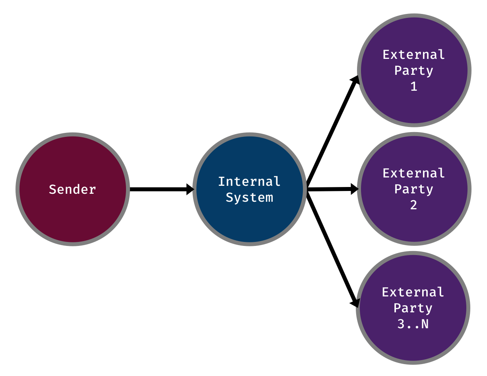
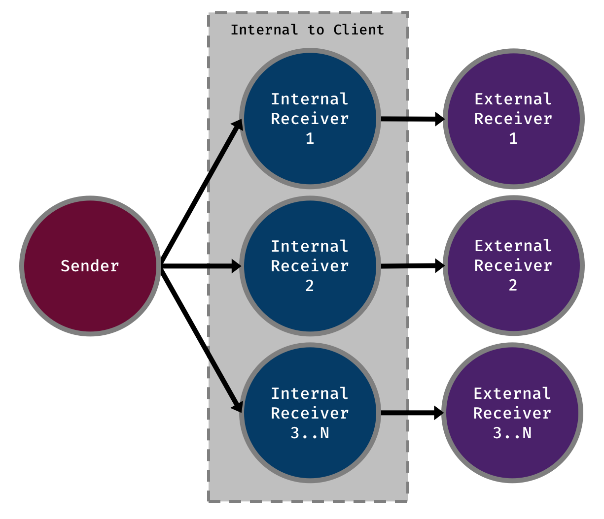

I recently rolled off a project focusing on the performance of Corda for a particular use-case. The result of this project lead to us processing 115 million requests within a single day over a network of over 170 nodes. Furthermore, Corda was able to handle 6300 requests per second confirming that the highest requirement of the network was met. This is by far the largest Corda network that has been deployed and the highest throughput achieved to date. Proving that Corda can deliver in a very demanding environment.

The study was conducted by Accenture for DTCC, which also looked into another DLT platform, Digital Asset. Further information can be found in the [press release](http://www.dtcc.com/news/2018/october/16/dtcc-unveils-groundbreaking-study-on-dlt).

  <a href="http://www.dtcc.com/news/2018/october/16/dtcc-unveils-groundbreaking-study-on-dlt">DTCC Announces Study Results Demonstrating that DLT Can Support Trading Volumes in the US Equity…
  Groundbreaking study proves DLT can process more than 100 million trades per day New York/London/Hong…www.dtcc.com
  </a>

In this post, I will use the experience I gained on this project to describe how you can also get the best out of Corda. I expect that there will be similar projects to what we did for DTCC coming up in the near future and I hope that the information here will help point other developers in the right direction.

So how did it go? Well, it wasn’t without its difficulties. But, I think we did well. More precisely, we proved that Corda can hit a high throughput if the network is thoughtfully architected and your CorDapps are well designed. Yes, I know that I’m basically saying if you do everything right then it will go well. It really is that important. As we tweaked our CorDapps throughout the project we found avenues to greatly improve the application’s performance. Making these changes allowed us to move closer and closer to the targets we were aiming for. But, none of this would have mattered if we had not architected our network in a particular way.

## Corda Enterprise is needed to achieve the highest possible performance

This is the simplest way to increase your performance by a factor of 10 or by however many cores your machine has. Among other things, Corda Enterprise allows the number of Flow workers running within the node to increase from 1 to many. This affects the number of Flows that can run asynchronously within the node. But, this does not change the performance of individual Flows which run at the same speed on each version. Realistically, without Enterprise you will never achieve extremely high performance targets.

If achieving this sort of performance is not a requirement for your use-case, then the Open Source version will meet your needs. For example, we 100% needed to use Enterprise for our project since the volumes of requests that DTCC handle and the rate that they need to be processed is enormous. On the other hand, if we were dealing with the handling and processing of Loans. The rate that requests flow through a node would drop significantly compared to DTCC’s needs. In this situation, using Open Source would suffice.

Conveniently, Enterprise and Open Source code are compatible allowing you to switch over without too much pain. There are differences in deployment and it is extremely likely you will need to fiddle around with this side when making the change.

The compatibility between the Enterprise and Open Source versions will allow you to try both, allowing you to determine which best suits your needs. This allows you to start writing your application on Open Source until it is deemed necessary to switch to Enterprise.

## Think about your Network

I really, really want to emphasise the importance of network architecture. I don’t even want to think about the performance we would have achieved if we stuck to our original design. We actually scrapped our original design since it was fundamentally flawed and would have prevented any hopes of reaching our goals. Personally, I think this section is half about Corda and half about architecting a good solution.

### Sharding to improve performance at scale

At the time of writing this post, Corda does not support Load Balancing. Currently, a single node processes all of the work for the identity it represents. This is an area they are fully aware of and is something they have on their roadmap to work on in the near future. If this was there, then it might have been possible to simply rely on spinning up a ton of instances that support a single Corda node. This would have led to more compute power and therefore increasing throughput.

Due to load balancing not being ready and the fact that we had a single actor sitting in the middle of the network who was a massive bottleneck to the handling of requests, we had to approach the overall network design differently. To compensate, we had to think of a way to provide our own sort of horizontal scaling into the system as the single node sitting in the middle had to be removed. If these issues were not addressed, there was no way we could achieve the network throughput of 6300 trades per second.

Our solution? Sharding. We determined a way that this one actor could be logically split up into many, much smaller parts. Each handling requests in parallel to each other. This required a bit of extra logic to route the request to the right sharded node. But, this solution likely saved the project. We never tested the performance of the single bottleneck node, but, I am 100% sure we would not have reached out targets.

Below I have included two diagrams. One of an example process using the single node design and another of the sharded approach.

Single node

Sharded

I will let the diagrams speak for themselves. I will not delve any further into the implementation since that information is still confidential. There should be enough information there to understand why and what we did, but not how we achieved it.

As you can imagine the second design will yield a much higher throughput. It also comes with the benefit of scaling linearly as nodes are added to the network.

With the original design, the throughput might be acceptable with a small number of nodes. But, as soon as you hit larger numbers, say 100s, maybe even as small as 10, you are going to notice the levelling out of performance. This is completely due to the whole network relying on the rate at which the single bottleneck node can process requests.

### Removing extra bottlenecks with multiple Notaries

Another area that will improve the network’s overall performance is the use of multiple Notaries. When the throughput of the network is already high, a single Notary will start to become the bottleneck of the workflow. By following the same idea as the previous section. A Notary can be sharded. Allowing each to process a smaller volume of transactions.

Every time I say “multiple Notaries”, I just feel like I need to clarify that I am not talking about a Notary Cluster.

I have already written a post, [Increasing network throughput with multiple Notaries](https://lankydanblog.com/2018/11/18/increasing-network-throughput-with-multiple-notaries/), covering this topic and rather than repeating myself, I will direct you there instead.

  <a href="https://lankydanblog.com/2018/11/18/increasing-network-throughput-with-multiple-notaries/">
<strong>Increasing network throughput with multiple Notaries</strong>

  
Do you need a very high throughput Corda network? Has the network's throughput levelled out? Have you already squeezed…lankydanblog.com

  </a>

## Tweak those Cordapps

Onto Cordapps. There is a lot you can do to improve performance here. Most of it comes from trying to do as little as possible.

- Do I need to do send all these transactions?
- Does this other party really need to sign this transaction?
- Do my transactions have too many states on them?
- How many times are Flows jumping between the initiator and counterparties?

These are all questions that are important to the performance of your Flows. I’m sure there are other places to gain performance (one I will touch on later) but these are the only ones I can think of right now. I’m sure you got the picture though.

Let’s have a quick look at the last question.

> How many times are Flows jumping between the initiator and counterparties?

This actually encompasses some of the other points I made. Anyway. Each time a jump across the network is made, the performance of the Flow goes down. It needs to travel from one Corda node to another and it likely needs to come back at some point. During this time, you are accumulating performance costs due to network latency and the process of checkpointing Flows to disk.

Network latency speaks for itself and doesn’t require further explanation. Checkpointing, on the other hand, requires a bit of fleshing out. Checkpointing is the process of serialising a Flow’s current execution so that it can be restarted from a specific point in case of failure. Doing so requires serialising the whole stack of the Flow which can be quite large and therefore a costly process to perform.

Taking this information into account, make sure you think about whether you really need to make these jumps. Try to keep them to a minimum. If you do this, I’m sure you will see your application’s performance increase.

## Multi-threading? That is good for performance right?

Yes, yes, yes. Although, we didn’t measure the impact including multi-threading made I am sure it made a good improvement. But, be careful. If you don’t do it correctly then you might get bit in the arse. At of the time of writing, Corda does not support multi-threading within Flows. You will get some weird errors if you do. That being said, it is possible. You can do so from within a Corda Service which runs slightly outside of the territory of a Flow. By delegating some processing to a service, we were able to make use of threads to start new Flows which each run asynchronously, processing similar but separated tasks.

I have written about this in my earlier post [Asynchronous Flow invocations with Corda Services](https://lankydanblog.com/2018/09/22/asynchronous-flow-invocations-with-corda-services/) which dives into this topic and to why you might end up falling over when trying this.

  <a href="https://lankydanblog.com/2018/09/22/asynchronous-flow-invocations-with-corda-services/">
<strong>Asynchronous Flow invocations with Corda Services</strong>

  
How can I make my Flows faster? There's a good chance you have thought about this before if you have been working with…lankydanblog.com

  </a>

## What is it like using Corda

I found using Corda relatively simple. It does get more difficult as you try to implement more complex use-cases. But, for the most part, a lot of Flows can follow the same simple structure. Add some states to a transaction, verify it, get all required parties to sign it and commit the transaction.

As it gets more complicated, you need to keep in mind which party needs to do what. For example, spending cash. As an initiator, you can’t put other people’s cash states into a transaction. You need to send them some information and request them to add it to a transaction. Scenarios like this took me a while to get to grips with. As more developers spend time working with Corda, I am sure these concepts will become easier to understand. More examples will be published and knowledge of how to write good Flows will be distributed.

Furthermore, I stand by the [Key Concepts](https://docs.corda.net/key-concepts.html) that Corda have produced. Going through these and the documentation provided took me pretty far in my understanding of Corda.

  <a href="https://docs.corda.net/key-concepts.html">
<strong>Key concepts - R3 Corda V3.3 documentation</strong>

  
This section describes the key concepts and features of the Corda platform. It is intended for readers who are new to…docs.corda.net

  </a>

## Moving forward

Now, I don’t speak for Corda or R3, but since we worked closely with them throughout this project I can speak of possible improvements to the platform.

<ul><li>Making it easier to deploy multiple Corda nodes. R3 worked with us to produce a framework to deploy nodes more easily which can likely be adapted and generalised to work for a wider audience.</li><li>Performance. There were a few areas within the Corda code that could be tweaked to make way for good performance gains.</li><li>Better multi-threading. As I mentioned earlier, this can be done within Corda Services but it might be possible to shift some of this into Flows. Mainly focusing on starting multiple <code>subFlow</code>s asynchronously and awaiting their completion.</li></ul>

## Wrapping up

Towards the end of the project, it was definitely hectic but the massive performance increase that we were able to make within 1 month is crazy. Once we improved our CorDapps to eke every bit of performance out of them, our numbers went from “meh” to “wow”. Thankfully, we designed our network correctly to make these numbers possible. All the tweaking in the world would not have saved it if the network wasn’t put together in the way it was.

So, can you get good throughput with Corda? Yes. Yes, you can. Using Corda Enterprise will make higher performance targets more achievable and allow you to do so with less work on your end. But, that is not really the right mindset to be in. Using the information I covered in this post, you should have a better understanding of how to design a high performance Corda application or network.

Going forward, Corda’s performance is only going to get better. Combining that with a good idea of how to design your application, should allow your numbers to shoot through the roof.

Lastly, before I close this post, I just want to thank R3 and especially Stefano for working closely with us during this project.

If you found this post helpful, you can follow me on Twitter at [@LankyDanDev](http://www.twitter.com/LankyDanDev) to keep up with my new posts.

---

Opinions and views found in my posts are my own and do not represent Accenture’s views on any subject.
