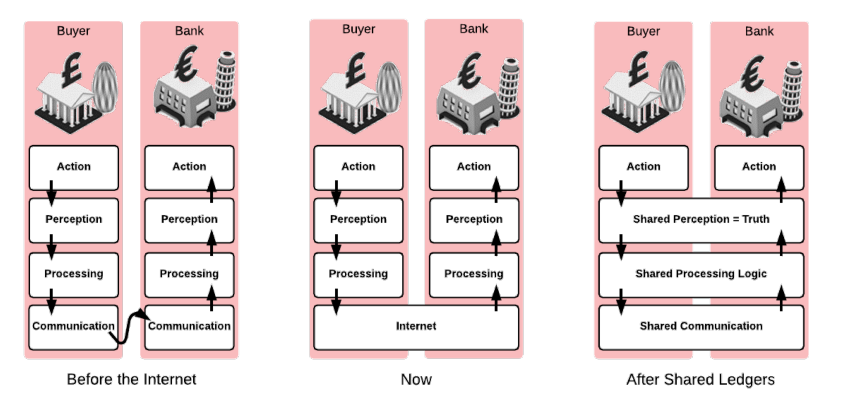
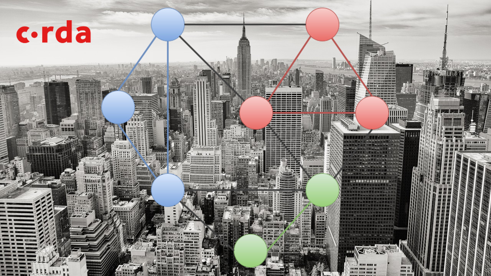

I've recently started a project (top secret, can't say anymore) which involves using Corda. So, what is it? If you've found this post on Google then you probably already have some sort of idea, but if you've come from most other sources then it most likely doesn't sound familiar. Well, Corda is a Distributed Ledger Technology (DLT for short). Some might say this is a blockchain, but I definitely believe it has its differences from other blockchains like Ethereum and Bitcoin and is more similar to other DLTs such as Hyperledger Fabric and Quorum (which itself is a fork of Ethereum). These differences are important. They are what allow Corda to perform better for its particular use cases. In this post I will give a brief overview of the factors that influenced the design of Corda.

Expanding on what I said in the introduction, Corda is a Distributed Ledger Technology to be used by businesses, such as financial institutions, to keep a shared ledger of transactions and thus removing the need for the involved parties to constantly check that each of their books are in line after interacting with each other. This is the primary problem that Corda is trying to solve.

Following on from this, since it is designed to allow interacting parties to make sure they are all in line, it also removes the need for all parties on the Corda network to know about each and every transaction, as only those involved are interested in them. Both of these points really need to be expanded upon and to do this we need to take a proper look into the problems Corda is attempting to solve so we can fully understand why Corda chose to make these fundamental decisions.

## Why are Distributed Ledgers a possible solution to keeping each party’s books in line without the need for constant checking from both sides?

That was quite a long question to write. Data consistency is one of the core features of Distributed Ledgers and is crucial to the problem that Corda is attempting to solve. Let's look more closely into why Corda believes that using a Distributed Ledger will remove the extra time and effort that businesses need to put in to keep data from all parties consistent.

When a business or financial institution, a bank for this example, transfers money from a client's account to the receiver's account in another bank both must check that what was sent was valid, that the funds from the client have been sent and finally that they were received correctly. Ensuring that the funds have decreased in one account and increased in the other requires multiple checks from both sides of the transaction as they need to be 100% sure that money hasn't magically disappeared or created out of thin air. Furthermore, a number of these checks are done manually, requiring even more time and effort to ensure consistency.

A Distributed Ledger could completely remove the need for this reconciliation, whether it is done by the interacting parties themselves or a third-party. This is due to the nature of Distributed Ledgers where all nodes (the parties) must be in the same state. More specifically to Corda, a transaction is only committed when all involved parties have accepted that the inputs and outputs of the proposed transaction are correct. If anyone disagrees then it doesn't take place. Otherwise the transaction is committed and the funds (or whatever the inputs and outputs were) are moved between the parties as previously agreed.

Notice that I haven't mentioned any need for manual checking of the transactions. There can still be manual interactions during the processing of a proposed transaction if, for example, it needs to be signed off before the process is complete.

Onto the next question.

## Why did Corda decide to make transactions private to only the parties included within the transaction?

First, we need to understand why blockchains like Ethereum and Bitcoin make all of their transactions public. One of the main attractions of blockchains is being trustless, meaning that I don't need to trust you personally (or anyone else) to still trust that all the transactions on the chain are valid. This is possible due to all transactions being public once they are included in a block and will remain that way permanently. For a bad actor to alter a transaction after it has been included in a block is almost impossible as it will require copies of the block on all other nodes in the network to also be changed before the next block is added to the chain.

The downside that comes with this is that every party using that blockchain must keep a local copy of the chain themselves so that when a new block is added to the chain all parties receive the update and kept in the same state.

Performance and scalability are greatly impacted by making a system trustless. For example, Ethereum currently requires every node to process all transactions and store the state of accounts and contract code. This reduces the possible throughput of all nodes on the network to that of a single node. If this model remains the same then as the number of users increases the average time that a user waits for their transaction to be mined can only go up.

Due to this problem, possible ways to improve the performance of the network are being looked into; the Ethereum Raiden Network and Bitcoin Lightning Network are both aiming to vastly increase both the performance and scalability of their respective systems.

Corda is not trustless. That does not mean it moves to the other end of the scale, but some trust is explicit as a party’s identity must be known to join an existing Corda network. Furthermore, the parties on the network must trust the issuers of assets onto the ledger that they themselves are moving around within transactions. This is where the requirement of trust ends. The parties themselves do not need to trust each other, between the ledger keeping everyone in step, the fact that each of their identities are known by the networks certificate authority provides some backup guarantee in case of any nefarious behaviour.

Additionally, even trustless blockchains or ledgers are not found at rock bottom of the trust scale as theirs is implicit within their consensus protocols and relies on a single actor (or group of actors) not controlling half of the mining power of the whole network. So, for now at least, we are going to have to settle for some trust in any system we choose to use.

By removing the need for consensus across all parties in the network and instead only between the participants of a transaction the time to complete one is reduced. The initial trust provided by the networks certificate authority provides the foundation for this decision. This is very important if distributed ledgers are going to replace the financial infrastructure that already exists.

Using the answers to these two questions we can determine that, as of this moment, Corda is not as decentralised as a blockchain like Bitcoin or Ethereum but it does allow businesses to transact without the need for a central point. This is in line with other Distributed Ledger Technologies such as Hyperledger Fabric.

Whether or not this is a good or bad point depends on your stance on the importance of decentralisation. Although, the distribution of contract code works in a similar way to a hard fork in a blockchain. All parties must agree to the new code before everyone upgrades; the old version of the code is then abandoned rather than having two different versions running independently. This sort of upgrade process moves it back up a tad on the decentralised scale.

I believe these are the sort of design decisions that need to be made if DLTs are going to move forward and become more widely used.

In conclusion, these are the factors that I believe greatly influenced the design of Corda. They chose to design a Distributed Ledger Technology that uses known identities to inject trust into the system and keeps transactions private between interacting parties, with the goal to reduce the effort required to maintain data consistency while still allowing it to scale well and handle a higher volume of transactions. I believe these decisions are needed if Distributed Ledger Technologies are going to replace how businesses interact with each other and possibly supplant current financial infrastructure.

If this post has piqued your interest and you want to have a look at Corda yourself, then go look at their [documentation](https://docs.corda.net/) which provides tutorials on the concepts Corda is built on along with how to use the platform so you can play with the it yourself.

If you enjoyed this post or found it helpful (or both), you can keep up with my new posts as I write them by following me on Twitter at [@LankyDanDev](https://twitter.com/LankyDanDev).

&nbsp;