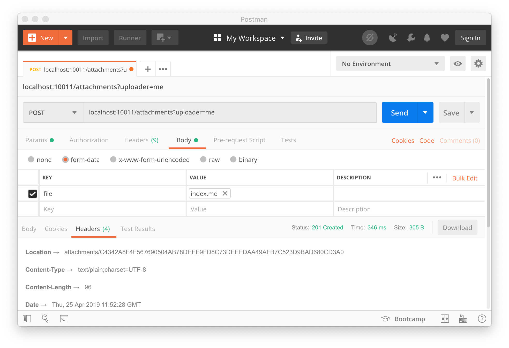
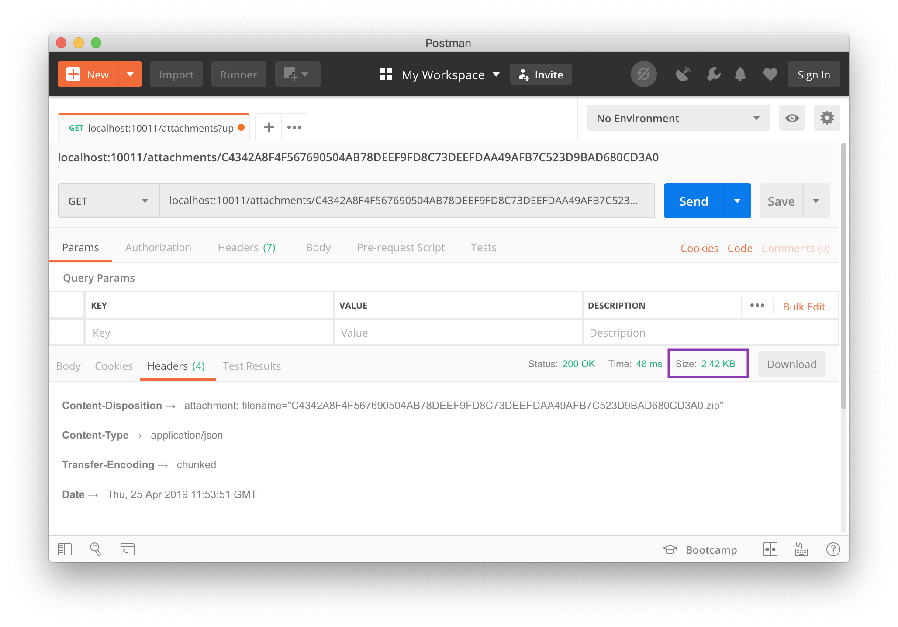
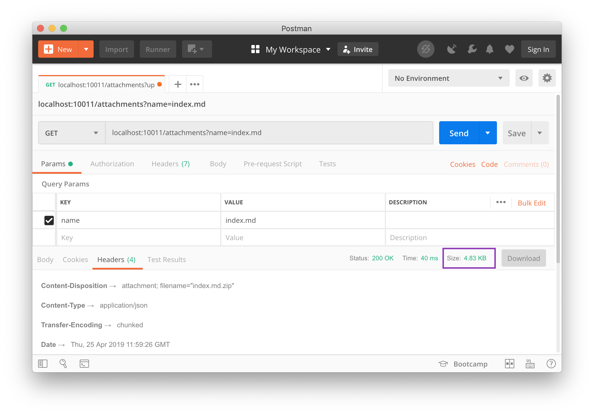

This post is dedicated to the number of people I have seen in the Corda Slack channel asking how to upload and subsequently download attachments to and from a node. Although both of these can already be achieved via the Corda Shell. In this post, I will be focusing on writing a client application that interacts with a node to control the attachments.

Hopefully, this short post will save me a lot of time in the future as well as helping you, the reader, implement this feature without the need to request help from anyone else.

As a Spring Fanboy, I will obviously be implementing the client application in Spring. By leveraging `spring-web`, an application can be put together with little effort while Spring does the heavy lifting. What does this mean for you? Well, it allows you to send and receive files to and from the Spring application by adding a few annotations and using the right objects. Praise Spring! 🙌🙏

One last thing, I am sure there is better code that can do the same thing as what I wrote for this post. If so, you can always submit a Pull Request to change it 😎. The post can be found [here](https://github.com/lankydan/lankydanblog-jamstack/blob/master/content/blog/2019/corda-attachment-download/index.md) if needed.

Let's get on with it.

## Uploading

```kotlin
private val proxy: CordaRPCOps = rpc.proxy

@PostMapping
fun upload(@RequestParam file: MultipartFile, @RequestParam uploader: String): ResponseEntity<String> {
  val filename = file.originalFilename
  require(filename != null) { "File name must be set" }
  val hash: SecureHash = if (file.contentType != "zip" || file.contentType != "jar") {
    uploadZip(file.inputStream, uploader, filename!!)
  } else {
    proxy.uploadAttachmentWithMetadata(
      jar = file.inputStream,
      uploader = uploader,
      filename = filename!!
    )
  }
  return ResponseEntity.created(URI.create("attachments/$hash")).body("Attachment uploaded with hash - $hash")
}

private fun uploadZip(inputStream: InputStream, uploader: String, filename: String): AttachmentId {
  val zipName = "$filename-${UUID.randomUUID()}.zip"
  FileOutputStream(zipName).use { fileOutputStream ->
    ZipOutputStream(fileOutputStream).use { zipOutputStream ->
      val zipEntry = ZipEntry(filename)
      zipOutputStream.putNextEntry(zipEntry)
      inputStream.copyTo(zipOutputStream, 1024)
    }
  }
  return FileInputStream(zipName).use { fileInputStream ->
    val hash = proxy.uploadAttachmentWithMetadata(
      jar = fileInputStream,
      uploader = uploader,
      filename = filename
    )
    Files.deleteIfExists(Paths.get(zipName))
    hash
  }
}
```

As I mentioned earlier I'm sure much can be done to improve it, but hey, it does the job.

I don't think there is too much to dive into here since a lot of the code is around checking and possibly converting the file into the right format.

Although, this does raise a question, why is the conversion needed in the first place? Well, only Zips or Jars (which are pretty much Zips) can be stored as attachments in Corda. Therefore, if a different file type is received, it must first be converted so it can be stored in the node.

The only Corda specific code here is the call to `uploadAttachmentWithMetadata`. Setting the `filename` becomes handy when attempting to retrieve and download the stored attachment.

The hash (`AttachmentId`, an alias for `SecureHash`) is returned from the endpoint. Just like the `filename`, this provides another way to retrieve the attachment later on.

A quick example of uploading the attachment can be seen in the image below:



## Downloading

I have implemented two different versions for downloading attachments.

### By Hash / AttachmentId

```kotlin
private val proxy: CordaRPCOps = rpc.proxy

@GetMapping("/{hash}")
fun downloadByHash(@PathVariable hash: String): ResponseEntity<Resource> {
  val inputStream = InputStreamResource(proxy.openAttachment(SecureHash.parse(hash)))
  return ResponseEntity.ok().header(
    HttpHeaders.CONTENT_DISPOSITION,
    "attachment; filename=\"$hash.zip\""
  ).body(inputStream)
}
```

This endpoint retrieves an attachment using the hash returned from the upload endpoint. `openAttachment` requires a hash to pull the attachment from the node.

The hash is passed in as a `String` since there doesn't seem to be any default conversion to `SecureHash` that Spring sets up and it isn't worth the effort to set up for this situation.

The correct header needs to be added to trigger the download of the attachment by the caller. Calling this endpoint will then return a result like the below:



### By name

```kotlin
private val proxy: CordaRPCOps = rpc.proxy

@GetMapping
fun downloadByName(@RequestParam name: String): ResponseEntity<Resource> {
  val attachmentIds: List<AttachmentId> = proxy.queryAttachments(
    AttachmentQueryCriteria.AttachmentsQueryCriteria(filenameCondition = Builder.equal(name)),
    null
  )
  val inputStreams = attachmentIds.map { proxy.openAttachment(it) }
  val zipToReturn = if (inputStreams.size == 1) {
    inputStreams.single()
  } else {
    combineZips(inputStreams, name)
  }
  return ResponseEntity.ok().header(
    HttpHeaders.CONTENT_DISPOSITION,
    "attachment; filename=\"$name.zip\""
  ).body(InputStreamResource(zipToReturn))
}

private fun combineZips(inputStreams: List<InputStream>, filename: String): InputStream {
  val zipName = "$filename-${UUID.randomUUID()}.zip"
  FileOutputStream(zipName).use { fileOutputStream ->
    ZipOutputStream(fileOutputStream).use { zipOutputStream ->
      inputStreams.forEachIndexed { index, inputStream ->
        val zipEntry = ZipEntry("$filename-$index.zip")
        zipOutputStream.putNextEntry(zipEntry)
        inputStream.copyTo(zipOutputStream, 1024)
      }
    }
  }
  return try {
    FileInputStream(zipName)
  } finally {
    Files.deleteIfExists(Paths.get(zipName))
  }
}
```

This snippet, like the uploading example, has a lot of extra code that plays around with `OutputStream`s and `InputStream`s.

This endpoint makes use of the `queryAttachments` function to retrieve the `AttachmentId`s matching the input criteria. A call to `openAttachment` is still needed to return the attachment once the `AttachmentId`s/hashes are retrieved. 

Going down this route makes much more sense when compared to the `downloadByHash` endpoint since a filename is more human-readable than a hash.

Most of the extra code in this example is handling the possibility of multiple files being returned. If there are multiple attachments with the same name, then they get zipped together and returned.

You can then make a request like the one below which can handle the eventuality of many attachments with the same name:



> Note that the file size is larger than the by hash version since I uploaded another file with the same name.

## Wrapping up

There isn't really a proper conclusion to write here. Basically, all I have to say is that, if you want to upload and download attachments to and from a Corda node with Spring, then the code in this post will help get you on your way. I am sure there are tidier ways to handle all the `InputStream`s and `OutputStream`s but they seem to get the job done.

If you found this post helpful and want to keep up with my posts as I write them, then you can follow me on Twitter at [@LankyDanDev](https://twitter.com/lankydandev).