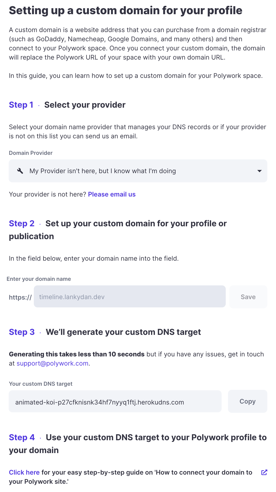
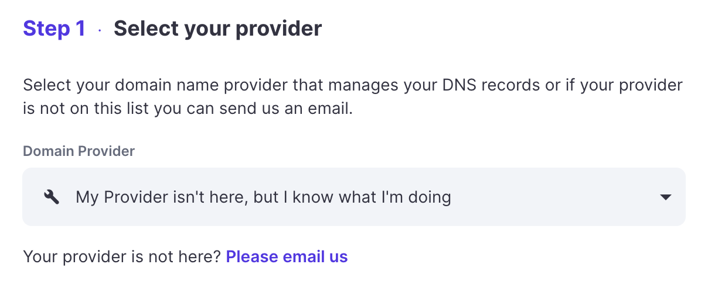
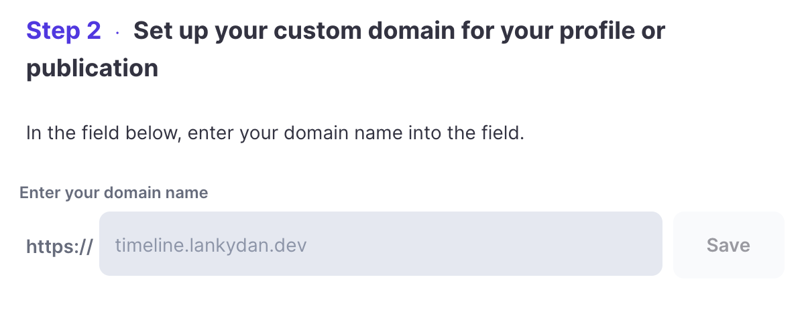
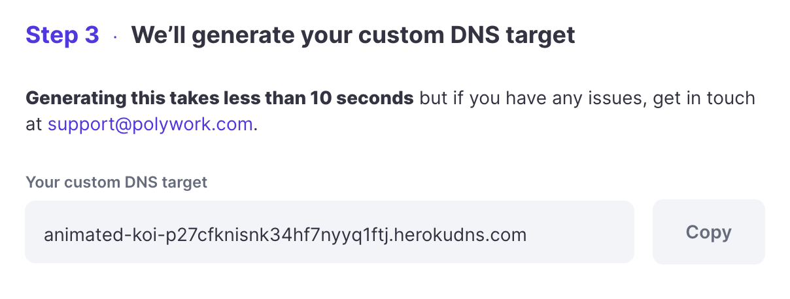
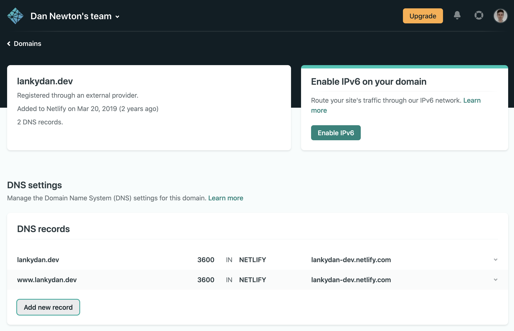
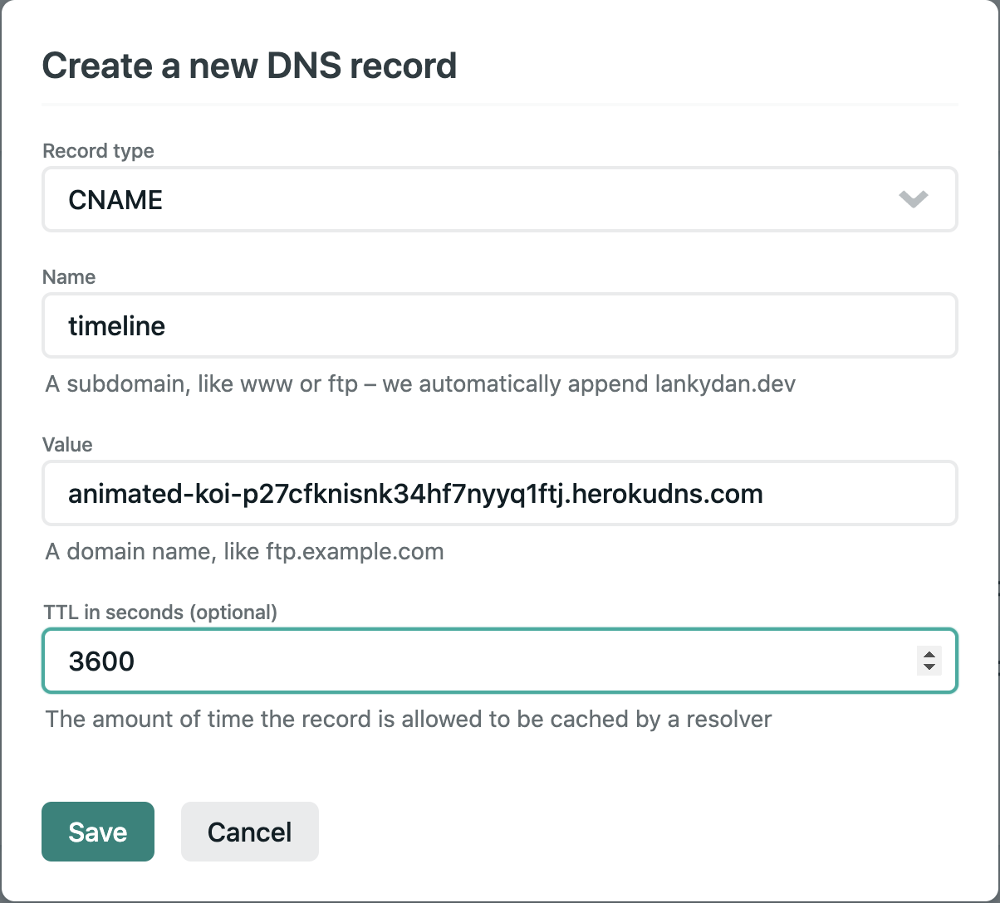
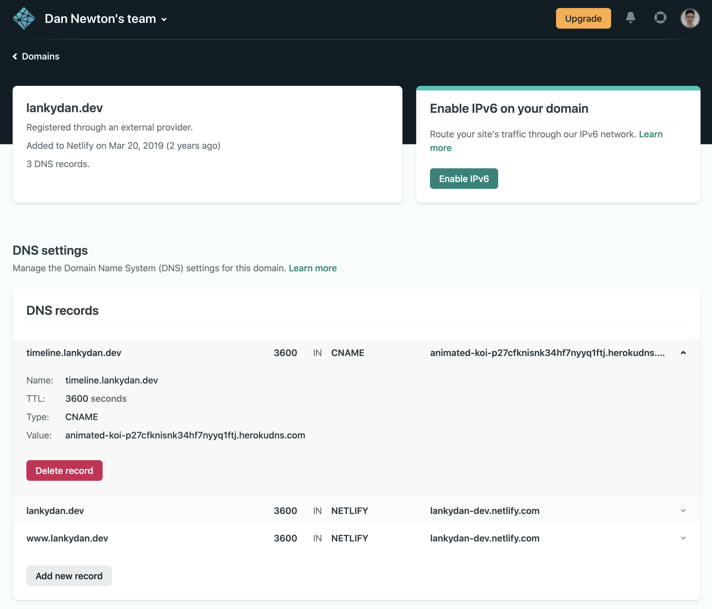

Polywork allows you to point a subdomain of your own site to your Polywork profile/feed. They do have instructions on setting this up; however, I made quite a few mistakes when trying this myself. I actually managed to make my site inaccessible due to screwing up the DNS records. I didn't really know what I was doing and thought I was doing the right things while following their instructions, but I was clearly wrong.

This post will cover how to set up a Polywork subdomain for sites hosted by Netlify. I'm being specific because my own site uses Netlify, and the instructions on Polywork don't cover this exact scenario.

0) Navigate to your [Polywork settings page](https://www.polywork.com/settings) and scroll down to the `Setting up a custom domain for your profile` section. I started the list from 0 to sync it with Polywork's listed out steps.

    

1) Choose your provider. Since this post is about Netlify hosted sites, you'll need to choose the `My Provider isn't here, but I know what I'm doing` option from the drop-down box. It is worth noting here that since I brought my domain name from Google Domains, I thought that I needed to select `Google Domains` from the drop-down box. This proved incorrect as it conflicted with how Netlify hosts my site.

    > At the time of writing, there wasn't a Netlify specific option. This might be different by the time you're reading this.

    

2) Choose the name of your custom domain. I'm focusing on using a subdomain here, so I chose `timeline.lankydan.dev` for mine where `lankydan.dev` is my site's name.

    

3) Generate a custom DNS target. This will be used later to connect your subdomain to your Polywork feed.

    

4) This is the point where we deviate from the steps listed out by Polywork.

    You'll want to navigate to your Netlify DNS settings page. 
    
    If you want to get there directly, use the following URL customised to your account/team and site name - `https://app.netlify.com/teams/<team_name>/dns/<site_name>`.

    To navigate there from your Netlify homepage, do the following:

    1) Go to your [Netlify homepage/overview page](https://app.netlify.com/)
    2) Select `Domains`, not the site you want to edit.
    3) From the `Domains` page, now select the site you want to modify.

    You will then see a page like the following:

    

    You can now modify your site's DNS settings.

5) Press `Add new record`. This will open a dialogue box to enter your configuration into.

    

    You'll want to fill it in with the following:

    - Record type - `CNAME`.
    - Name - The name of your desired subdomain, the same as chosen in Polywork's settings previously (setting mine to `timeline` creates the overall subdomain of `timeline.lankydan.dev`).
    - Value - The custom DNS target generated in Polywork's settings.
    - TTL (Time To Live) - Provide a value you want or leave it empty to default to 1 hour (3600 seconds).

    Once filled with information similar to the above, press save.

6) Your DNS record is now added and should look like the following when selected.

    

Everything should be working now, meaning when you access your newly setup subdomain, it will redirect you to your Polywork feed.

Depending on how fast you tried to do this, you may run into some HTTPS issues, as the certificate for your subdomain hasn't been acknowledged yet. This happened to me; waiting 5 minutes or so and trying again resolved the problem.

I hope that works nicely for you, and enjoy your new custom Polywork URL!