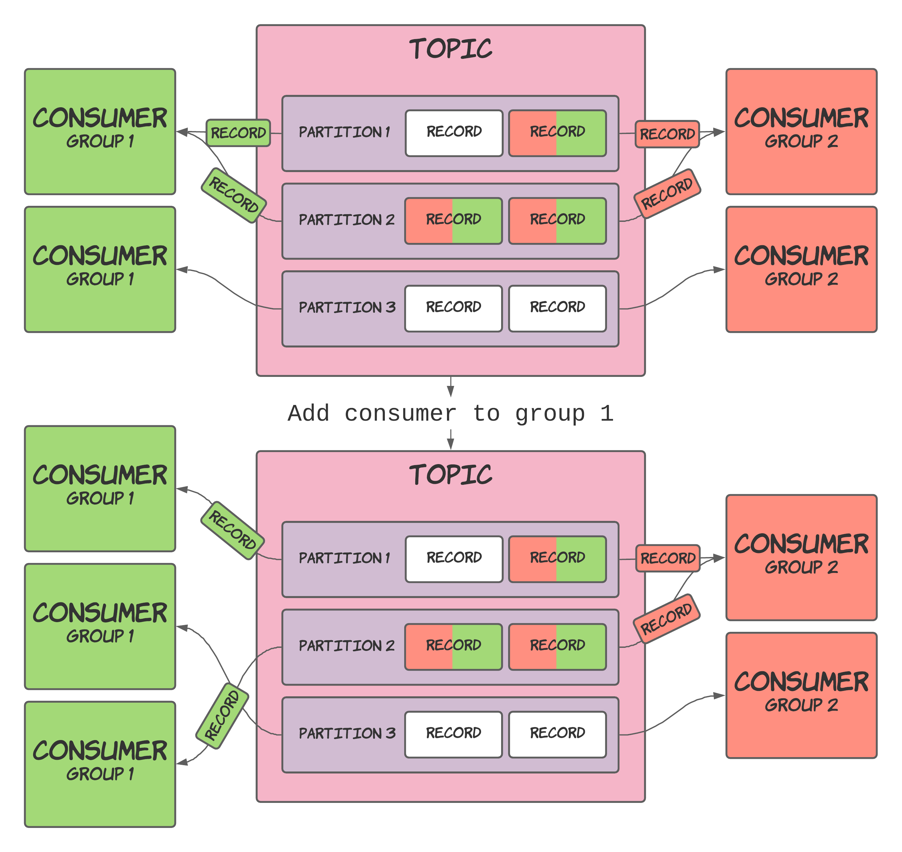

Consumers can form groups, aptly named "consumer groups". These consumer groups determine what records a consumer receives. I know that sounds quite vague, but honestly, I can't think of any other short and snappy way to summarise this topic.

To be more specific, consumer groups do the following:

- Groups consumers by function
- Shares a topic's partitions between consumers in the same group

The following sections expand on these points.

## Groups consumers by function

Consumer groups allow you to relate a set of consumers working together to perform a single function, process or task. Every consumer group will process every record in a topic independently from other groups. 

For example, suppose you have a topic representing sales data. In that case, one group could maintain an aggregate of the sale values while another is passing it to a downstream system for later processing. Both of these groups will run independently and manage their offsets, even when subscribing to the same topic.

The diagram below has two consumer groups who receive all the records stored in the topic:


## Shares a topic's partitions between consumers in the same group

Every consumer inside a consumer group is assigned a number of a topic's partitions, ensuring that records are shared between the group while also keeping each partition's records in order. This mechanism is made more efficient by keeping the assigned partitions the same until introducing a new consumer to the group. At this point, Kafka reassigns the partitions between the group's consumers, and this process is called "rebalancing". Consumers can also be assigned multiple partitions if there are more partitions than consumers within a group.

The diagram shows the sharing of partitions within a single consumer group:


Introducing another consumer group does not affect the assignment of existing groups, as shown below:


The system will rebalance when a new consumer is added to one of the groups, visualised below:



A new consumer was added to `group 1`, which caused the assigned partitions to rebalance between them.

## Creating a consumer group

You don't have to create a group explicitly. Instead, it's done as part of creating a consumer.

When constructing a consumer, pass in the `group.id` property of the group. In fact, this field is required, so any Kafka example or tutorial you've followed will have already included this piece of code.

```kotlin
fun createConsumer(): Consumer<String, String> {
  val props = Properties()
  props["bootstrap.servers"] = "localhost:9092"
  // The important stuff is below!
  props["group.id"] = "test"
  // That's the end of the important stuff!
  props["enable.auto.commit"] = "true"
  props["auto.commit.interval.ms"] = "1000"
  props["key.deserializer"] = "org.apache.kafka.common.serialization.StringDeserializer"
  props["value.deserializer"] = "org.apache.kafka.common.serialization.StringDeserializer"
  return KafkaConsumer(props)
}
```

Initialising more consumers adds them to the existing group without you having to do anything else. Kafka makes this work exceptionally smoothly since the Broker knows about all the consumers in the group and can therefore handle consumers joining (or leaving) a group.

## How partitions are assigned

The chosen "assignment strategy" determines the assignment of partitions within a group.

The default strategy is the `RangeAssignor`, which I would rather not explain in my own words, so I'll quote [Kafka's JavaDocs](https://kafka.apache.org/27/javadoc/org/apache/kafka/clients/consumer/RangeAssignor.html) instead.

> The range assignor works on a per-topic basis. For each topic, we lay out the available partitions in numeric order and the consumers in lexicographic order. We then divide the number of partitions by the total number of consumers to determine the number of partitions to assign to each consumer. If it does not evenly divide, then the first few consumers will have one extra partition.
>
> For example, suppose there are two consumers `C0` and `C1`, two topics `t0` and `t1`, and each topic has 3 partitions, resulting in partitions `t0p0`, `t0p1`, `t0p2`, `t1p0`, `t1p1`, and `t1p2`.
>
> The assignment will be:
>
> C0: [`t0p0`, `t0p1`, `t1p0`, `t1p1`]
> C1: [`t0p2`, `t1p2`]

You can configure a consumer group's assignment strategy by using the `partition.assignment.strategy` property and defining the qualified class name of the assignor to use.

> More information on the different assignors can be found in [Kafka's documentation](https://kafka.apache.org/documentation/#consumerconfigs_partition.assignment.strategy).

## Summary

Consumer groups in Kafka allow you to:

- Group consumers by their function in a system.
- Split the processing load of a topic by sharing its partitions between consumers in a group.

You've seen how to create a consumer and place it in a group or add one to an existing group by specifying its `group.id` during initialisation. You will hopefully also recall that Kafka does the rest of the work and that selecting the `group.id` is all you have to do.

By finishing this post, we have now covered the core parts of Kafka (at least in my opinion), and you should have enough knowledge to start building applications using it. Probably nothing fancy, but you'll at least have the foundational understanding to get started.

I'll look at particular topics more closely in future posts that I might have brushed over previously, or I'll cover new material as I learn it myself.