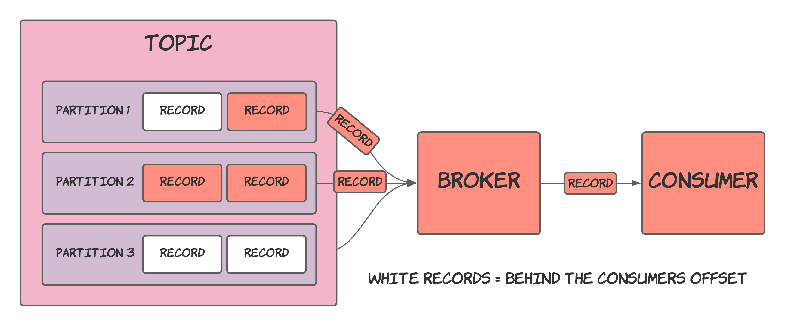
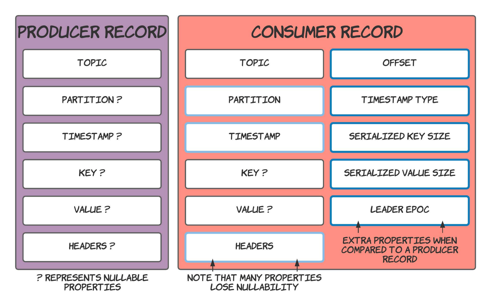
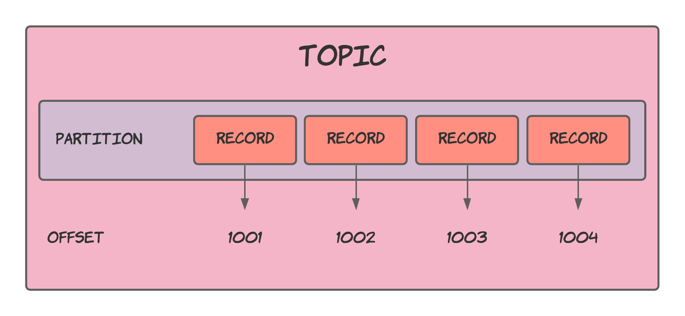
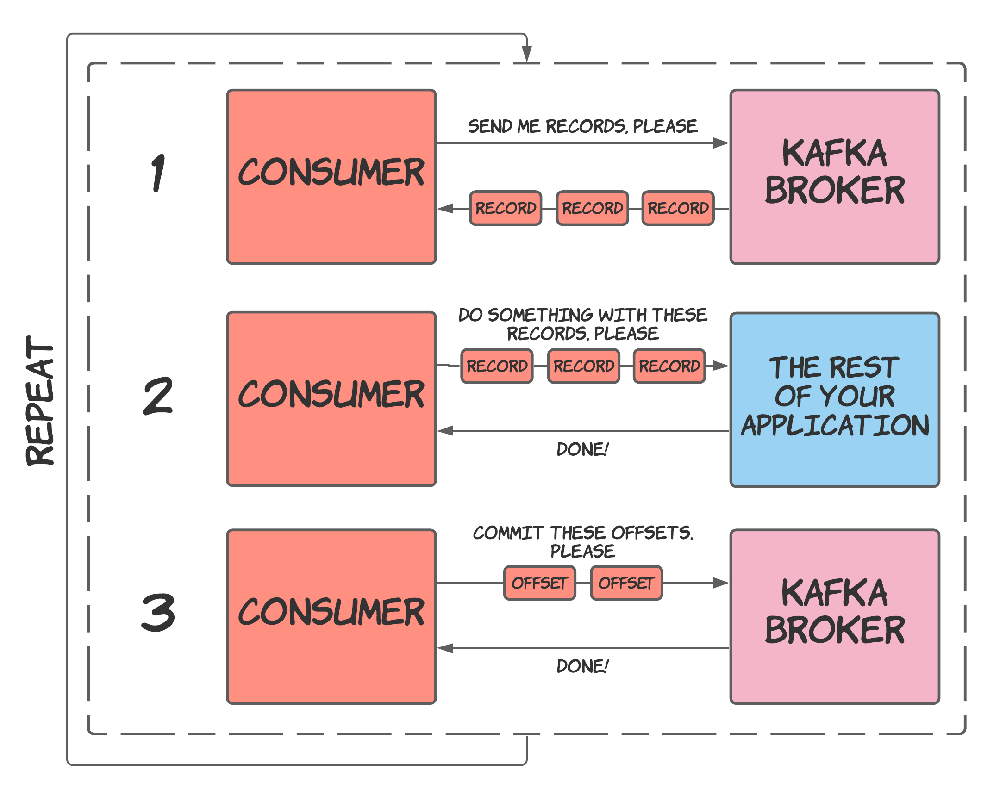

Consumers make up the Kafka client code that reads records from topics, working at the opposite end of the chain as [producers](../producers/index.md) and benefiting from the same client features such as connection pooling and network buffering. Thus, providing you with a concise API that still allows you to write highly effective applications.

The diagram below visualises the interaction between a consumer and broker, where the consumer receives records stored in a topic.



In the following sections of this post, we will take a closer look at how consumers work and the client code needed to leverage them in your applications.

> The code written in this post is in Kotlin, but similar code should be applicable for any JVM language. Furthermore, clients in other languages will also look virtually the same.

## Creating a consumer

The first step is creating a `KafkaConsumer`:

```kotlin
fun createConsumer(): Consumer<String, String> {
  val props = Properties()
  props["bootstrap.servers"] = "localhost:9092"
  props["group.id"] = "test"
  props["enable.auto.commit"] = "true"
  props["auto.commit.interval.ms"] = "1000"
  props["key.deserializer"] = "org.apache.kafka.common.serialization.StringDeserializer"
  props["value.deserializer"] = "org.apache.kafka.common.serialization.StringDeserializer"
  return KafkaConsumer(props)
}
```

When creating a `KafkaConsumer`, you must provide its configuration via a `Properties` object or a `Map<String, Object>`. In addition, `KafkaConsumer`'s constructor also accepts values for the `key.deserializer` and `value.deserializer` properties.

> You can find the available configuration options in [Kafka's documentation](https://kafka.apache.org/documentation/#consumerconfigs).

Now that you have an initialised consumer, you'll need to subscribe to some topics to receive records.

## Subscribing to topics

A consumer must subscribe to topics to retrieve the records stored in them. To be clear, a single consumer can subscribe to multiple topics at once. You do not have to make a separate consumer per topic.

A consumer subscribes to topics using its `subscribe` method (seems pretty obvious, I know...).

```kotlin
consumer.subscribe(listOf("string name of topic"))
```

Even though `subscribe` sounds straight forward, it does quite a lot of work behind the scenes, dynamically assigning a consumer the partitions it receives records from. The assignment of partitions becomes essential when you start writing more exciting applications that contain a more significant number of consumers.

## Polling (retrieving) records

After a consumer subscribes to some topics, it needs to request records to pass them off to the rest of the application. This process is called polling and is done using the `poll` function.

When calling `poll`, you must pass in a timeout duration to allow your application to move along if no records are available for retrieval. 

```java
ConsumerRecords<K, V> poll(Duration timeout);
```

When no records are passed to a consumer within the timeout duration, it will progress with an empty collection of records.

The objects returned from `poll` are `ConsumerRecord`s. These are similar but different from the `ProducerRecord`s used to create records stored within a topic.



`ConsumerRecord`s have several extra fields and a few that become required compared to `ProducerRecord`s.

A `ConsumerRecord` contains the following fields:

- __Topic__ - The topic to the record was stored in.
- __Partition__  - The partition to the record was stored in.
- __Timestamp__ - The timestamp of the record.
- __Key__ (optional) - The key of the record.
- __Value__ (optional) - The value of the record.
- __Headers__ - Extra metadata to go alongside the record's value.
- __Offset__ - The offset that the record holds within its partition.
- __Timestamp type__ - Indicates how the record's timestamp value was generated.
- __Serialized key size__ - The size of the serialized, uncompressed key in bytes. If key is null, the returned size is -1.
- __Serialized value size__ - The size of the serialized, uncompressed value in bytes. If key is null, the returned size is -1.
- __Leader epoch__ - The current value of the leader epoch (this [StackOverflow post](https://stackoverflow.com/questions/50342961/what-is-a-role-of-leader-epoch-checkpoint-in-log-segment-of-kafka-partition#50403059) seems to give some information on how this value is generated).

You don't have to worry about generating these fields as you will only be receiving them after calling `poll`. The values are either defined by a `ProducerRecord` or generated by Kafka.

Code-wise, polling records is done as follows:

```kotlin
val records: ConsumerRecords<String, String> = consumer.poll(Duration.ofSeconds(5))
for (record: ConsumerRecord<String, String> in records) {
  println("Consumer reading record: ${record.value()}")
}
```

> `ConsumerRecords` implements `Iterable` and can therefore be iterated over directly.

`poll` returns a `ConsumerRecords` object which provides some convenience functions and can also be iterated over directly. For example, it allows you to extract all the records for a particular topic, which is handy since you can subscribe to multiple topics in a single consumer.

You'll then want to loop over the returned `ConsumerRecord`s and process them in whatever way your application desires.

## Offsets

Every record stored in a partition is assigned an offset which denotes how far they are from the start of the partition. Adding new records increases the offset, guaranteeing that more recent records will always have a higher offset than older records (based on time stored).



Offsets are not significant when persisting new records as this part is all handled by Kafka; however, the concept plays an important role when consuming records.

Consumers use partition offsets to keep track of what records have been processed. As it polls records and computes whatever needs computing, it needs to note down the offsets of these records, so that the consumer knows what point to start polling records from in case of failure.

## Committing offsets

The process of keeping track of a consumer's offset is known as "committing". In that it _commits_ the current offset for a partition to storage.

A consumer does not store its offsets locally. Instead, it sends them to the Kafka broker, who then persists them to disk. 

Maintaining offsets in this way keeps the importance of consumer clients low within the context of the whole application. Starting, stopping and even destroying the machines running the consumers is possible without preventing the application from recovering. You can initialise a new consumer client and instantly continue processing from where the previous consumer was.

Furthermore, it allows you to focus your efforts on securing the broker's machines rather than maintaining maximum security on many consumer clients. The broker contains the critical information, and keeping offsets in this way works to ensure this.

To commit a consumer's offsets to the Kafka broker, you should use one of the following methods:

```java
// Consumer.java

// Synchronous offset committing
void commitSync();
void commitSync(Duration timeout);
void commitSync(Map<TopicPartition, OffsetAndMetadata> offsets);
void commitSync(final Map<TopicPartition, OffsetAndMetadata> offsets, final Duration timeout);
// Asynchronous offset commtting
void commitAsync();
void commitAsync(OffsetCommitCallback callback);
void commitAsync(Map<TopicPartition, OffsetAndMetadata> offsets, OffsetCommitCallback callback);
```

These methods all commit a consumer's offsets and come with different degrees of control. For example, the overloads of `commitSync` and `commitAsync` that have no arguments are fully managed solutions that determine the offsets from the polled records — setting the offsets of each partition to the highest offset value contained in the received records.

The other options give you more control but require you to do more work and set the offsets yourself.

You will want to commit your offsets after processing records. This will form part of the standard process when working with Kafka. Poll records, process them and commit the updated offsets to confirm that they should not be received again.

The code for this process will look like:

```kotlin
val records: ConsumerRecords<String, String> = consumer.poll(Duration.ofSeconds(5))
for (record: ConsumerRecord<String, String> in records) {
  println("Consumer reading record: ${record.value()}")
}
consumer.commitAsync()
```

> Committing can also be done periodically in the background if configured to do so, see the [Kafka documentation - enable.auto.commit](https://kafka.apache.org/documentation/#consumerconfigs_enable.auto.commit).

## Polling loop

To finish the process of polling records, processing them and committing the updated offsets, you'll want to group these steps and repeat them as your application requires. For most use cases, repeating these steps in a loop might suffice, which would provide a consumer that infinitely pulls records from a Kafka broker and feeds them to the rest of the application.

> This loop resembles what you'll see in the Consumer's JavaDocs as well as many examples online.

The most straightforward way to do something infinitely is to use a `while(true)` loop run on a dedicated thread:

```kotlin
thread {
  while (true) {
    val records: ConsumerRecords<String, String> = consumer.poll(Duration.ofSeconds(5))
      for (record: ConsumerRecord<String, String> in records) {
        println("Consumer reading record: ${record.value()}")
      }
    consumer.commitAsync()
  }
}
```

I don't have anything left to say here, so let's close up this post.

## Summary

The overall process of using a Kafka consumer consists of:

1) Creating a consumer.
2) Subscribing to some topics.
3) Polling records from the Kafka broker.
4) Processing these records with the rest of your application.
5) Committing the updated offsets back to the Kafka broker.
6) Repeat, by going back to step 3 (polling records).

I have also put together a nice diagram to showcase this (I think it's nice anyway!).



Bringing all these steps together gives you the following code:

```kotlin
fun main() {
  val consumer = createConsumer()
  thread { consumeMessages(consumer, topic) }
}

fun createConsumer(): Consumer<String, String> {
  val props = Properties()
  props["bootstrap.servers"] = "localhost:9092"
  props["group.id"] = "test"
  props["enable.auto.commit"] = "true"
  props["auto.commit.interval.ms"] = "1000"
  props["key.deserializer"] = "org.apache.kafka.common.serialization.StringDeserializer"
  props["value.deserializer"] = "org.apache.kafka.common.serialization.StringDeserializer"
  return KafkaConsumer(props)
}

fun consumeRecords(consumer: Consumer<String, String>, topic: String) {
  consumer.subscribe(listOf(topic))
  while (true) {
    val records: ConsumerRecords<String, String> = consumer.poll(Duration.ofSeconds(5))
      for (record: ConsumerRecord<String, String> in records) {
        println("Consumer reading record: ${record.value()}")
      }
    consumer.commitAsync()
  }
}
```

We have now looked at how to write the consuming side of an application that leverages Kafka. Combining this along with the information covered in previous posts about topics, partitions and producers, you should now have enough knowledge to write applications that interact with Kafka.

In the following posts, we will cover topics (not a Kafka topic) that expand on what we covered so far to allow you to start writing more effective Kafka applications.