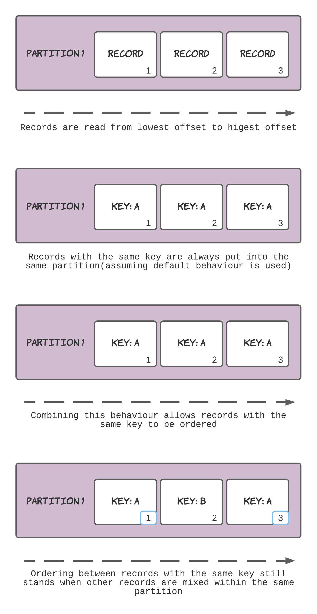
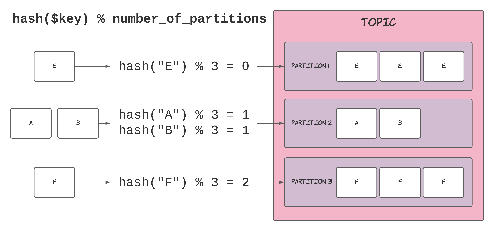

Ordering records in Kafka requires you to make a conscious decision to construct your system in a way that supports ordering. You don't have to do this, as it depends on the functionality of your system. You don't need ordering for all situations, however, many problems require ordering between events (or records in Kafka) to safely and adequately implement a process.

So how can records be ordered?

We can answer the question by using our knowledge about topics, partitions and how consumers retrieve records. The important information we need is as follows:

- Consumers read records from partitions inside topics.
- Each new record is inserted with an incremented offset based on the previous maximum offset.
- These records are read from the lowest to highest offset values.
- Records with the same key are always stored in the same partition.

By combining this information, we can infer that ordering between records can be maintained when they have the same key. By ensuring that all records that have some relationship between them have the same key, you can guarantee that they will be placed into the same partition, where a consumer will now retrieve them in the order they were stored.

I have also put together a diagram summarising the information above:



If you think about this from a more application-level perspective and replace "related records" with something with more context, say, a customer identifier, it becomes easier to understand how you could leverage the ordering provided by Kafka.

All records for a customer would have their keys set to the customer's identifier, which guarantees Kafka will order any events that this customer triggered.

Code-wise, this might look like:

```kotlin
fun pay(customerId: UUID, amount: BigDecimal) {
  producer.send(
    ProducerRecord(
      PAYMENTS, // topic
      customerId, // key
      amount // amount
    )
  )
}
```

The `customerId` is a value that represents a single customer. By using this value as the key for all records related to a single customer, Kafka will place the records into the same partition. When producers read from the `PAYMENTS` topic, they will receive records in the order they were created, making writing the downstream processing logic more straightforward.

Now, I'm going to chuck a bit more information at you, that you don't _need_ to know. However, it will fill in the gaps you might already be questioning on _how_ it works. 

More precisely, how does a topic decide which partition to store a record in?

A formula determines the a record's partition:

```
hash($key) % number_of_partitions
```

Where:

- `hash` A function that hashes the input `$key` with Kafka's chosen digest algorithm.
- `$key` The key of a record.
- `number_of_partitions` - The number of partitions in the topic.

> % (Mod/Modulo) returns the remainder when dividing the left side by the right (e.g. 20 % 7 = 6)

Below is a diagram that visualises the process of determining the partition of a record:



> Note, this is assuming that the default formula for calculating a record's partition is used. You can configure this if desired, more information can be found in the [Kafka documentation](https://kafka.apache.org/documentation/#producerconfigs_partitioner.class) and in their [JavaDocs](https://kafka.apache.org/24/javadoc/?org/apache/kafka/clients/producer/Partitioner.html) (although the amount of information is honestly a bit lacking).

## Summary

- Records within a single partition are ordered by insertion order.
- Records with the same key are stored in the same partition (when using default settings).
- This ensures ordering between records with the same key.
- The formula for calculating a record's partition is `hash($key) % number_of_partitions`.