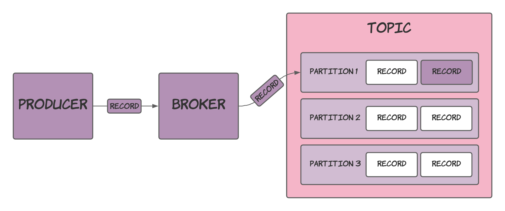
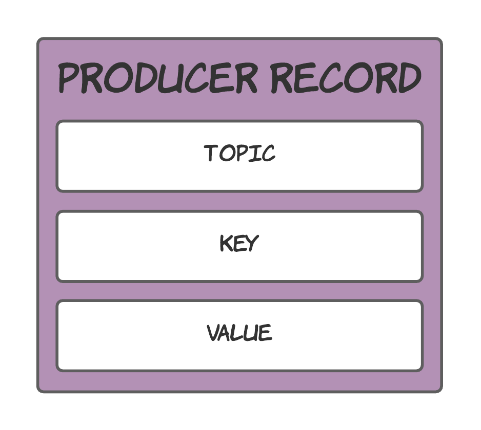
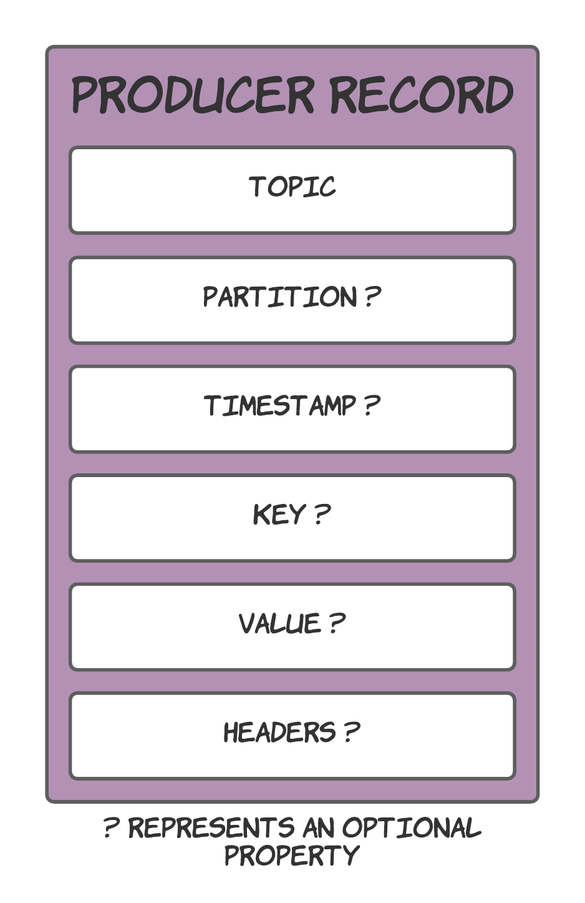
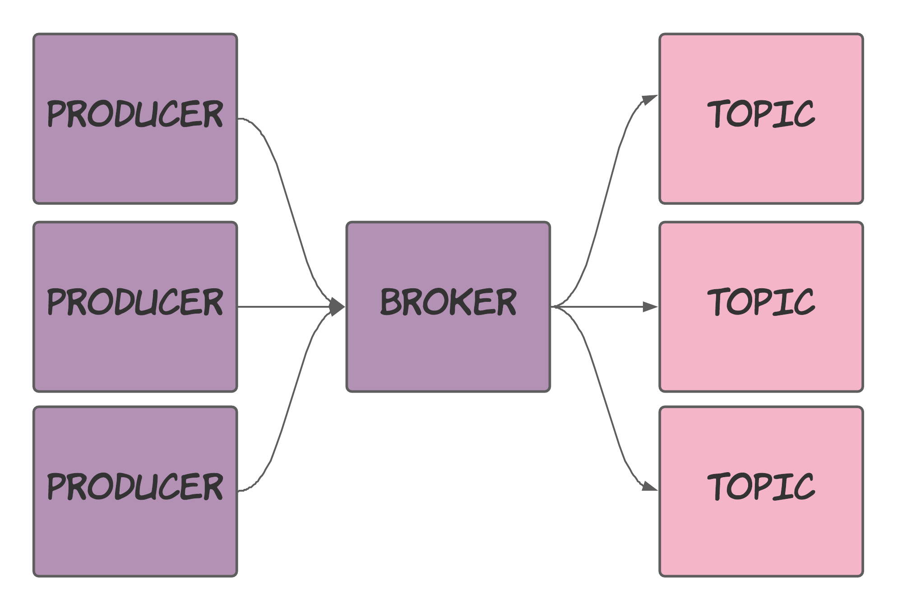
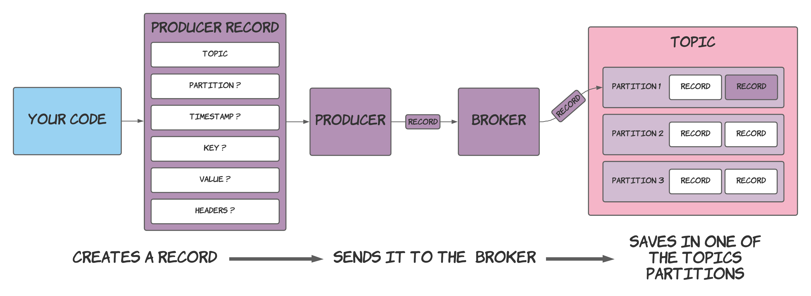

Producers make up the Kafka client code that sends records to topics. These clients dramatically reduce the complexity of leveraging Kafka as it handles problems like connecting pooling and network buffering. You can choose to interact with a small amount of API while still writing highly effective applications.

The diagram below demonstrates how a producer sends a record to a broker, who then records it in one of its topics' partitions.



From a high level, this is how a producer interacts within a Kafka system. The following sections will explore how to use the producer API and the code required to do so.

> The code written in this post is in Kotlin, but similar code should be applicable for any JVM language. Furthermore, clients in other languages will also look virtually the same.

## Creating a producer

Create a `KafkaProducer` to start sending records to Kafka:

```kotlin
fun createProducer(): Producer<String, String> {
  val props = Properties()
  props["bootstrap.servers"] = "localhost:9092"
  props["acks"] = "all"
  props["retries"] = 0
  props["linger.ms"] = 1
  props["key.serializer"] = "org.apache.kafka.common.serialization.StringSerializer"
  props["value.serializer"] = "org.apache.kafka.common.serialization.StringSerializer"

  return KafkaProducer(props)
}
```

When creating a `KafkaProducer`, you must provide its configuration via a `Properties` object or a `Map<String, Object>`. `KafkaProducer`'s constructor also accepts values for the `key.serializer` and `value.serializer` properties.

> You can find the available configuration options in [Kafka's documentation](https://kafka.apache.org/documentation/#producerconfigs).

You're now ready to start producing records, but first, you need to know what a record contains.

## Creating records

From the simplest perspective, a record consists of a key, value, and the topic that stores the record.



However, there is much more than just this. In fact, neither the key nor value are actually required (in that they can be `null`).

This is what a record really looks like:



> Ordered in the same order as required by `ProducerRecord`'s full constructor.

To reiterate, and because not everyone likes diagrams, a record consists of the following properties (along with some explanations):

- __Topic__ - The topic to send the record to.
- __Partition__ (optional) - The partition to send the record to. When not provided, the partition is calculated by hashing the record's key and modding it against the number of partitions.
- __Timestamp__ (optional) - The timestamp of the record. When not explicitly provided, it will default to `System.currentTimeMillis`.
- __Key__ (optional) - The key of the record.
- __Value__ (optional) - The value of the record.
- __Headers__ (optional) - Extra metadata to go alongside the record's value.

Yes, both the key and value can be `null`. However, when you think about it, it doesn't seem too crazy. It's perfectly valid to receive `null` objects from the rest of your application code and Kafka being ok with that likely saves you a headache further down the line. However, it is probably still worth thinking about `null` values to be a good little developer.

The code for creating a `ProducerRecord` is shown below:

```kotlin
val record: ProducerRecord<String, String> = ProducerRecord(
  topic, // Topic
  time.toString(), // Key
  "Record sent at $time" // Value
)
```

Nothing fancy to show here since I only include the `topic`, `key` and `value`. Several constructors help you create `ProducerRecord`s; however, you might be forced to pass in some `null`s to make the records your applications require.

## Sending records

After creating a record to send, all that remains is actually sending it. The code required for this is straightforward:

```kotlin
producer.send(record)
```

`send` asynchronously sends a record to the Kafka broker, returning a `Future` that you can use to make the call blocking if you desire (by calling `Future.get`).

You can also register a callback that executes when the sending of the record is acknowledged:

```kotlin
producer.send(record) { metadata: RecordMetadata, exception: Exception ->
  log.info("Stored in topic: ${metadata.topic()}, partition: ${metadata.partition()} with offset: ${metadata.offset()}")
}
```

That's it. The record provides the rest of the information, allowing the process of sending a record to remain simple.

## Multiple producers

Kafka supports multiple producers without significantly affecting your applications.



You'll need to create extra producers using the same process as starting a single producer. You don't have to do anything special here.

## Summary

The overall process for sending a record to a Kafka topic consists of:

- Creating a producer.
- Creating a record.
- Sending the record via the producer.

The diagram below brings together all the pieces discussed in this post:



Bringing the 3 steps together gives you code similar to the following:

```kotlin
// Create a producer
fun createProducer(): Producer<String, String> {
  val props = Properties()
  props["bootstrap.servers"] = "localhost:9092"
  props["acks"] = "all"
  props["retries"] = 0
  props["linger.ms"] = 1
  props["key.serializer"] = "org.apache.kafka.common.serialization.StringSerializer"
  props["value.serializer"] = "org.apache.kafka.common.serialization.StringSerializer"

  return KafkaProducer(props)
}

fun produceMessages(producer: Producer<String, String>, topic: String) {
  // Execute every 2 seconds
  fixedRateTimer(daemon = true, period = Duration.ofSeconds(2).toMillis()) {
    val time = LocalDateTime.now()
    // Create a record
    val record: ProducerRecord<String, String> = ProducerRecord(
      topic, // Topic
      time.toString(), // Key
      "Record sent at $time" // Value
    )
    println("Producer sending message: $record")
    // Send the record
    producer.send(record)
  }
}
```

You now know how to formulate the producing side of an application that leverages Kafka. Next up is understanding how to use the created records on the other end of your application. I will cover consumers in my following post.