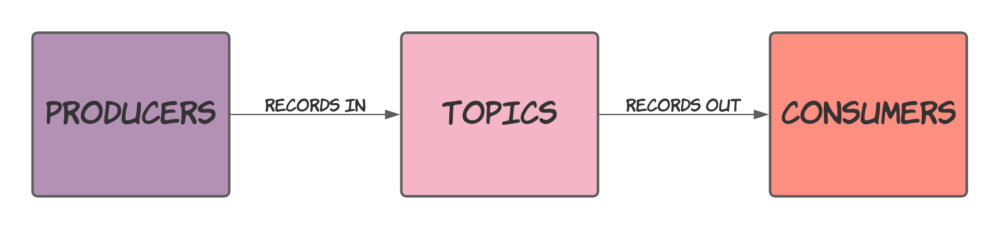
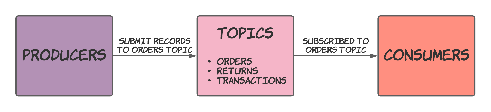
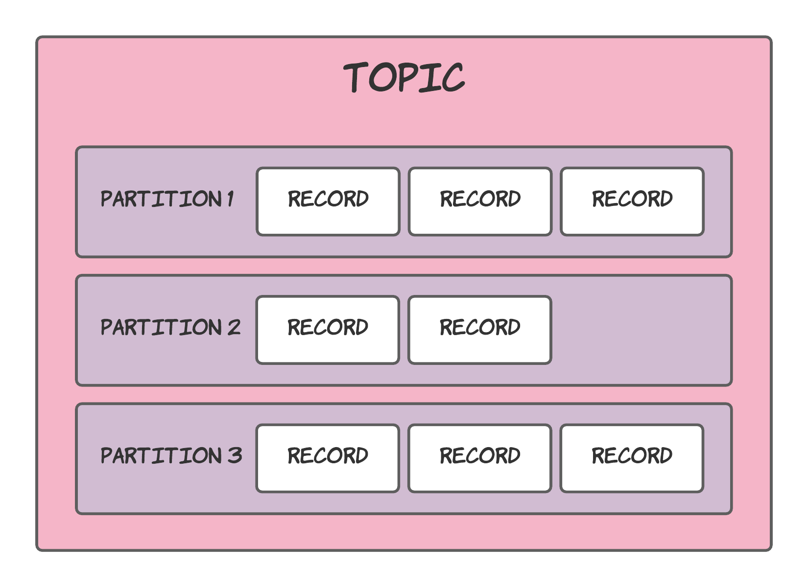
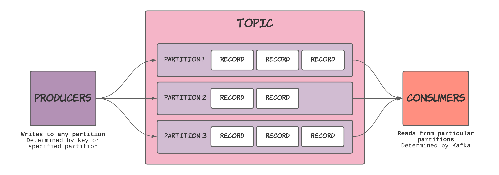

## Topics

Kafka, at a high level, stores records in topics. When handing a new record off to Kafka, you must decide the name of the topic you wish to send it to. On the flip side, you must also provide a topic's name to receive and process records out of Kafka.

> Records, events, messages or whatever you want to call them equate to the same thing. Kafka seems to call them records, so that is what I will stick with within this post. 

Think of topics as the queue or table that you want your data to be stored in. I quite liked the comparison between topics and database tables made in this [talk by Robin Moffatt](https://www.youtube.com/watch?v=xy6jNKI3tKU&t=473s). For example, you have a topic that contains orders, which is quite reasonable to compare to a database table containing order information. Your applications can then use this topic to submit information about orders as they arrive while downstream services process them.

In Kafka terminology, producers submit new records, while consumers read these same records later (albeit possibly almost instantly). Topics tie producers and consumers together while creating a clear cut boundary between them. 

Topics are denoted by name, meaning that as records are produced, they will include the name of the topic they should be stored in, while consumers can subscribe to several topics, again decided by name.

For example, this might look like:

The two diagrams above show what topics are in Kafka, but only from a high level. The following section will take a closer look at what goes on inside a topic.

## Partitions

A single topic can consist of multiple internal queues, named partitions, which hold the records published to Kafka.

Each partition within a topic maintains its own order. Leveraging this fact is what allows applications that include Kafka to scale well (if done correctly). 

Producers push records to any partition within a topic. When submitting a record, a partition is chosen, determined by its key, or explicitly specifying a partition. Divvying out records in this manner, allows each partition to grow at similar rates.

When consumers subscribe to a topic, they are assigned some partitions that they receive records from. For each partition, a consumer will receive records that maintain their produced order. Thanks to this ordering, you can start using multiple consumers to process events from a single topic to improve performance and availability.

The following diagram below gives a visual representation of how producers and consumers interact with a topic's partitions.

Further explanations of partitions are complicated without looking more into other concepts such as producers, consumers and consumer groups. I will cover all of these subjects, illuminating how every component of Kafka works together to build scalable, performant and resilient applications.