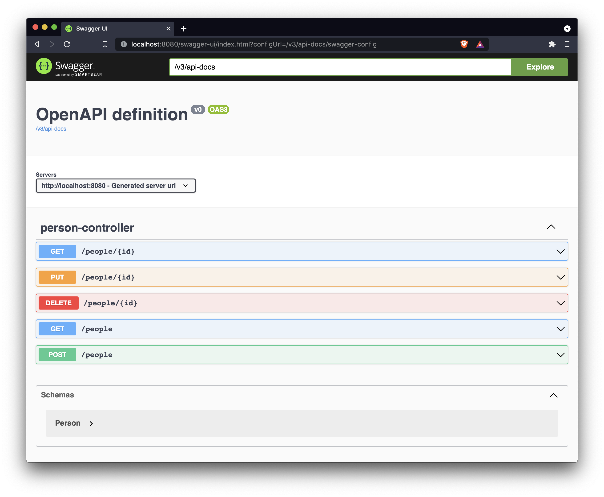
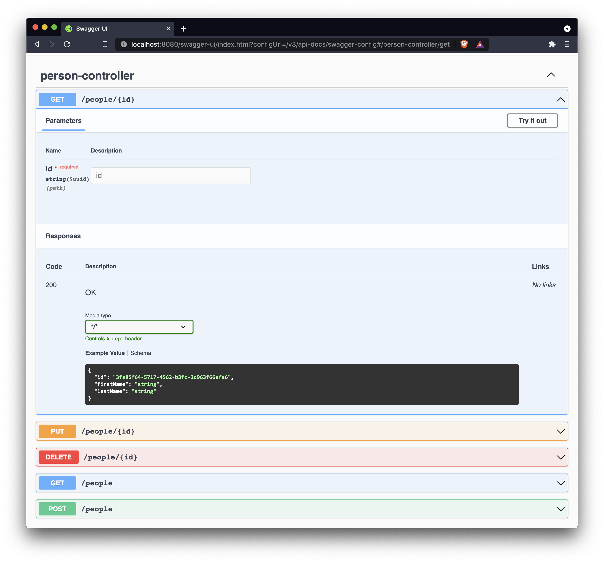
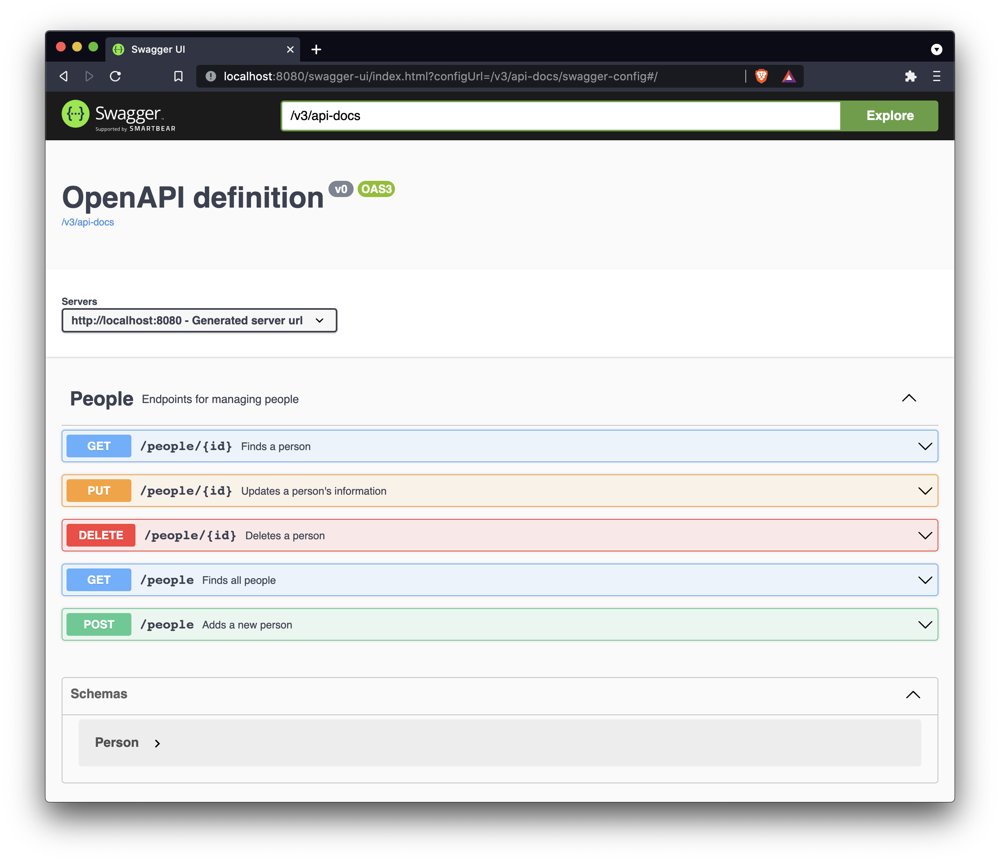
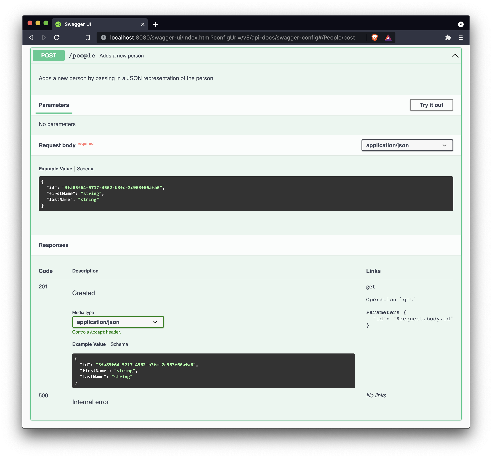

The OpenAPI specification defines how to write HTTP APIs that can be consumed by any programming language and provide insight into the APIs' functionality without access to source code or documentation. In other words, following the specification makes it easier for consumers to understand what it does and how to use it. Tools, such as Swagger, can then be used to display documentation without developers maintaining documentation separate from an API's code. 

All these described points translate into happier users while mitigating some of the burdens you'll face while supporting your APIs. 

This post will show how to produce an OpenAPI compliant and documented REST API using Spring and [springdoc-openapi](https://springdoc.org/#Introduction). We will be using _standard_ Spring `@RestController`s to achieve this.

> You can read more on the OpenAPI specification itself [here](https://spec.openapis.org/oas/latest.html#introduction).

## What is springdoc-openapi?

[springdoc-openapi](https://springdoc.org/#Introduction) is a library that automatically generates documentation for OpenAPI compliant REST APIs built with Spring. It inspects an application's code at runtime, looking at HTTP endpoints, their annotations and returned objects and uses this information to generate documentation.

The library provides support for _standard_ (don't know what to really call this) Spring web code (e.g. endpoints defined in `@RestController`s/`@Controller`s) and [Spring Webflux](https://docs.spring.io/spring-framework/docs/current/reference/html/web-reactive.html).

To top everything off, springdoc-openapi can start a [Swagger UI](https://swagger.io/tools/swagger-ui/) based on the documentation it generates, making it even easier for users to understand and interact with your APIs.

## `springdoc-openapi` dependency

To include `springdoc-openapi` in your project, use the following dependency:

```xml
<dependency>
    <groupId>org.springdoc</groupId>
    <artifactId>springdoc-openapi-ui</artifactId>
    <version>1.5.10</version>
</dependency>
```

This dependency should be used alongside Spring Boot. 

> For more information on supported functionality and their dependencies, refer to the official [springdoc-openapi documentation](https://springdoc.org/#modules).

## Taking your first steps with `springdoc-openapi`

After including the library in your project, how do you start generating documentation?

Well, it just works. As with most Spring Boot related libraries, it runs without requiring you to do anything and scans your `@RestControllers` (and `@Controller`s) for HTTP endpoints, generating OpenAPI related documentation based on the scan results.

The generated documentation can then be accessed by a Swagger UI which is started by default when using `springdoc-openapi` and is accessible by going to `<server:port>/swagger-ui.html`, which will redirect you to a slightly different URL straight after (`<server:port>/swagger-ui/index.html?configUrl=/v3/api-docs/swagger-config`). Going to `/swagger-ui/index.html` will instead display Swagger's pet store example, which probably isn't what you wanted to see.

Now, let's look at what documentation is generated for a standard `@RestController`. We will use Swagger to observe the output documentation (this will continue for all following examples).

```java
@RestController
@RequestMapping("/people")
public class PersonController {

    private final PersonRepository personRepository;

    PersonController(PersonRepository personRepository) {
        this.personRepository = personRepository;
    }

    @GetMapping
    public ResponseEntity<Iterable<Person>> all() {
        return ResponseEntity.ok(personRepository.findAll());
    }

    @GetMapping("/{id}")
    public ResponseEntity<Person> get(@PathVariable("id") UUID id) {
        return personRepository.findById(id).map(ResponseEntity::ok)
            .orElseThrow(() -> new NoSuchElementException("Person with id: " + id + " does not exist"));
    }

    @PostMapping
    public ResponseEntity<Person> post(@RequestBody Person person) {
        Person saved = personRepository.save(
            new Person(
                UUID.randomUUID(),
                person.getFirstName(),
                person.getLastName()
            )
        );
        URI uri =
            MvcUriComponentsBuilder.fromController(getClass())
                .path("/{id}")
                .buildAndExpand(saved.getId())
                .toUri();
        return ResponseEntity.created(uri).body(saved);
    }

    @PutMapping("/{id}")
    public ResponseEntity<Person> put(@PathVariable("id") UUID id, @RequestBody Person person) {
        if (!personRepository.existsById(id)) {
            return ResponseEntity.notFound().build();
        } else {
            Person saved = personRepository.save(new Person(id, person.getFirstName(), person.getLastName()));
            return ResponseEntity.ok(saved);
        }
    }

    @DeleteMapping("/{id}")
    public ResponseEntity<Void> delete(@PathVariable("id") UUID id) {
        if (!personRepository.existsById(id)) {
            return ResponseEntity.notFound().build();
        } else {
            personRepository.deleteById(id);
            return ResponseEntity.noContent().build();
        }
    }
}
```

The output for the controller above is shown below:



We can then expand any of the endpoints, for example, the first `GET` endpoint:



Great, so we have some documentation and a swanky Swagger UI to display it. However, several areas could be improved.

Let's focus on the expanded `GET` endpoint shown above. Here's what is missing (from my knowledge anyway):

- A description of what the endpoint does.
- A description of what the `id` parameter is or how it's used.
- Possible error codes are missing; it's unlikely that `200 Ok` would always be returned.
- The media type is not defined/restricted.

There are a few others outside of the `GET` endpoint as well.

- The title grouping the endpoints together is not helpful.
- There is no description of what the group does or is for.

In the next section, we will address these shortcomings.

## Using OAS annotations for improved documentation

As mentioned above, you will miss out on a lot of documentation if you rely on `springdoc-openapi` to do everything without you giving it a helping hand.

Luckily, another library provides ways to add this extra documentation that is compatible with `springdoc-openapi`. The `swagger-annotations` library gives you access to numerous additional annotations (as the name suggests) to document your APIs as the OpenAPI specification wants you to do.

You will have access to `swagger-annotations` without further changes as it is an API dependency of `springdoc-openapi`.

You can put the annotations from `swagger-annotations` onto your `@RestController`s and their methods to specify additional information about your APIs. When `springdoc-openapi` starts scanning your code as before, it now has more details of what to include in the generated documentation.

Let's have a look at an example. Below is the same `PersonController` as before, minus most of the code so we can focus on issues mentioned earlier:

```java
@RestController
@RequestMapping("/people")
@Tag(name = "People", description = "Endpoints for managing people")
public class PersonController {

    @GetMapping("/{id}")
    @Operation(
        summary = "Finds a person",
        description = "Finds a person by their Id.",
        tags = { "People" },
        responses = {
            @ApiResponse(
                description = "Success",
                responseCode = "200",
                content = @Content(mediaType = "application/json", schema = @Schema(implementation = Person.class))
            ),
            @ApiResponse(description = "Not found", responseCode = "404", content = @Content),
            @ApiResponse(description = "Internal error", responseCode = "500", content = @Content)
        }
    )
    public ResponseEntity<Person> get(
      @PathVariable("id") 
      @Parameter(description = "The Id of the person to find.") 
      UUID id
    ) {
        return personRepository.findById(id).map(ResponseEntity::ok)
            .orElseThrow(() -> new NoSuchElementException("Person with id: " + id + " does not exist"));
    }

    // Other endpoints
}
```

The first thing to notice is that there is way more code now. In fact, the content in the annotations is far greater than the functional code of the snippet, highlighting the work it takes to properly document your APIs against the OpenAPI specification.

So what is going on in the example?

Let's start with the annotation on the class itself:

- `@Tag` - Groups endpoints together, by their `name`. If no tag information is provided by a class and its methods, then a tag named after the class is used. You can also define a `description` of the tag to describe the overall functionality of a group of endpoints.

Now onto the `GET` endpoint, below I have expanded on the two annotations with the most impact:

- `@Operation` - Adds details about what the endpoint does, including some properties to achieve this.
  - `summary` - The summary (or title) of an endpoint.
  - `description` - The description of the endpoint.
  - `tags` - What tags to group the endpoint under. You don't _have_ to specify an array here if there is a single tag; writing `tags = "People"` also works.
  - `responses` - An array of `@ApiResponse`s that details what the endpoint can return, allowing you to show what happens on successful requests as well as unsuccessful or erroneous requests.

- `@ApiResponse` - Provides more information on what an endpoint returns. By filling in a number of its properties, users will better understand your API.
  - `description` - The name or description of the endpoint.
  - `responseCode` - The response code that is returned.
  - `content` - Allows you to specify what media types can be returned along with an example of the response body by using `@Schema`. In the example above, it causes Swagger to display JSON representation of the `Person` class.

- `@Parameter` - Include more information about a request parameter.
  - `description` - The description of the parameter.

> There are many more properties available to these annotations than what is shown above.

It's great and all me telling you what it does, but seeing the impact on the generated Swagger UI should cement your understanding of the annotations.



This time around, the title/tag of the grouped endpoints is `People` and contains the description written in the `@Tag` annotation.

Now let's expand the `GET` endpoint since it contains the most changes. I've highlighted the differences since there are quite a few.


To clarify, the differences are:

- The endpoint has a summary and description.
- There is a description of the `id` argument.
- The description of the `200 Ok` response has been changed and also specifies the media type of the returned data.
- Extra response codes have been included to cover failure scenarios.

That should give you a decent overview of using the OAS/Swagger annotations to better document your APIs in conjunction with `springdoc-openapi`.

If you want to see the alterations I made to the other endpoints shown in the original code, you can find them on [GitHub](https://github.com/lankydan/spring-rest-api-with-swagger/blob/main/src/main/java/dev/lankydan/people/web/PersonController.java).

## Extra tips after playing around with `springdoc-openapi` and the OAS annotations

I thought I'd add this section to cover a few things I ran into when playing with the `springdoc-openapi` library. Useful observations that I didn't want to scatter throughout the happy path shown in the rest of this blog post.

Let's get started.

- Don't use the `@ApiResponses` annotation or multiple `@ApiResponse` annotations if you want to show response links. 

  There seems to be an issue that the library has been suffering from, which prevents it from correctly generating response links in some situations.

  To resolve this, stick to using `@Operation`'s `responses` property.

  

  If this is not done, the `Links` on the bottom right will show empty even if you specified a value.

- If you don't want example content to be generated for some responses, you will need to use an empty `@Content` annotation. Not using it will cause the library to create the example, as this is its default behaviour.

  This was shown previously, but I didn't highlight it at that point. Here is an example of the code again:

  ```java
  @ApiResponse(description = "Internal error", responseCode = "500", content = @Content)
  ```

- To construct an example response that consists of an array of objects, use `@Content.array` in conjunction with the `@ArraySchema` annotation. For example:

  ```java
  @ApiResponse(
      description = "Success",
      responseCode = "200",
      content = {
          @Content(
              mediaType = "application/json",
              // Use the `array` property instead of `schema`
              array = @ArraySchema(schema = @Schema(implementation = Person.class))
          )
      }
  )
  ```

  It is worth noting that the library will not generate anything for a `@RestController` method returning a `List`, so you will have to use code similar to the above if you want to document the endpoint.

## Summary

You should now understand how to use `springdoc-openapi` to generate documentation for your RESTful APIs that adhere to the OpenAPI specification.

You've seen how `springdoc-openapi` will generate documentation and display it with a Swagger UI without you having to do anything. However, you've also seen how the output lacks useful information without manual configuration by using the OAS annotations (via `swagger-annotations`).

At the end of the day, you'll need to go through the pain of documenting your REST APIs so that your users, customers, teammates, and even your future self will have more enjoyable experiences with your work.