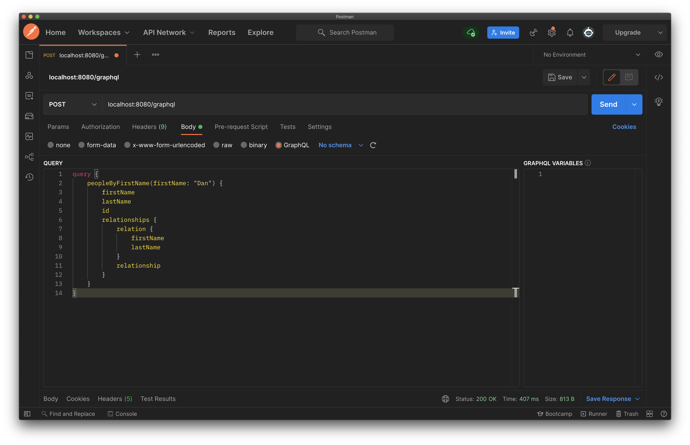

[GraphQL Java](https://github.com/graphql-java/graphql-java) is one of the most popular GraphQL server-side implementations for Java that I've found (with over 5k stars at the time of writing). If you're planning to expose a GraphQL API from a Java or JVM application, then this is an excellent library to start using.

This blog post will cover how to use GraphQL Java within a Spring application that exposes an endpoint for clients to send queries to. GraphQL Java does have its own [official documentation covering this subject](https://www.graphql-java.com/tutorials/getting-started-with-spring-boot/); however, I found it a bit too simplistic, which made it harder for me to wrap my head around it. I hope you don't think the same about the content of this post, although I guess you could write your own that is even more complicated than my examples!

I will be writing this from the assumption that you understand some of the basics of GraphQL. I won't be covering anything extremely complicated, so the basics will give you a good base for the content of this blog post. Knowing how to create a schema type and a query that does nothing fancy will be all you need. You can find this information from the official [graphql.org](https://graphql.org/learn/) site.

Also, here's a heads up that I have written my examples in Kotlin, although I tried to keep it friendly for Java readers.

## Dependencies

Below are the Spring and GraphQL related dependencies used in this post:

```xml
<parent>
  <groupId>org.springframework.boot</groupId>
  <artifactId>spring-boot-starter-parent</artifactId>
  <version>2.6.1</version>
</parent>

<dependencies>
  <dependency>
    <groupId>com.graphql-java</groupId>
    <artifactId>graphql-java</artifactId>
    <version>16.2</version>
  </dependency>
  <dependency>
    <groupId>com.graphql-java</groupId>
    <artifactId>graphql-java-spring-boot-starter-webmvc</artifactId>
    <version>2.0</version>
  </dependency>
  <dependency>
    <groupId>org.springframework.boot</groupId>
    <artifactId>spring-boot-starter-web</artifactId>
    <version>2.6.1</version>
  </dependency>
</dependencies>
```

## The schema we'll use

Below is the GraphQL schema that we'll use throughout this post:

```graphql
type Query {
  people: [Person]
  peopleByFirstName(firstName: String): [Person]
  personById(id: ID): Person
}

type Person {
  id: ID,
  firstName: String,
  lastName: String
  relationships: [Relationship]
}

type Relationship {
  relation: Person,
  relationship: String
}
```

I'll cover how we register and interact with the schema later on; knowing the shape of the types in the schema will set up the following sections.

## Fetching data with DataFetchers

GraphQL Java uses `DataFetcher`s to fetch data to include in the result of a query. More specifically, a `DataFetcher` retrieves the data for a single field when a query is executed.

Every field has an assigned `DataFetcher`. When an incoming GraphQL query is received, the library will call the registered `DataFetcher` for each field in the query.

> The official `DataFetcher` documentation can be found [here](https://www.graphql-java.com/documentation/data-fetching).

It is worth pointing out now, as it personally caused me a lot of confusion to begin with, that a "field" can mean two things:

- The name of a query.
- A property/field in a schema type.

This is important as it means that a `DataFetcher` can be linked to a query. In fact, every query __must__ have an associated `DataFetcher`. Not doing this will cause GraphQL query requests to fail as there is no entry point to begin processing the query.

I keep mentioning `DataFetcher`s, but what are they really in terms of code? Below is the `DataFetcher` interface:

```java
public interface DataFetcher<T> {

  T get(DataFetchingEnvironment environment) throws Exception;
}
```

So when I say `DataFetcher`, I'm really talking about implementations of the `DataFetcher` interface.

Let's look at an example `DataFetcher` that will respond to the `people` query:

```graphql
type Query {
    people: [Person]
}
```

The `DataFetcher` for this query:

```kotlin
@Component
class PeopleDataFetcher(private val personRepository: PersonRepository) : DataFetcher<List<PersonDTO>> {

  override fun get(environment: DataFetchingEnvironment): List<PersonDTO> {
    return personRepository.findAll().map { person -> PersonDTO(
        person.id,
        person.firstName,
        person.lastName
      ) 
    }
  }
}
```

The `PeopleDataFetcher` returns a `List<PersonDTO>` to correspond to the `[Person]` specified as the turn type of the GraphQL query. The `PersonDTO` contains the same fields found in the `Person` GraphQL type:

```kotlin
data class PersonDTO(val id: UUID, val firstName: String, val lastName: String)
```

> A field for relationships has been omitted to simplify the examples 

When `PeopleDataFetcher.get` is executed, it queries the database, maps the results to `PersonDTO`s and returns them.

When an incoming GraphQL query, like the following is received:

```graphql
query {
    people {
        firstName
        lastName
        id
    }
}
```

The following is returned after GraphQL Java has called the `PeopleDataFetcher`:

```json
{
  "data": {
    "people": [
      {
        "firstName": "John",
        "lastName": "Doe",
        "id": "00a0d4f2-637f-469c-9ecf-ba8839307996"
      },
      {
        "firstName": "Dan",
        "lastName": "Newton",
        "id": "27a08c14-d0ad-476c-ba09-9edad3e4c8f9"
      }
    ]
  }
}
```

That covers a first look at what `DataFetcher`s do. We'll expand on them in the following sections to improve your understanding of GraphQL Java.

## The default PropertyDataFatcher

As mentioned in the previous section, every field must have an assigned `DataFetcher`. That means for the `Person` type:

```graphql
type Person {
  id: ID,
  firstName: String,
  lastName: String
  relationships: [Relationship]
}
```

You would need to associate `DataFetchers` to:

- `Person.id`
- `Person.firstName`
- `Person.lastName`
- `Person.relationships`

That seems a bit onerous, especially when you might be able to retrieve all of this data in one go. For example, retrieving data from a database could be the difference between 1 SQL query vs 4.

To resolve this, any field without an assigned `DataFetcher` uses the `PropertyDataFetcher` by default. 

The `PropertyDataFetcher` uses various methods (e.g. getters or keys in a map) to extract field values from the parent field (could be a query or schema type).

To provide a concrete example, the `PeopleDataFetcher` we saw previously was used to respond to the `people` GraphQL query (the query, type and `PeopleDataFetcher` are included below):

```graphql
type Query {
  people: [Person]
}

type Person {
  id: ID,
  firstName: String,
  lastName: String
  relationships: [Relationship]
}
```

```kotlin
@Component
class PeopleDataFetcher(private val personRepository: PersonRepository) : DataFetcher<List<PersonDTO>> {

  override fun get(environment: DataFetchingEnvironment): List<PersonDTO> {
    return personRepository.findAll().map { person -> PersonDTO(
        person.id,
        person.firstName,
        person.lastName
      ) 
    }
  }
}
```

The `PeopleDataFetcher` returns a `PersonDTO` for each `Person` it finds to respond to the top-level query. This can be thought of as the "parent field".

The GraphQL library will then move down to fetch values for each queried field in `Person`, for example, `firstName` and `lastName`. Using the `PropertyDataFetcher`, it accesses each `PersonDTO` returned by the parent field's `DataFetcher` (`PeopleDataFetcher`) and extracts the values using their getters.

In concrete terms, this means:

- `Person.id` -> Value provided by `PersonDTO.id`.
- `Person.firstName` -> Value provided by `PersonDTO.firstName`.
- `Person.lastName` -> Value provided by `PersonDTO.lastName`.
- `Person.relationships` -> Empty because no value was provided.

> `PersonDTO.id` is how you write `Person.getId` in Kotlin (the applies to the other fields).

You might need to run that through your head a few times so it makes sense. I only properly understood this after debugging the library when my code wasn't working correctly.

## Writing a DataFetcher for a schema type's field

The `PeopleDataFetcher` we've seen throughout this post responds to a query. Now let's look at a custom `DataFetcher` that should be associated with a schema type's field.

The `PersonRelationshipsDataFetcher` fetches data for the `Person.relationships` field:

```kotlin
@Component
class PersonRelationshipsDataFetcher(
  private val relationshipRepository: RelationshipRepository
) : DataFetcher<List<RelationshipDTO>> {

  override fun get(environment: DataFetchingEnvironment): List<RelationshipDTO> {
    // Gets the object wrapping the [relationships] field
    // In this case a [PersonDTO] object.
    val source = environment.getSource<PersonDTO>()
    return relationshipRepository.findAllByPersonId(source.id).map { relationship ->
      RelationshipDTO(
        relation = relationship.relatedPerson.toDTO(),
        relationship = relationship.relationship
      )
    }
  }
}
```

It looks similar to the `PeopleDataFetcher` we saw previously, except for the new call to `DataFetchingEnvironment.getSource`. This method allows a `DataFetcher` to access the object returned by the `DataFetcher` associated with the parent field. After accessing this object, information is extracted from it (`PersonDTO.id`) to be used in the SQL query executed by the `PersonRelationshipsDataFetcher`.

## Writing a DataFetcher for a query containing an argument

Queries become far more worthwhile when you can pass arguments into them.

Take the query:

```graphql
type Query {
  peopleByFirstName(firstName: String): [Person]
}
```

To handle this you'd want a `DataFetcher` like the one below:

```kotlin
@Component
class PeopleByFirstNameDataFetcher(private val personRepository: PersonRepository) : DataFetcher<List<PersonDTO>> {

  override fun get(environment: DataFetchingEnvironment): List<PersonDTO> {
    // The argument is extracted from the GraphQL query
    val firstName = environment.getArgument<String>("firstName")
    return personRepository.findAllByFirstName(firstName)
      .map { person -> PersonDTO(person.id, person.firstName, person.lastName) }
  }
}
```

The important method call here is to `DataFetchingEnvironment.getArgument`, which does as it says and extracts an argument from the incoming GraphQL query. Handily, `getArgument` allows you to specify the type the argument should be (so you don't have to convert it yourself). 

> `DataFetchingEnvironment` also contains other methods regarding arguments, e.g. `getArguments` and `containsArgument`.

## Setting up a GraphQL instance

You've seen how to write a few `DataFetcher`s by this point; we now need to tie everything together by creating a `GraphQL` instance and registering an application's `DataFetcher`s.

The `@Configuration` code below does just that:

```kotlin
@Configuration
class GraphQLConfiguration(
  private val peopleByFirstNameDataFetcher: PeopleByFirstNameDataFetcher,
  private val peopleDataFetcher: PeopleDataFetcher,
  private val personByIdDataFetcher: PersonByIdDataFetcher,
  private val personRelationshipsDataFetcher: PersonRelationshipsDataFetcher
) {

  @Bean
  fun graphQL(): GraphQL {
    val typeRegistry: TypeDefinitionRegistry = SchemaParser().parse(readSchema())
    val runtimeWiring: RuntimeWiring = buildWiring()
    val graphQLSchema: GraphQLSchema =  SchemaGenerator().makeExecutableSchema(typeRegistry, runtimeWiring)
    return GraphQL.newGraphQL(graphQLSchema).build()
  }

  private fun schemaFile(): File {
    return this::class.java.classLoader.getResource("schema.graphqls")
      ?.let { url -> File(url.toURI()) }
      ?: throw IllegalStateException("The resource does not exist")
  }

  private fun buildWiring(): RuntimeWiring {
    return RuntimeWiring.newRuntimeWiring()
      .type(newTypeWiring("Query").dataFetcher("peopleByFirstName", peopleByFirstNameDataFetcher))
      .type(newTypeWiring("Query").dataFetcher("people", peopleDataFetcher))
      .type(newTypeWiring("Query").dataFetcher("personById", personByIdDataFetcher))
      .type(newTypeWiring("Person").dataFetcher("relationships", personRelationshipsDataFetcher))
      .build()
  }
}
```

The purpose of this `@Configuration` class is to create a `GraphQL` instance that GraphQL Java uses. Further setup is not required as it will be picked up by Spring Boot's auto-configuration.

The first step of creating the `GraphQL` instance requires reading the application's GraphQL schema. `SchemaParser.parse` can take in `File`s, `InputStream`s, `Reader`s or `String`s, which it parses (as the class name suggests) and returns a `TypeDefinitionRegistry` to be used later. In this application, the schema is defined in a resource file which gets fed into `SchemaParser.parse`. This is what allows the GraphQL library to understand incoming queries and what can or cannot be handled.

The `DataFetcher`s are then registered with a `RuntimeWiring` instance (through a `RuntimeWiring.Builder` returned by `RuntimeWiring.newRuntimeWiring`). Every time I mentioned "gets the `DataFetcher` associated to the field", this is where the association actually happens. I can stop hand waving all the time now since you've seen the code. 

Each `DataFetcher` in this example application is injected into the configuration class and linked to the `RuntimeWiring` instance through its `type` method. Each `TypeRuntimeWiring.Builder` instance (returned by `newTypeWiring`) requires 3 fundamental inputs:

- The name of the schema type (`"Query"` or a type name).
- The name of the field (query name or schema type field).
- The `DataFetcher` associated with the type and field.

After registering each `DataFetcher`, the `RuntimeWiring` instance is finalised using `build`.

Finally, the `TypeDefinitionRegistry` and `RuntimeWiring` created previously are passed through a `SchemaGenerator` and then into `GraphQL.newGraphQL` to retrieve a fully functional `GraphQL` instance.

## Sending a GraphQL query to the application

With the setup complete, the application now exposes a `/graphql` endpoint provided by the auto-configured code in `graphql-java-spring-boot-starter-webmvc`. This endpoint is where clients will send GraphQL queries to.

In this section, we'll look at how to send a query using cURL and Postman (which has GraphQL functionality) and view the returned data.

The query we are trying to send:

```graphql
query {
    peopleByFirstName(firstName: "Dan") {
        firstName
        lastName
        id
        relationships {
            relation {
                firstName
                lastName
            }
            relationship
        }
    }
}
```

- cURL:

  ```shell
  curl 'localhost:8080/graphql/' \
  -X POST \
  -H 'content-type: application/json' \
  --data '{ "query": "query { peopleByFirstName(firstName: \"Dan\") { firstName lastName id relationships { relation { firstName lastName } relationship }}}"}'
  ```

- Postman:




Both of these methods return the same data (I would be worried if they didn't):

```json
{
  "data": {
    "peopleByFirstName": [
      {
        "firstName": "Dan",
        "lastName": "Newton",
        "id": "27a08c14-d0ad-476c-ba09-9edad3e4c8f9",
        "relationships": [
          {
            "relation": {
              "firstName": "Laura",
              "lastName": "So"
            },
            "relationship": "Wife"
          },
          {
            "relation": {
              "firstName": "Random",
              "lastName": "Person"
            },
            "relationship": "Friend"
          }
        ]
      },
      {
        "firstName": "Dan",
        "lastName": "Doe",
        "id": "3c07b717-8b9c-4d88-926f-c892be38ee85",
        "relationships": []
      },
    ]
  }
}
```

The most crucial factor here is that a `POST` request is used. It seems standard for GraphQL APIs to use `POST` requests for both fetching and mutating data. This threw me off for a while, as the error I received from the `/graphql` endpoint didn't cause me to believe it was due to using the wrong HTTP verb. 

For clarity, using the wrong HTTP verb (e.g. a `GET`) through Postman leads to the following response and logline:

```json
{
    "timestamp": "2022-01-03T16:50:58.376+00:00",
    "status": 400,
    "error": "Bad Request",
    "path": "/graphql"
}
```

```log
Resolved [org.springframework.web.bind.MissingServletRequestParameterException: Required request parameter 'query' for method parameter type String is not present]
```

## Improving the registration of DataFetchers

The registration of `DataFetcher`s could be improved as they are currently registered by injecting every `DataFetcher` by name into the `GraphQLConfiguration` class and manually associating each with a type and field name. This isn't too bad right now since the application is small; if you argued that it already looks dodgy, then I'd agree with you.

To make the code more maintainable and extensible moving forward, we can introduce a new structure for defining `DataFetcher`s and registering them. 

We can achieve this by defining a new interface that specifies the type and field name a `DataFetcher` should be linked to:

```kotlin
/**
 * [TypedDataFetcher] is an instance of a [DataFetcher] that specifies the schema type 
 * and field it processes.
 *
 * Instances of [TypedDataFetcher] are registered into an instance of [RuntimeWiring] 
 * after being picked up by Spring (the instances must be annotated with @[Component]
 * or a similar annotated to be injected).
 */
interface TypedDataFetcher<T> : DataFetcher<T> {

  /**
   * The type that the [TypedDataFetcher] handles.
   *
   * Use `Query` if the [TypedDataFetcher] responds to incoming queries.
   *
   * Use a schema type name if the [TypedDataFetcher] fetches data for a single field
   * in the specified type.
   */
  val typeName: String

  /**
   * The field that the [TypedDataFetcher] should apply to.
   *
   * If the [typeName] is `Query`, then [fieldName] will be the name of the query the 
   * TypedDataFetcher] handles.
   *
   * If the [typeName] is a schema type, then [fieldName] should be the name of a single
   * field in [typeName].
   */
  val fieldName: String
}
```

By using `TypedDataFetcher`, you can retrieve all its implementations as Spring allows injecting of `List`s containing all instances implementing an interface. 

Combining this interface with modifications to the `DataFetcher` registration code in `GraphQLConfiguration` brings it all together:

```kotlin
@Configuration
class GraphQLConfiguration(private val dataFetchers: List<TypedDataFetcher<*>>) {

  // Create the GraphQL instance (no changes from the previous example).

  /**
   * Loops through all injected [TypedDataFetcher] instances and includes them in the output [RuntimeWiring] instance.
   */
  private fun buildWiring(): RuntimeWiring {
    val wiring = RuntimeWiring.newRuntimeWiring()
    for (dataFetcher in dataFetchers) {
      wiring.type(newTypeWiring(dataFetcher.typeName).dataFetcher(dataFetcher.fieldName, dataFetcher))
    }
    return wiring.build()
  }
}
```

The registration now uses the `typeName` and `fieldName` provided by each `TypedDataFetcher`, breaking the rigid link between `DataFetcher` implementations and the types, fields or queries they represent. Adding new `TypedDataFetcher`s becomes straightforward after making this alteration; you create a new implementation, define the `typeName` and `fieldName`, annotate with it `@Component`, and the rest is handled for you.

## Summary

GraphQL Java lets you do what the name suggests, support GraphQL queries within Java (or other JVM languages).

It does this through associating `DataFetcher`s to types and fields that you write and pointing incoming queries their way. With the library handling the parsing of queries, it frees you to focus on implementing the `DataFetcher`s that contain your application's primary functionality.

I'd love to try and summarise how to use GraphQL Java further; however, I already struggled to write the post in the most coherent way as possible; there is no way I could condense it to a few sentences.

Anyway, the end!